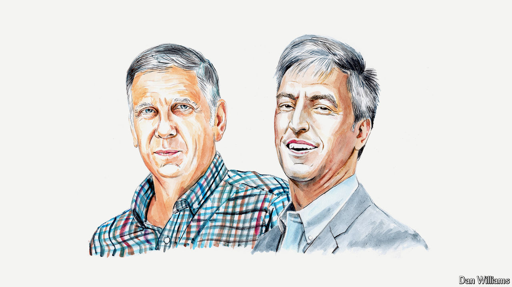
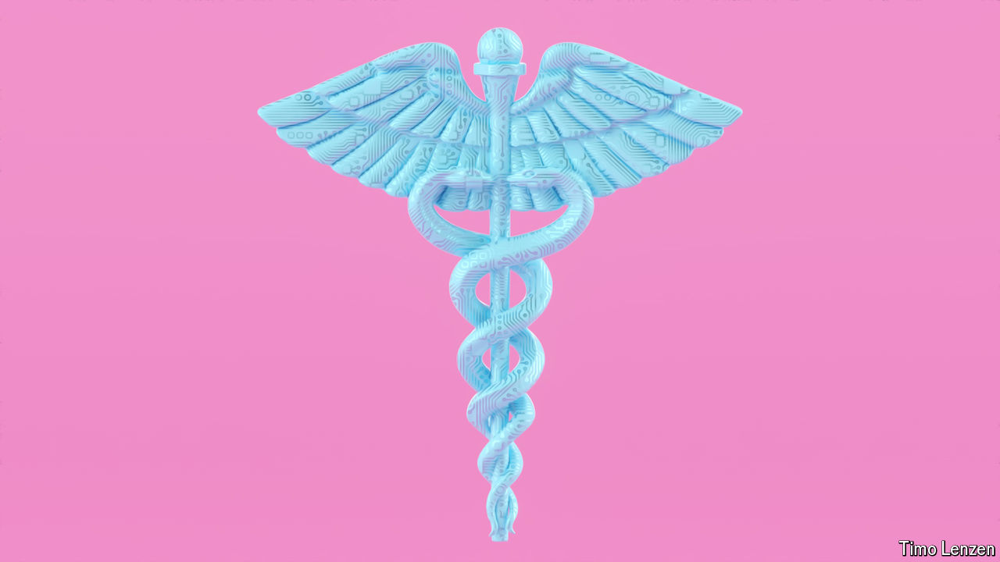
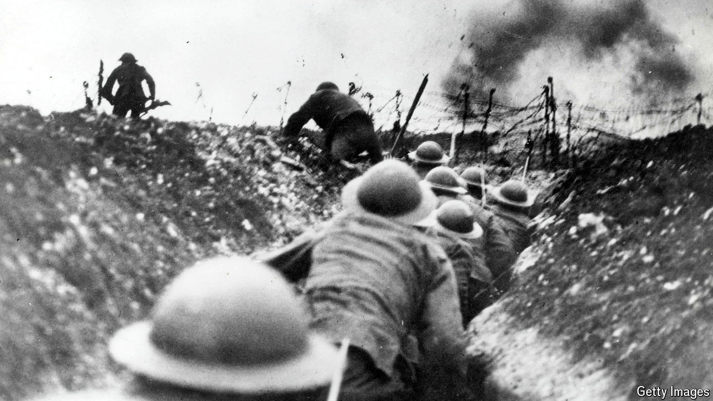
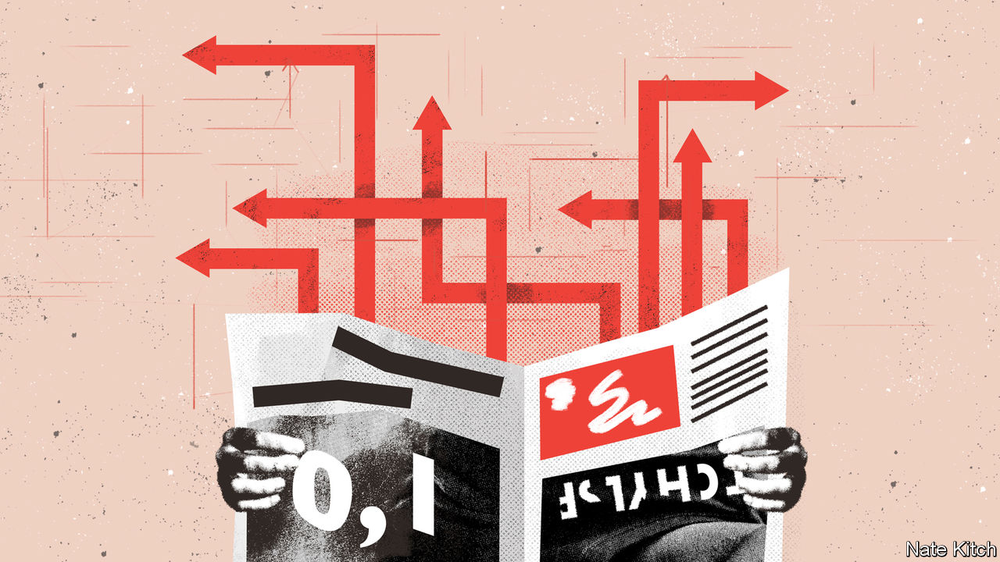

###### On abortion and crime, artificial intelligence in health care, war novels, casual sex

# Letters to the editor 

##### A selection of correspondence 

 

> Apr 25th 2024 


Why crime fell

We support the rights of women to control their fertility. However, we were surprised to see Steven Levitt and John Donohue reiterating their claim that abortion caused a drop in crime (, April 8th). , the case in 1973 that legalised abortion in America, related only to that country. But the drop in crime was international, occurring in all high-income countries. Abortion was not a factor causing the steep falls in crime observed in Canada, Britain and many other places. Declines in big-volume crimes in America, including burglary and larceny theft, began in 1980 not 1990. This was just seven years after , so too soon for abortion to have had an impact on adolescent crime.

We have been researching the role of security for many years. Evidence showing the importance of security in generating the reduction in crime has grown. 

The Levitt and Donohue analysis relied on five states that introduced abortion earlier than 1973. Any effect is probably spurious and related to income. These states had median incomes far above the national average. Higher-income residents replace their cars and renovate or buy new homes more quickly and frequently, buying more and newer security measures. There is scientific consensus on the effectiveness of electronic vehicle-immobilisers in reducing car theft across multiple jurisdictions, and of door deadlocks in reducing break-ins. 

America, followed by other rich countries, experienced what has been termed an avalanche of security in all walks of life. With easy property crimes no longer available, fewer adolescents became involved in crime. This led to reductions in violent crime, which are far fewer in number than property crimes.

Graham Farrell

University of Leeds

Nick Tilley

University College London

 


A proper use of AI in health

The  on artificial intelligence in health care (March 30th) was correct to point out that AI has a significant potential to augment clinical diagnostic workflows. Prospective trials are indeed required to demonstrate the safety and efficacy of these devices before deployment in clinical environments, especially as the majority of regulator-approved devices are diagnostic. 

However, it is equally as important that studies are well designed, methodologically robust and assess clinically relevant outcomes. AI technology introduces several unique challenges that increase the risk of bias, including how data is sourced and subsequently used to train, validate and test AI algorithms. Global initiatives to harmonise reporting guidelines and quality assessment of diagnostic studies will be crucial to allow clinicians, regulators and health policymakers to determine which AI tools are safe and effective for clinical use.

Dr Ahmad Guni

Clinical research fellow

Imperial College London

There are valuable applications of AI in medicine. Replacing the provider with the artificial, even accompanied by an avatar, is not one of them. For the replacement to work, the interventions recommended to the patient would have to be straightforward, single-choice options which the patient would accept. In practical terms, there are usually different options for the patient to select, which are not, in an objective manner, able to be ranked as “best”. 

Rather, choosing an option requires a discussion with patients that takes an important note of their personal values. Most extreme among these is when patients decide whether to have treatment for their disease or palliative care. Applying their values to these decisions results in vastly different selections, given the otherwise same diagnoses and treatment options. Guiding patients through these decisions requires an ability to establish a personal rapport too nuanced to be replaced by an algorithm. The same inputs could result in potentially quite different care plans from one patient to the next.

Dr Brandon Smaglo

Associate professor of gastrointestinal medical oncology

University of Texas MD Anderson Cancer Centre


 


There are two critical barriers to the uptake of AI in health: legal liability and the investment required to train health-care providers to use AI effectively and safely. We are not lawyers, so cannot comment on liability issues. But we can say that few medical or nursing trainees have the skills to navigate AI. It is already a struggle to integrate digital health technology into training. We continue to produce health-care graduates who are simply ill-equipped to engage with AI at the level your report suggests is required. 

This is a quality and safety-of-care issue. Teaching doctors, nurses and health professionals to use their critical judgment on AI, in contrast to becoming prompt engineers or worse yet, passive absorbers of AI outputs, is not a trivial matter for providers and consumers of health care. It needs to become a priority as AI becomes more pervasive.

Dr David Reser

Senior lecturer

Monash Rural Health

Dr Zerina Lokmic-Tomkins

Associate professor

School of Nursing 

Monash University


Paul Meehl showed in 1954 that simple regression models, calculated on a slide rule, outperformed doctors on some diagnostic tasks. His models were never used. Every ten or 20 years grand claims are made about AI diagnosis. None of these AI systems was successfully deployed on a wide scale. Remember IBM Watson from a decade ago? I highly recommend Eliza Strickland’s excellent retrospective on Watson published in IEEE Spectrum in April 2019. Will things be different this time? Perhaps, but people should be aware of this history.

Ehud Reiter

Professor of computing science

University of Aberdeen

In “Star Trek: Voyager” the starship’s crew is attended to by a holographic medical AI called “the Doctor”. The Doctor’s quest for self-awareness and a sense of humanity was one of the show’s most interesting storylines; he was often the wryest and most-philosophical character. As he once declared, “Photons and force fields, flesh and blood, why quibble over details? I’m just as real as any of you.”

Augustus Haney


 


War is hell

The omission of “The Naked and the Dead” from your list of the best war novels was surprising (, March 21st). Published in 1948 it was Norman Mailer’s debut at the tender age of 25 and is widely regarded as one of the best novels ever written in English. Through a clinical and stark account of combat in the Philippines the reader is exposed to the brutal dehumanising nature of war. The book should be studied in schools as part of the education of our young men.

Umberto Ansaldo

Professor of linguistics

University of Hong Kong

One of the more overlooked books written from the viewpoint of the common foot soldier is Eugene Sledge’s “With the Old Breed”, a visceral account of his days island-hopping across the Pacific as a Marine in 1944-45. Written 35 years after the end of the second world war and based on notes he had written in a pocket version of the New Testament bible that he carried into battle, Sledge’s prose is as remarkable as it is realistic. The astonishing, graphic descriptions of combat often leave the reader speechless. 

Jody Ferguson


 


Reaching a climax

I was both surprised and encouraged to read that “Britons born before 1945 have come to accept casual sex at a slower pace than members of Generation X” (Bagehot, March 9th). Perhaps the older generation has something to teach the younger about the journey being more important than the destination. 

Andy Bates


