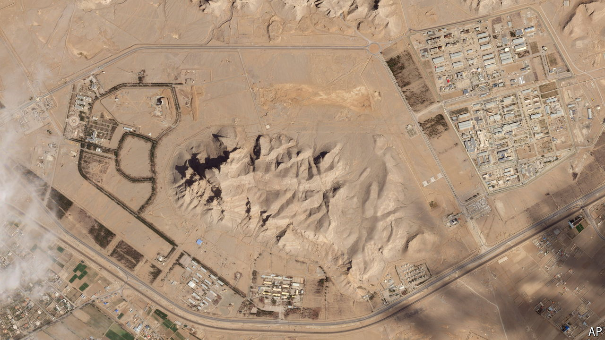

###### Iran’s defensive tactics

# How Iran covered up the damage from Israel’s strikes 

##### New images shared with The Economist show how a swap helped calm a crisis 

 

> Apr 24th 2024 

When Iran and Israel exchanged drone and missile strikes earlier this month, the world was braced for a fully-fledged war in the Middle East. In the end both sides, having violently made their point, let matters rest. New satellite images now show how Iran saved face and backed down: it simply swapped one destroyed air-defence radar for a fresh one. 

On April 19th, in response to an  days earlier, Israeli jets are thought to have fired  towards an air base near the Natanz nuclear complex south of Tehran. The site has been key to Iran’s nuclear programme since it was publicly exposed 22 years ago and is heavily defended with its Russian-made s-300 air-defence system. 


Israeli missiles appear to have scored a direct hit. They struck a 30n6e2 “Tombstone” radar, which is designed to track incoming air and missile threats, allowing interceptor missiles to take them out, according to analysis by Chris Biggers, an imagery expert who used to work for America’s National Geospatial-Intelligence Agency. The rest of the battery had been moved away, presumably in case Israel were to strike again. 

New images acquired by Mr Biggers and shared exclusively with  now show that Iran, by the next day, had pulled a switcheroo. It replaced the Tombstone radar with a different 96l6e “Cheese board” radar, placing it on the same spot. It also kept the launcher canisters, which fire interceptors, in an upright position, as though ready to fire. “It’s a case of denial and deception,” concludes Mr Biggers, “to suggest the site is still operational.” It almost certainly is not. The two radars are not interchangeable and the battery will not work with a damaged Tombstone. 

Iran is unlikely to fool America or Israel, both of which have high-end satellites and will know that the battery is kaput. But the kabuki radar allows the country’s propagandists to claim that all is well. That may have averted a broader crisis.

One lesson is that Israel can strike Iranian air-defence systems—and the valuable sites they protect—without even entering Iranian air space. Another is that commercially available satellite images, once the preserve of a few big states, can expose the obfuscation of governments. 

The third and final lesson is that this transparency is still patchy. American satellite firms have long been subject to legal restrictions on publishing high-resolution images of Israel. Though the rules were eased a few years ago, most providers are still nervous about releasing sharp images of sensitive Israeli sites. That can have perverse consequences. Iran’s supporters have circulated low- and medium-resolution images to suggest their attacks on April 13th were highly accurate.

Decker Eveleth of the Middlebury Institute of International Studies has studied private high-resolution images of those strikes. He says they were, in fact, possibly less precise than Iran’s attack  in Iraq four years ago, either because of Israel’s gps jamming or the distance the missiles had to travel. 

Still, the absence of clear-cut evidence lets Iran claim the win. Much like the radar switch, that may suit all concerned. ■


