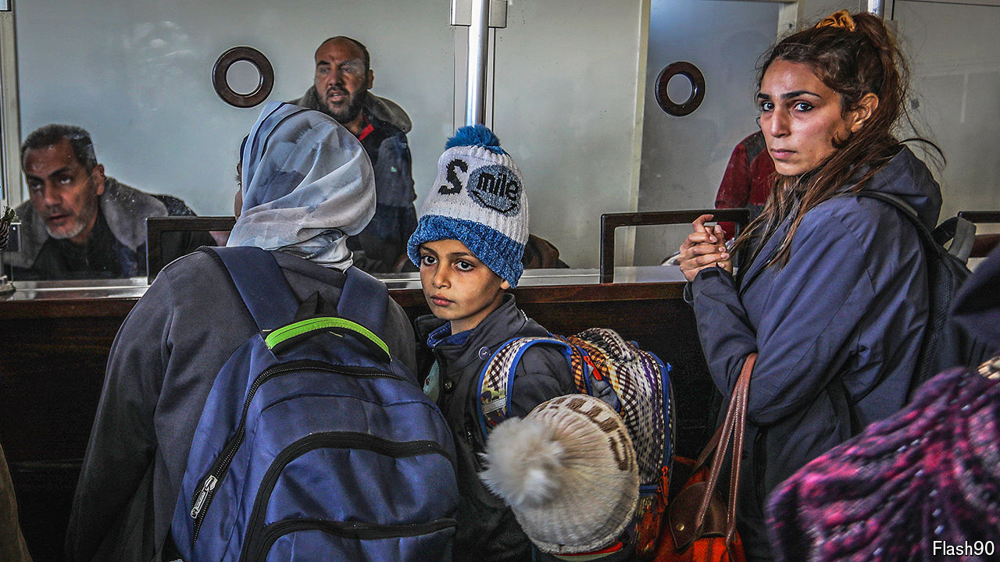

###### Your money or your life

# How much do Palestinians pay to get out of Gaza? 

##### Middlemen are profiting from Gazans’ desperation 

 

> Apr 25th 2024 

On a clear night in March, Ahmed sat on a rooftop in Rafah, in southern Gaza. It was the only place he could get a phone signal in the crumbling and crowded city. Two weeks earlier, Ahmed had paid $5,000 to Hala Consulting and Tourism Services, a travel agency in Cairo, to get him onto a register of those allowed to cross into Egypt. New lists are published each day on Telegram and Facebook. Ahmed’s contact had assured him that his name would appear soon. At last, at 10pm, it popped up. Early the next day, he went to the border. Getting across was a confusing process. The Egyptian officials, he said, treated Palestinians “like animals”. But he made it into Egypt and then on to Cairo.

Until October 7th, Palestinians who wanted to leave Gaza had in theory two choices: a few could use the Erez crossing, in the north of the strip, monitored by Israel, or they could try the southern one at Rafah, overseen by Egypt. Erez is now closed to those leaving Gaza. The cost of getting through Rafah, the city to which around 1.4m Gazans have fled, is extortionate.


Even before the war, leaving Gaza via Rafah was not easy. Gazans could put in a formal request through the enclave’s interior ministry, but that did not guarantee they would get out on the day. Or they could pay a middleman for a place on lists co-ordinated by Egyptian authorities.

Prices for such crossings for Palestinians have soared since the war. In January 2022, Human Rights Watch (hrw), an international monitor, put them at around $700 per person. Today they cost at least $5,000 for an adult and $2,500 for a child. Some report paying up to $15,000. With fears about an impending Israeli invasion of Rafah growing, prices show no sign of going down.

For most Gazans, finding money for even the most basic food is difficult at the moment. Sourcing thousands of dollars for a border crossing is unimaginable. So family and friends in the West are helping, raising money on platforms such as GoFundMe. Mahmoud Algharabli, a doctor in Ohio, moved from Gaza to America eight years ago. “I feel disgusted that I have to beg people for money so I can save my family,” he says. But he has managed to raise enough money to get 16 members of his family into Egypt. 

He paid more than $50,000 in fees to Hala to register them on the entry lists. The company has a monopoly on getting people out of Gaza and into Egypt, says Amr Magdi, a researcher at hrw. Hala’s boss is “a guy who is very close to the Egyptian military and the intelligence agencies”, he continues. (Hala did not respond to a request for comment.)

The United Nations Office for the Co-ordination of Humanitarian Affairs has documented allegations of bribery at the Rafah crossing for years. Mr Magdi says Hala could not operate without the say-so of the Egyptian authorities, though the government denies any accusation of profiteering. The money, says Mr Magdi, goes to corrupt officials and officers in Egypt’s army who decide whether those who make it on the lists can actually leave Gaza. The exploitation does not put people off, however. Demand for services is so great that even those who can find the money have to wait in a long queue. ■


