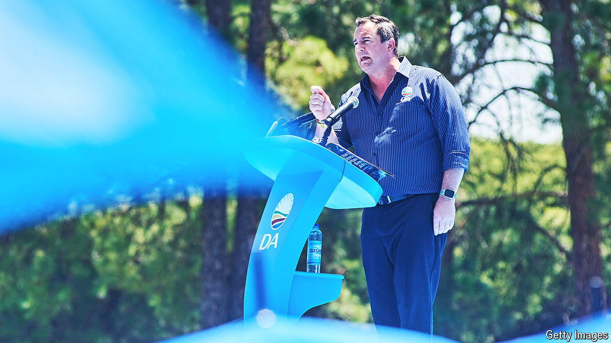

###### Long walk to nowhere

# How race and politics interact in modern South Africa 

##### Why the ANC’s losses are not the official opposition’s gain 

 

> Apr 25th 2024 

For the Democratic Alliance (da), South Africa’s largest opposition party, the election on May 29th should be a golden opportunity. For the first time since it came to power in 1994 the African National Congress (anc) may lose its national majority. After 30 years many voters are fed up with some of the world’s highest rates of unemployment, inequality and murder. But the da is still struggling to persuade them that it is a better alternative. 

That makes the party an interesting case study of how race and politics interact in South Africa three decades after apartheid. In most countries the main opposition party might benefit from a fall in support for the ruling party: the anc, which won 57.5% of the vote in 2019, may get 40% this time, according to some polls. Yet John Steenhuisen, the da’s leader, says that for his party to win 22%, as it did ten years ago, would be a major achievement. 

This is a curiously modest ambition for a party which, on paper at least, has a lot going for it. The da boasts a strong nationwide presence, having been the largest opposition party since 1999, and a stellar track record in the places where it has been elected to govern. On the campaign trail, Mr Steenhuisen rightly emphasises that the party controls South Africa’s best-run metropolitan area (the city of Cape Town); the best-run secondary city (Drakenstein); and the best-run small town (Swartland); as rated by Good Governance Africa, a think-tank. All these are in the Western Cape province, also run by the da. 

It enjoys another major advantage: a level playing field. South Africa is renowned for the strength of its democracy. Elections are free and fair. Opposition parties are able to campaign without harassment or intimidation.

The da’s problem is mathematically obvious. In a country that is 81% black you will remain an opposition party if you cannot win over much of the majority. It draws most of its support from the country’s minorities: whites, mixed-race “coloured” people and those of Asian descent. 

But why is this so? There are three reasons: pedigree, personalities and policies. The da traces its roots to liberal parties that opposed the National Party, the architects of apartheid. It argues, with some justification, that it has the most diverse candidates of any party in South Africa today. Yet in a country with a history of white supremacy, most black voters have historically leaned towards the party of Nelson Mandela or its offshoots. “Of course I’m not naive,” says Mr Steenhuisen. “Race will play a role. But I take great heart from experiences in other democracies. Barack Obama was a minority in America, and he was able to get elected.”

To put it mildly, Mr Steenhuisen, a white man, is no Barack Obama. The da leader is a pugnacious parliamentary campaigner, but has a tendency to annoy black voters with comments that may sound amusing in Cape Town but go down poorly elsewhere. Helen Zille, a former DA leader, caused outrage when she suggested in a tweet that colonialism was not all bad. 

Bye bye bye

The da’s personality problem has been compounded by the loss of senior black figures. Herman Mashaba, a former da mayor of Johannesburg, quit in 2019, three days before the resignation of Mmusi Maimane, the first and only black party leader of the da or its predecessor organisations, dating back to 1959. They have both since formed their own parties. Others also left: a local tabloid called it “Blaxit”.

Carlos Amato, a political cartoonist, lampoons the da as a bar of Top Deck, referring to a local Cadbury’s product with white chocolate on top of dark. “Something is wrong when an allegedly liberal party in sa loses so many black leaders so prodigiously,” wrote Justice Malala, a prominent analyst, in a column last month. Publicly, Mr Steenhuisen dismisses these criticisms as sour grapes from party members who have lost internal contests. 

That may be true. Neither Mr Maimane nor Mr Mashaba is famed for a small ego. But both also disagreed with white leaders in the da over policy. A particular issue is the da’s decision in 2020, both internally and in its public documents, to oppose policies that use either race or gender as a criterion for addressing inequality. This position represented a return to the da’s classically liberal roots, but alienated some of its senior black figures. 

Mr Steenhuisen compares the da to Britain’s Conservative Party and cites Margaret Thatcher as its inspiration. Its centre-right, economically liberal views are a tough sell, however. It has a good case that anc efforts to distribute wealth to black South Africans have been corrupt and ineffective. It reasonably argues that social policies should target individuals based on whether they are in poverty, not groups of different races. But in a country where nearly all poor people are black, that can be a difficult argument to win. 

Pedigree, personalities and policies can all come together in the voters’ eyes. Focus groups are said to like the sound of policies championed by the da—until they learn it was the da that came up with them. 

Some in the da fear it may never get more than 20-25% of the vote, given the country’s inequalities and demography. That may be a failure of imagination. But that share could still give it a powerful say in South Africa’s future. The anc is adamant that it will do better than polls suggest, but if its support does fall precipitously, it will need a big opposition party to form a coalition government. Mr Steenhuisen has left the door open for such a possibility. It would be a government of national unity for a divided country. ■

