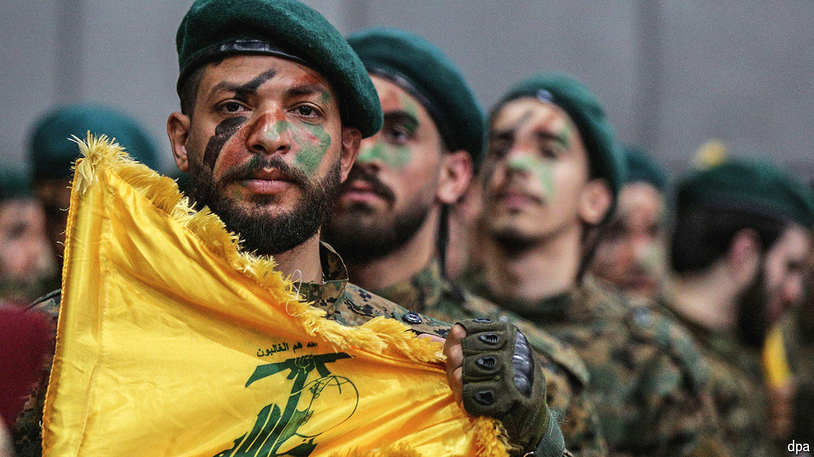
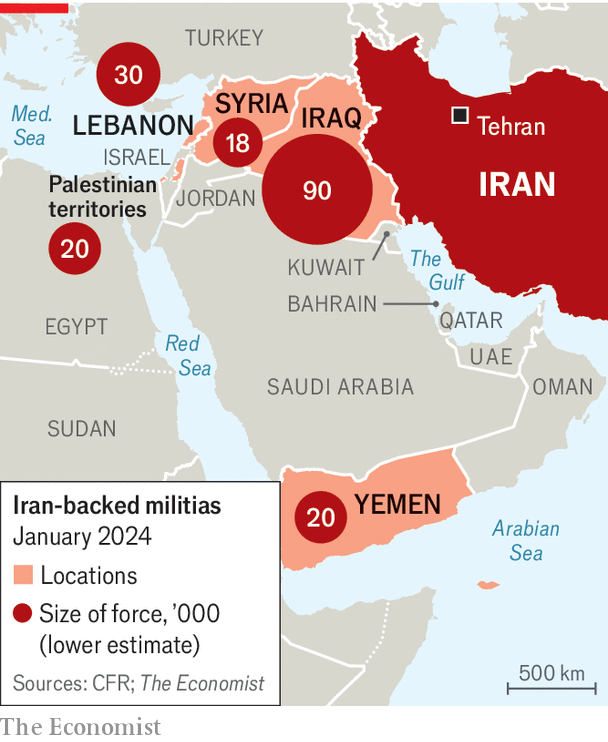

###### Militia mayhem

# The Middle East has a militia problem 

##### More than a quarter of the region’s 400m people live in states dominated by armed groups 

 

> Apr 25th 2024 

TO BE lebanese is to see, in every event, the seeds of a new civil war. Recent months have provided ample cause for worry. In March residents of Rmeish, a Christian village in the south, confronted members of Hizbullah, a Shia militia and political party, as they tried to set up a rocket launcher in the town centre. Then on April 7th Pascal Sleiman, an official from the Lebanese Forces (LF), a right-wing Christian party, was abducted near the northern city of Byblos and murdered. The party’s leader was quick to hint at a Hizbullah role (it denied responsibility).

Both incidents raised fears of Christian-Shia fighting. They also spoke to the same underlying problem: the state’s inability to control militias, specifically Hizbullah. The villagers in Rmeish could not seek help from the army, which has little authority in the south. And if Hizbullah was behind the murder in Byblos, it would never be held to account: the group has enjoyed impunity for decades of killings.

 


The Middle East has a militia problem. Of the 400m people in the Arab world, more than a quarter live in countries where the state is too weak to rein in armed groups (see map). Lebanon has Hizbullah. Yemen has the Houthis, a Shia faction that controls the country’s most populous regions. Iraq has a constellation of militias. So do Libya and Syria.

Such groups are not unique to the Middle East. What makes its militias distinct is their symbiosis with the state. In theory Hizbullah is like any other party in Lebanon’s sectarian democracy: its members sit in parliament and run ministries. It is also the only party better equipped than the army—and with the power to decide whether to drag the country into a foreign war.

The results are profound. Militias bring internecine warfare at home. But since October 7th they have also helped pull four Arab countries into an escalating battle with Israel, serving as proxies for Iran, which until recently refrained from fighting directly. Militias murder and intimidate their countrymen, loot billions of dollars from treasuries and scare off foreign investors. They are increasingly hated—yet devilishly hard to uproot.

The use or threat of violence is the first factor. Hizbullah is widely blamed for a string of assassinations that picked off its foes, from Rafik Hariri, a former prime minister, in 2005, to Mohamad Chatah, an ex-finance minister, in 2013. “They knew exactly who to kill,” says a victim’s relative. “Their opposition never recovered.”

Money plays a role, too: many militias control vast economic empires. Ali Allawi, a former Iraqi finance minister, once said the treasury received less than $1bn of the $7bn in customs duties levied each year. Militias siphoned off much of the rest. In 2022 they formed a construction conglomerate and convinced the state to award it an area half the size of Cyprus. They issue loans to pensioners and collect hundreds of thousands of dollars a day taxing lorries at checkpoints. 

There are many violent and corrupt rebel groups worldwide, but few control 12% of parliament’s seats and run the labour ministry, as Hizbullah does in Lebanon. Other factors explain their primacy in the Middle East. Weak, illegitimate states are the first ingredient. The region’s militias draw from deep wells of popular anger. The Shias of Lebanon, who form Hizbullah’s base, were for centuries a poor underclass; those in Iraq were viciously repressed during Saddam Hussein’s 24-year reign. Libya lacks deep sectarian splits but has regional divisions that stem from long misrule by Muammar Qaddafi, the dictator overthrown in 2011.

Next add a war that serves as the militias’ raison d’être and makes them useful to the state. For decades the Assad regime controlled Syria tightly. Then came the popular uprising in 2011 that turned into a civil war when troops began killing protesters. The Syrian army needed help from a multitude of militias to squash the revolt.

Similarly, many of Iraq’s militias emerged in the 2000s, fighting against American-led occupiers. They cemented their role in 2014 in a struggle against the jihadists’ Islamic State when Iraq’s army fled and surrendered the city of Mosul.

When militias share the state

That points to a third ingredient. Rebels by definition fight the state. In the Middle East, though, the state often confers a degree of legitimacy on such groups, then finds it impossible to reverse. The accord that ended Lebanon’s civil war in 1989 called on all militias to disarm. But it made an exception for Hizbullah, which argued it was a resistance group fighting Israel.

The Houthis had long been an insurgency in northern Yemen, the poorest region of a poor country. In 2014, amid postrevolutionary chaos, they swept south and captured the capital and other big cities. The Yemeni army did not block them, hailing the Houthis as revolutionaries. All three ingredients were in place: a weak state, a conflict and a dollop of credibility.

This is where the Middle East’s militias diverge into two categories. Today they are the state in much of Yemen. But by seizing power the Houthis have galvanised opposition. Many Yemenis now blame them for poverty, famine and disease. As rebels, the Houthis railed against official corruption; in power, they embraced it. 

Those in Iraq, Lebanon and Syria followed a different script. Instead of taking over the government they have sought to co-opt it. Hizbullah doles out contracts through ministries, hires supporters for civil-service jobs and skims money from customs. Most of Lebanon’s parties do the same. But Hizbullah also controls its land border with Syria and several security and intelligence agencies, which other parties do not. Its formidable arsenal gives it a veto: its gunmen occupied Beirut in 2008 to force the cabinet to reverse decisions the party disagreed with. It is simultaneously part of the state and above it. Lina Khatib of Chatham House, a British think-tank, calls it “power without responsibility”.

During Lebanon’s civil war, most of its sectarian militias sought help from abroad. The LF received arms and funding from Israel, along with several Western and Arab states. When the war ended, though, formal support dried up. Only Hizbullah still gets sturdy help from a foreign state: Iran, which has sent tens of billions of dollars and an arsenal of modern weapons over more than 40 years.

That helps to explain the about-face by Samir Geagea, the LF’s leader. One of the most vicious commanders in the civil war, in recent years he has seemed bent on conflict with Hizbullah. Yet on April 22nd, after two weeks of hinting at its role in Mr Sleiman’s murder, Mr Geagea announced that there was no evidence to implicate the group. He might want a battle—but is in no position to wage one.

More than anything, it is external support that explains the stubborn strength of the Middle East’s militias. Iran has been the main culprit, backing not just Hizbullah but also groups in Iraq, Syria and Yemen (other donors do the job in Libya). America has tried to block such aid through sanctions, with little success. Western policymakers and the UN have pursued schemes to convince militias to disarm. But as long as they have a pipeline of money and weapons from abroad they have little incentive to go along. ■


