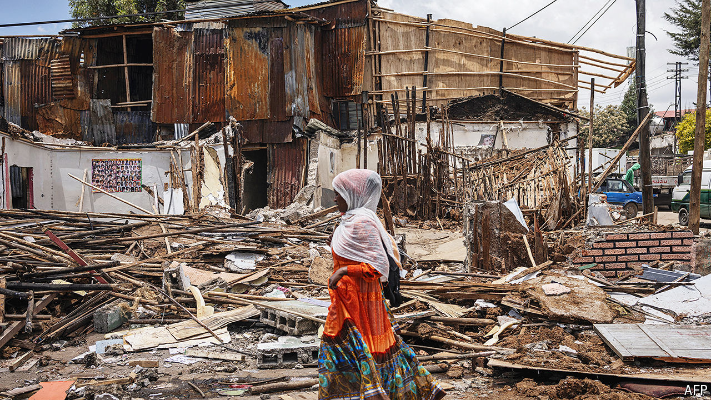

###### The destruction of Addis Ababa

# The historic heart of Addis Ababa is being demolished 

##### Abiy Ahmed is imposing his vision on Ethiopia’s capital 

 

> Apr 25th 2024 

The historic neighbourhood of Piassa, at the old heart of Addis Ababa, is being taken apart. Workmen are uprooting pipes, felling lampposts and chiselling at façades. One building is being dismantled brick by brick, as though a video of its construction is being wound backwards. Shops are being smashed through with sledgehammers. Homes have been bulldozed.

The demolitions in Ethiopia’s capital are among the most dramatic that its residents can remember. “Unless we change Addis Ababa, we cannot bring in as much foreign wealth as we desire,” said Abiy Ahmed, the country’s restless prime minister. He plans to lift a ban on foreigners owning property, hoping to attract the same glitzy money that has poured into Dubai. The city administration talks of beautifying road corridors and developing cycle lanes. But it is not just buildings that are being dismantled: it is also an idea of what the city might be, and who it is for.

Addis Ababa (which means “new flower” in Amharic) was founded in 1886, when the emperor’s wife gazed down from the surrounding hilltops upon the hot springs on the valley floor. Piassa became its cosmopolitan hub, drawing Greeks, Armenians and Italians, artists and traders, aristocrats and hustlers. In its streets generations of Ethiopians “experimented with ways and meanings of being urban”, says Marco Di Nunzio of the University of Birmingham, who has written a book about the area. It was a place of commerce and conviviality, retaining something of that spirit to this day, even as many of its buildings fell into disrepair.

But Mr Abiy dreams of a city of tourism and technology, of grand parks and gleaming museums, overlooked by a planned multibillion-dollar complex which will include a national palace and a grand hotel. In February, in Piassa itself, he opened the Adwa Victory Memorial, which commemorates the victory of Ethiopian soldiers over Italian invaders in 1896. Visitors walk past tinkling fountains into cavernous exhibition rooms, where the country’s history is displayed in glass cabinets or on lcd screens. The thick walls muffle the sound of the demolitions outside.

As many as 11,000 people have been evicted from Piassa, without any say in the matter. One man says he was given two weeks to leave his home. He has been promised a condominium on the edge of the city, but it is unfinished; in the meantime he is renting a room at three times the cost of his old place. Like other people interviewed, he asks for his name to be withheld. The prowling police brook no criticism of the project. One of the saddest things, he says, was the frightened silence of his neighbours on the day the bulldozers came.

Some residents say that redevelopment is necessary: in the words of a stoical mechanic, similar changes have happened in cities all over the world. But the upshot is that many residents are being driven out of the heart of the capital. Historically, rich and poor lived closer together in Addis Ababa than in cities like Nairobi or Cape Town, says Biruk Terrefe of Oxford University, but that urban fabric is now being unstitched by “a turbocharged sanitisation of the city centre”.

The thud of sledgehammers can be heard on roadsides all over the city. A shopkeeper in another part of town says he spent 300,000 birr ($5,300) to refurbish his premises last year. Now it is threatened with demolition to make way for a cycle lane. “I have no hope here in Addis any more,” he says. “Unless you are rich, you can’t survive.” ■


