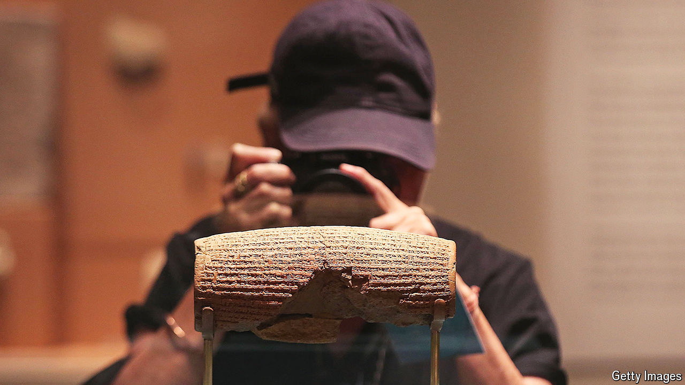

###### The Cyrus cylinder

# Why Iranian dissidents love Cyrus, an ancient Persian king 

##### The British Museum is sending one of Iran’s adored antiquities to Israel 

 

> Apr 25th 2024 

The cyrus cylinder is, at first glance, an unremarkable chunk of clay, the size of a rugby ball. And yet it is one of Iran’s most treasured antiquities. The cuneiform script that covers its surface recounts the capture of Babylon, in modern-day Iraq, by Cyrus the Great, a Persian emperor. One of its most striking claims is that Cyrus allowed those who had been deported to Babylon to go home. That included the Jews. Cyrus, the only non-Jew in the Hebrew Bible deemed to be a messiah, or anointed one, even paid for the restoration of the Jewish temple in Jerusalem, according to the Book of Ezra. 

The cylinder is owned by the British Museum which is due to send it to Jerusalem on loan later this year. This has outraged Iran’s rulers. In January Hadi Mirzaei, head of the General Office for Museums in Tehran, threatened the British Museum with legal action. An object of such cultural significance to Iran could not, Mr Mirzaei suggested, be trusted to Israel, a country against which the Islamic Republic has recently carried out air strikes. 

Today Cyrus has become a symbol of leaders, particularly American ones, who are friendly towards Israel. Binyamin Netanyahu (and many conservative Christians) likened Donald Trump to the Persian king after he moved the American embassy from Tel Aviv to Jerusalem in 2018. Harry Truman, the first world leader to recognise the state of Israel in 1948, had gone further, declaring, “I am Cyrus!”

The Iranian government is more circumspect about the emperor. Its religious leaders prefer to venerate Muslims. The Cyrus cylinder is seen as the first articulation of human rights, which are not highly valued by the Islamic Republic. Neither is Cyrus’s support for a Jewish return to Zion.

And yet Iran’s leaders are willing to co-opt his memory when it suits. Mahmoud Ahmadinejad, then president, made a great show of the cylinder’s visit to Iran in 2010 in an effort to rally nationalist sentiment and fend off his foes. “They pick and choose,” says Narguess Farzad of London’s School of Oriental and African Studies. 

Other regime hands, however, are less keen on Cyrus. His tomb in Pasargad, a city in ancient Persia, has become a gathering point for its opponents. Thousands of Iranians circumambulated it in 2016. Police arrested about 70 of them. “Cyrus Day” has become an unofficial holiday. Celebrating Cyrus allows Iranians to show their disdain for the regime without outright protests, says Ammar Maleki of Tilburg University in the Netherlands. 

The image of Cyrus as a figure of enlightened kingship grates with the mullahs. Iran’s last shah, Mohammad Reza Pahlavi, liked to think of himself as a modern-day Cyrus. “Rest in peace, for we are awake,” he assured the old king at a gathering of world leaders to celebrate 2,500 years of Iranian monarchy in 1971. That year, his sister presented the un with a replica of the cylinder, which has been described as a precursor to its human-rights charter. His son, Reza Pahlavi, styles himself as Cyrus’s successor, too. 

Cyrus’s reputation as a defender of human rights is questionable; he was an emperor, after all. But amid tensions with Israel and the threat of war, the memory of warmer relations—and a different kind of leader—appeals to many Iranians. ■


