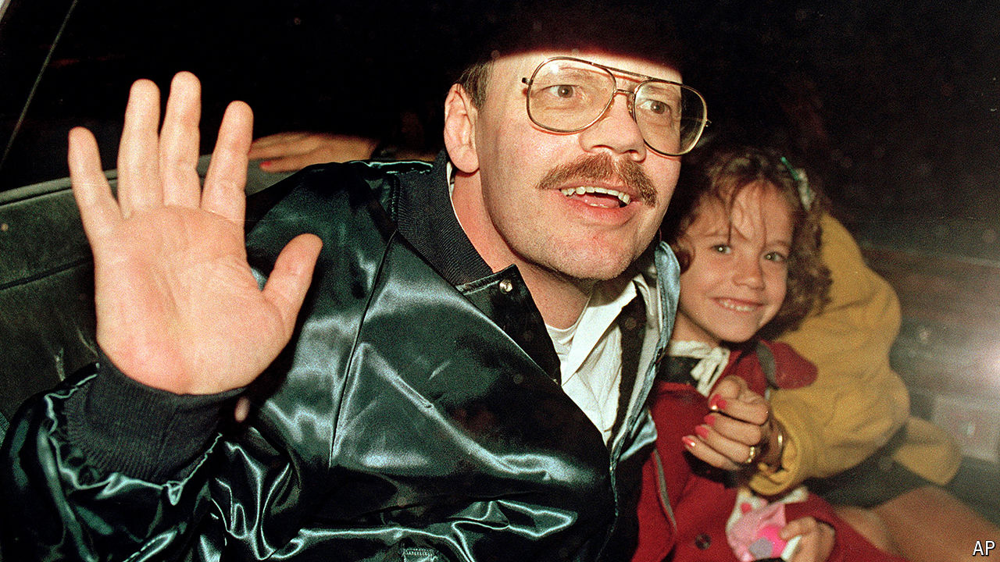

###### Prisoner of Hizbullah

# Terry Anderson was held by Islamic militants for 2,454 days 

##### The former Marine and AP Beirut bureau chief died on April 21st, aged 76 

 

> Apr 25th 2024 

It was only part of his life, he insisted. He had done so much else. Before it, he had been a Marine, joining straight out of high school and seeing combat duty in Vietnam. Then, after studying journalism at Iowa State, he had signed on with the Associated Press. He reported from Japan and South Africa, and then volunteered—volunteered!—for the Beirut desk. There was a civil war in Lebanon, but he found that fascinating, the best job he ever had. There were straightforward good times, too, when he and his colleagues and Madeleine, his beautiful Lebanese fiancée, would gather on the balcony of his seaside apartment, high above the rubbled streets, smoke cigars, sip Scotch and watch the twilight come down over the sea. 

Terry Anderson did plenty afterwards, too. He taught journalism at several universities, and set up a foundation to build schools in Vietnam. He became honorary chairman of the Committee to Protect Journalists, and helped homeless veterans. Other ventures didn’t go so well. He had to close two restaurants and a bar, the Blue Gator in Athens, Ohio, where he hoped to indulge his love of blues. His charter-boat business went bust, and his horse farm had to be sold. He ran for the Ohio Senate, but lost. In 2009 he declared bankruptcy. There were three marriages and three divorces. His weight ballooned. He had to admit he was sometimes a jerk. But had he always been one, or had those seven years made him one? If so, they had also made him a hero and a famous man. He tried not to think about them, but they would not go away. 

On March 16th 1985 he had been enjoying an early-morning tennis game by the sea, part of his new fitness regime. (Jogging, no smoking, a low-carb diet.) His play absorbed him rather more than the green Mercedes sedan that kept cruising past the court. But as he drove home the car drew up alongside; three gunmen ran from it, pulled his door open and thrust him inside. He was to be a prisoner of these Hizbullah militants for almost seven years. Because he plied his reporter’s trade openly, they took him for a spy. 

His own arrogance got him kidnapped, he said. He thought he was safe. His subsequent treatment both infuriated him and reduced him at times to despair. He did not think they would kill him; it was clear they wanted to trade him for their own captured comrades. Nor did they torture him, as they did others. But they were young, pistol-happy and with an enemy in their hands, so they did their brutal best to degrade him. He was kept chained and often blindfolded, with no idea where he was. As the war ebbed and flowed he was moved around Lebanon, strapped to the chassis of a truck or, at times, in a coffin, taped up like a corpse. 

Without the blindfold he was still in the near-dark, in basements or small damp cells where he slept on thin, dirty mattresses on concrete floors. Most of the food was inedible. For perhaps a year and a half in total he was kept in solitary confinement, which he could barely endure. As a Christian he tried for hours to pray, but found just a blankness in which he was talking to himself, not God. It was all too easy to believe that the world had forgotten him. (His sister, Peggy Say, was lobbying everyone she could think of to gain his release, and the Reagan administration was embarking on an illegal scheme of selling arms to Iran, Hizbullah’s sponsor, but he knew none of that.) He marked the thousandth day of his captivity by beating his head against his cell wall until it bled. 

Several things got him through in the end. One was his Marine training. Another was native stubbornness: he would simply wake up in the morning and do what he had to do, summon the energy from somewhere, day after day after day. Most ordinary people, he reflected, led their lives that way. And nothing about him and his fellow captives was particularly extraordinary. 

Their company was the most important factor. His fellow prisoners—principally Brian Keenan, John McCarthy and Tom Sutherland—helped him greatly. When he was with them, they talked as much as they could about anything at all: Keenan, a Belfast boyo, about Irish affairs, Sutherland, an animal geneticist, about agriculture, until he felt ready to start a farm himself. They played poker with a deck he made out of scrap paper, and chess with pieces he crafted from the silver foil round processed cheese. He became their leader, harrying the guards for better food and decent books to read—Dickens’s novels, “Animal Farm” and “The Plague” were on his list—and for news of the world outside, which he was desperate to recover. 

Twice he almost did. One day he was allowed to see the sun and eat a hamburger, but it turned out to mean nothing. In 1987 he was given a suit and taken to a carpeted apartment with Marcel Fontaine, then his cellmate. Only Fontaine was released, though he went on wearing that suit for a week, hoping. His own release was not until December 4th 1991, 2,454 days after his capture. 

The AP colleagues who bear-hugged him, and his family, who brought flowers, saw a jubilant man with a fine moustache and big glasses, just as in the old days. Those days were what he meant to resume. He would forgive his captors, forget the lost years, and get on with his life. He was not a vindictive person. But he, like his fellow captives, was damaged more than he knew. He found it hard to deal with relationships, decision-making, emotions and crowds. He married Madeleine quickly, but then divorced her. Counselling helped only so far. In 1999 he sued the government of Iran for $100m in damages, and in 2002 he received $26m from frozen Iranian assets. He blew it in seven years. 

Was that claim revenge? No, he said, just stating responsibility. He refused to let that part of his life define the larger, slowly improving part. Yet it kept doing so. As the years passed, he was still regularly asked whether he had forgiven his captors. He wasn’t sure. And had he got over it? You would have to ask his ex-wives, he would say ruefully. He didn’t know. He was who he was. ■

