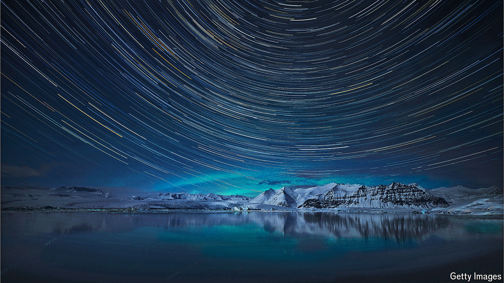
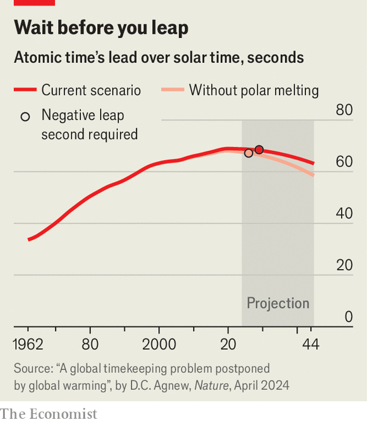

###### Tick tock

# Climate change is slowing Earth’s rotation 

##### This simplifies things for the world’s timekeepers 

 

> Apr 24th 2024 

THE PERFECT day should have 86,400 seconds: 24 hours for Earth to spin around its axis, 60 minutes in each hour, and 60 seconds in each minute. But the apparent precision of these simple calculations ignores the messy reality of planetary bodies. Tidal forces, combined with the roiling currents in Earth’s core and the redistribution of ice sheets at its surface, cause the planet’s rate of spin to vary ever so slightly from year to year.

This irritant was scotched in 1967 with the definition of a new second, derived from the vibrations of caesium atoms inside uber-precise atomic clocks. The two seconds, solar and atomic, are almost exactly equivalent. But not quite. The leap year 1972, for example, should have had 31,622,400 seconds. Reckoned by atomic seconds, however, Earth’s full journey around the sun took 31,622,401.14. As a result, two additional seconds were added: the very first “leap seconds”. One, on June 30th that year, made up for the lag; the second anticipated an impending additional one. It was added to the very last minute of the year’s very last day.

 


For a while, leap seconds were a regular fixture. Between 1972 and 2016, there were 27. Owing to a gradual acceleration in Earth’s spin that has allowed solar seconds to catch up with atomic ones, there have not been any since. In fact, within the next few years the time nerds of the International Earth Rotation Service (IERS), the body that decides when leap seconds should fall, may need to implement an entirely novel “negative leap second”. On some future December 31st, in other words, the stroke of midnight will follow a 59-second minute. Such adjustments are a vexing prospect for organisations reliant on perfect timekeeping, from stockmarkets to power grids. But a new study suggests that climate change will buy them some welcome extra time. 

In a paper published in  last month, Duncan Agnew, a geophysicist with an interest in timekeeping at the University of California in San Diego, disentangled the various factors that are causing Earth’s spin to accelerate. To do so, he used a range of data sources including laser measurements of the distance between Earth and the Moon, disturbances to Earth’s gravity, and records of ancient eclipses. Partly responsible for the recent speed-up, he concluded, are the currents that ripple through Earth’s molten core. The melting of the polar ice sheet since the end of the last ice age, 12,000 years ago, has also made Earth spin faster. Their weight squashed the poles; their subsequent disappearance allowed Earth’s crust to rebound and become more spherical. This caused an acceleration in the planet’s spin, an effect familiar to skaters tucking in their arms to rotate faster.

Dr Agnew also found effects pulling in the other direction. In recent decades, climate change has been shrinking the Greenland and Antarctic ice sheets, shifting water mass off the land and into the oceans where it can be redistributed. By reducing both regions’ mass, the melt decreases their gravitational pull, with the net effect of “pushing” water away from their shores. Water lost from the Greenland ice sheet ends up pooling most noticeably around the equator and in the southern hemisphere. The opposite, more or less, is true for water released from the Antarctic ice sheet. Glaciologists who have tracked how all this water mass moves around from land to oceans have consequently found a shift away from the poles and towards the equator. That means Earth’s waistline is thickening, says Jonathan Bamber, a glaciologist at the University of Bristol. The effect is not huge—it is measured in millimetres per year—but is nonetheless enough to exert a braking effect on Earth’s spin.

Not a second too soon

It is also delaying the need for a negative leap-second. Without climate change, current trends suggest IERS will need to implement one within just two years. Dr Agnew’s calculations suggest they have until 2029. That time will allow software engineers running systems reliant on the precision of atomic clocks to devise new programs capable of handling the negative leap second. 

Alternatively, as some have suggested, IERS could use that time to eliminate the concept entirely. Solar seconds and atomic ones are already allowed to differ by one second. Extending that tolerance to one minute would probably eliminate the need for leap seconds of all kinds for decades to come. For timekeepers the world over, that day may be as close to perfect as it is ever possible to get. ■


