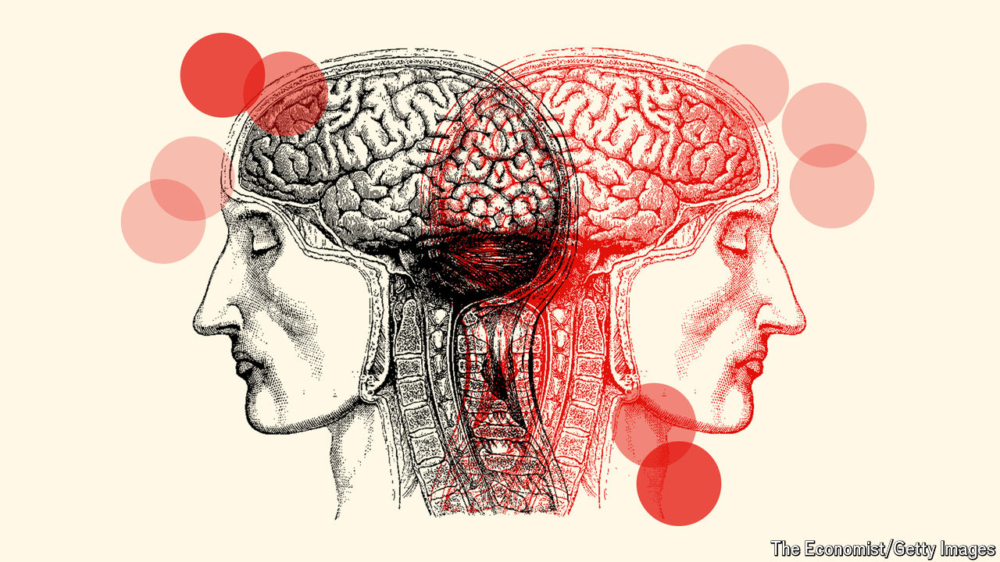
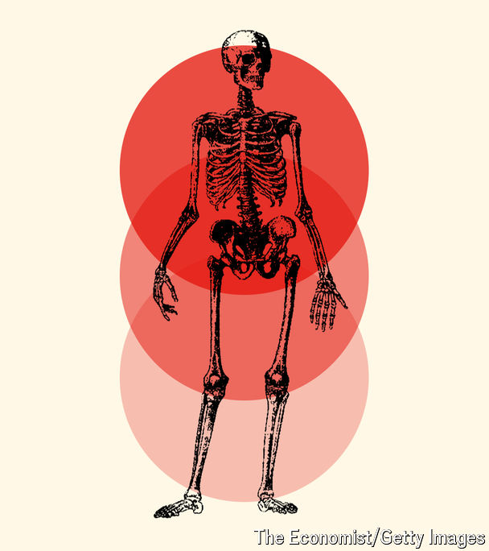
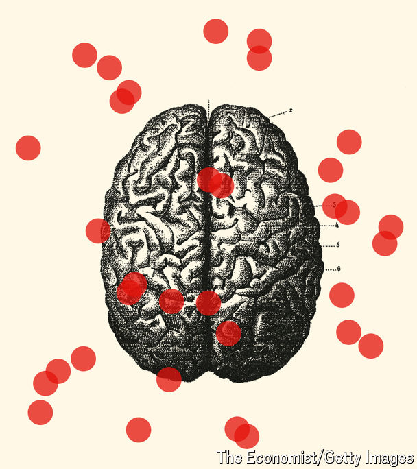

###### Brain v body

# Many mental-health conditions have bodily triggers 

##### Psychiatrists are at long last starting to connect the dots 

 

> Apr 24th 2024 

THE TICS started when Jessica Huitson was only 12 years old. Over time her condition worsened until she was having whole-body fits and being rushed to hospital. But her local hospital, in Durham, England, was dismissive, suggesting she had anxiety, a mental-health condition, and that she was probably spending too much time watching videos on TikTok. Her mother describes the experience as “belittling”. In fact, Jessica had an autoimmune condition brought on by a bacterial infection with . The condition is known as Paediatric Autoimmune-Neuropsychiatric Disorders Associated with (PANDAS). When the infection was identified and treated, her symptoms finally began to improve.

Ms Huitson is not alone in having a dysfunction in the brain mistaken for one in the mind. Evidence is accumulating that an array of infections can, in some cases, trigger conditions such as obsessive-compulsive disorder, tics, anxiety, depression and even psychosis. And infections are one small piece of the puzzle. It is increasingly clear that inflammatory disorders and metabolic conditions can also have sizeable effects on mental health, though psychiatrists rarely look for them. All this is symptomatic of large problems in psychiatry.

A revised understanding could have profound consequences for the millions of people with mental-health conditions that are currently poorly treated. For example, over 90% of patients with bipolar disorder will have recurrent illness during their lives; and in children with obsessive-compulsive disorder (OCD) over 46% do not achieve remission. Some 50-60% of patients with depression eventually respond after trying many different drugs. 

For some in the profession, a deeper understanding of the biology of mental health, tied to clear biological fingerprints of the kind that might come from a laboratory test, will lead to more accurate diagnoses and better targeted treatments. 

Shrinks, rapped

The field of psychiatry has historically been focused around the description and classification of symptoms, rather than on underlying causes. The Diagnostic and Statistical Manual of Mental Disorders (DSM), sometimes known as the bible of psychiatry, emerged in 1952 and contains descriptions, symptoms and diagnostic criteria. On the one hand, it has brought helpful consistency to diagnosis. But on the other, it has grouped patients into cohorts without any sense of the underlying mechanisms behind their conditions. There is so much overlap between the symptoms of depression and anxiety, for example, that some wonder if these are actually even separate categories of illness. At the same time, depression and anxiety come in many different subtypes—panic disorder with and without agoraphobia, for example, are distinct diagnoses—not all of which may be meaningfully distinct. This can lead to patient groups in drug trials being so diverse that drugs and therapies fail simply because the cohort being studied has too little in common. 

Previous attempts to find causal mechanisms for mental-health conditions have run into difficulty. In 2013 the National Institute of Mental Health, an American government agency, made a heroic gamble to move away from research based on the DSM’s symptom-based categories. Money was funnelled into basic research on disease processes of the brain, hoping to directly connect genes to behaviours. Some $20bn of new research was funded but the idea failed spectacularly—most of the genes uncovered had tiny effects. Allen Frances, a professor of psychiatry at Duke University, calls the search for such biomarkers “a fascinating intellectual adventure, but a complete clinical flop”.

Genes alone are clearly not the answer. Ludger Tebartz van Elst, a professor of psychiatry and psychotherapy at the University Hospital Freiburg, in Germany, says that many different conditions such as schizophrenia, attention deficit hyperactivity disorder (ADHD), anxiety and autism can be triggered by the same genetic disorder, 22q11.2, caused by the loss of a small piece of chromosome 22.

Despite this counsel of misery, a shift in psychiatry is potentially on the horizon. Some of this is coming from a revived interest in finding neurological biomarkers with ever-more sophisticated technology. In addition, there is a greater understanding that some mental-health conditions actually have triggers or roots which need to be treated as medical conditions rather than psychiatric ones. 

Fundamental health

A key moment came in 2007, when work at the University of Pennsylvania showed that 100 patients with rapidly progressing psychiatric symptoms or cognitive impairments actually had an autoimmune disease. Their bodies were creating antibodies against key receptors in nerve cells known as NMDA receptors. These lead to brain swelling and can trigger a range of symptoms including paranoia, hallucinations and aggression. The disease was dubbed “anti-NMDA-receptor encephalitis”. Most important of all, in many cases it was treatable by removing the antibodies, or using immunotherapy drugs or steroids. Studies of patients having a first episode of psychosis have found that between 5% and 10% also have brain-attacking antibodies. 

 


It seems likely that, in rare cases, OCD can be caused by the immune system, too. This is seen in the childhood condition PANDAS, with which Ms Huitson was diagnosed in 2021. But it is also sometimes found in adults. One 64-year-old man reported spending an extraordinary amount of time obsessively trimming his lawn only to look back on this behaviour the next day with feelings of regret and guilt. Researchers found these symptoms were being caused by antibodies attacking the neurons in his brain.

More recently, Belinda Lennox, head of psychiatry at the University of Oxford, has conducted tests on thousands of patients with psychosis. She has found increased rates of antibodies in the blood samples of about 6% of patients, mostly targeting the NMDA receptors. She says it remains unknown how a single set of antibodies is capable of producing clinical presentations ranging from seizures to psychosis and encephalitis. Nor is it known why these antibodies are made, or if they can cross the blood-brain barrier, a membrane that controls access to the brain. She assumes, though, that they do—preferentially sticking to the hippocampus, which would explain how they affect memory and lead to delusions and hallucinations.

Dr Lennox says a shift in medical thinking is needed to appreciate the damage the immune system can do to the brain. The “million dollar question”, she says, is whether these conditions are treatable. She is now running trials to find out more. Work on patients with immune-driven psychosis suggests that a range of strategies including removing antibodies and taking immunotherapy drugs or steroids can be effective treatments. 

Another important discovery is that metabolic disturbances can also affect mental health. The brain is an energy-hungry organ, and metabolic alterations related to energy pathways have been implicated in a diverse range of conditions, including schizophrenia, bipolar disorder, psychosis, eating disorders and major depressive disorder. At Stanford University there is a metabolic psychiatry clinic where patients are treated with diet and lifestyle changes, along with medication. One active area of research at the clinic is the potential benefits of the ketogenic diet, in which carbohydrate intake is limited. This diet forces the body to burn fat for energy, thereby creating chemicals known as ketones which can act as a fuel source for the brain when glucose is in limited supply. 

Kirk Nylen, head of neuroscience for Baszucki Group, an American charity that funds brain research, says 13 trials are under way worldwide looking at the effects of metabolic therapies on serious mental illness. Preliminary results have shown a “large group of people responding in an incredibly meaningful way. These are people that have failed drugs, talk therapy, trans-cranial stimulation and maybe electroconvulsive-shock therapy.” He says that he keeps meeting psychiatrists who have come to the metabolic field because of patients whose low-carb diets were followed by huge improvements in mood. Results from randomised controlled trials are expected in the next year or so.

It is not only understanding of the immune and metabolic systems that is improving. Vast quantities of data are now being parsed with unprecedented speed, sometimes with the help of artificial intelligence (AI), to uncover connections previously hidden in plain sight.

Dr Jung, tear down this wall

This could at long last bring biology more centrally into the diagnosis of mental health, potentially leading to more individualised treatments, as well as better ones. In early October 2023, UK Biobank, a biomedical database, published data revealing that people with depressive episodes had significantly higher levels of inflammatory proteins, such as cytokines, in the blood. A study last year also found about a quarter of depressed patients had evidence of low-grade inflammation. This could be useful to know as other work suggests patients with inflammation respond poorly to antidepressants. 

 


More innovation is under way. A number of researchers are exploring different ways of improving the diagnosis of ADHD, for example, classifying patients into a number of different subgroups, some of which may have been previously unknown. In three separate announcements in February 2024, different groups announced the discovery of biomarkers that could predict the risks of dementia, autism and psychosis. The search for better diagnostic tools is also likely to be accelerated by the use of AI. One firm, Cognoa, is already using AI to diagnose autism in children by analysing footage of their behaviour—side-stepping the long waits for clinicians. Another outfit, the Quantitative Biosciences Institute (QBI) in California, has used AI to create an entirely new map of the protein-protein interactions (and the molecular networks) involved in autism. This will greatly facilitate further explorations of diagnostic tools and treatments.

All such developments are promising. But many of the field’s problems could be resolved by relaxing the distinctions that exist today between neurology, which studies and treats physical, structural and functional disorders of the brain, and psychiatry, which deals with mental, emotional and behavioural disorders. Dr Lennox finds it extraordinary that the treatment options differ so completely if a patient ends up on a neurology ward or a psychiatric ward. She wants antibody testing to be more routine in Britain when someone presents with a sudden post-viral mental illness that does not get better with standard treatments. Thomas Pollak, a senior clinical lecturer and consultant neuropsychiatrist at King’s College London, says MRI scans should probably be used on patients after their first episode of psychosis as, in 5% to 6% of patients, it would change the way they are treated. 

This rift between neurology and psychiatry is greater in Anglo-Saxon countries, says Dr Tebartz van Elst. (These are countries including America, Britain, Canada, and New Zealand.) In Germany, psychiatry and neurology are more integrated, with neurologists training in psychiatry, and psychiatrists doing a year of neurology as part of their training. That makes it easier for investigational work to be done. He says he offers most patients with first-time psychosis or other severe psychiatric syndromes an MRI of the brain, an electroencephalogram, lab tests for inflammation, and a lumbar puncture to find evidence to support different treatments in some patients. The price tag, around €1,000 ($1,070), is no more than the cost of hospitalising a patient for three or four days, says Dr Tebartz van Elst, so may be good value for money.

What’s the diagnosis?

All this work will one day put psychiatry, and its patients, on a firmer footing. It is already offering validation for some of those for whom the field has failed. 

Jessica Huitson is only one of them. Diagnosed and treated too late, she still struggles with her condition and her future is uncertain. Those with ME/CFS, a post-infectious condition which comes with a series of cognitive problems such as attention and concentration deficits, were once dismissed as malingering or diagnosed with “yuppie flu”. New work suggests it is associated with both immune and metabolic dysfunction. 

Some wonder whether these conditions are the tip of a much larger iceberg. The prize in finding out more will be better patient care and outcomes. Biology is coming, whether psychiatry is ready or not.■


