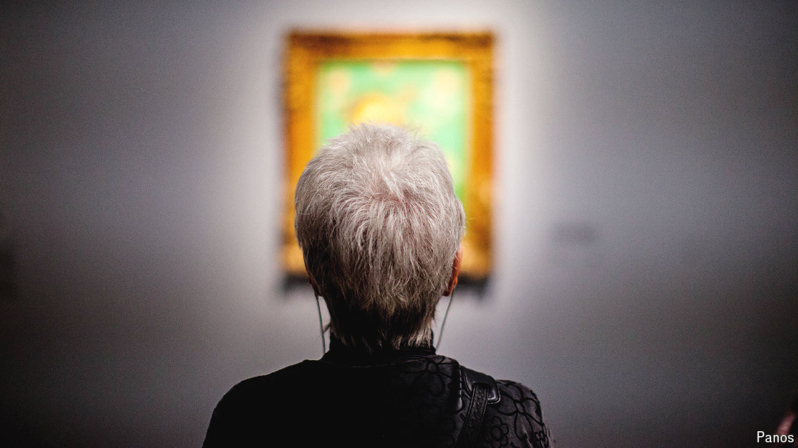

###### Second sight

# Memorable images make time pass more slowly 

##### The effect could give our brains longer to process information 

 

> Apr 24th 2024 

TIME FAMOUSLY speeds up when you are having fun. But it slows down, it turns out, when one looks at something worth remembering. According to research published on April 22nd in , people’s sense of how fast time passes can be influenced by the memorability of the images in front of them. Scientists propose this effect could be a way for the brain to sneak in more processing time before a snap decision needs to be made.

A team led by Martin Wiener, a cognitive neuroscientist at George Mason University in America, tested how visual stimuli alter people’s experience of time. They showed several dozen participants images of different scenes—from empty box rooms to filled stadiums—for between 300 and 900 milliseconds. After each one the participants had to say if the time spent looking at the image was short or long. Their responses revealed that, when the images featured large scenes, such as a vacant warehouse, more time seemed to have passed. The opposite happened when the images were of spaces cluttered with objects, such as an overfull garage.

That was strange. Previous research has found that the experience of stretched time increases with size; for instance, if people are flashed images of different numbers for equal lengths of time, they think the higher numbers are shown for longer. But the cluttered scenes seemed to contradict that trend. To see if something else was at play, the researchers ran another experiment using pictures that differed in memorability. Humans better remember pictures focused on people, actions and centrally placed objects. Dr Wiener’s team used images from a 60,000-image data set, where each image had been judged on its memorability (a man with flowers in his beard: memorable. Foliage: less so).

The more memorable the image, the more it seemed to stretch time. It also worked in reverse: when participants were called back to the lab a day later, they were better at remembering the time-slowing pictures. To help explain the result, the team fed the memorability pictures to a neural network designed to spot objects in images at a pace that correlates with humans. Perhaps counter-intuitively, it was faster at processing more memorable pictures. The researchers believe that this effect in the artificial neural network may be analogous to what happens in human brains. If so, it could be the key to explaining why time sometimes seems to slow down. 

Exactly how processing speed leads to altered time perception is still unclear, but the researchers believe the connection lies in how the brain prioritises incoming information. They propose a new model in which the brain tries to do more processing when it encounters something important, relevant or memorable. It does so, they suggest, by making seconds seem to pass slower, possibly as a way to get more processing done before the body reacts. If a human came face-to-face with a predator, for example, a more sustained burst of thought might be useful, says Dr Wiener. 

That is a new and compelling way to think about what time means for the brain, says Chris Paffen, an experimental psychologist at Utrecht University who was not involved with the work. It would make time “a primary aspect of how we deal with the world”, rather than just a measure of how long something takes, he says. Though it remains little more than a hypothesis for now, its memorability is undisputed. ■


