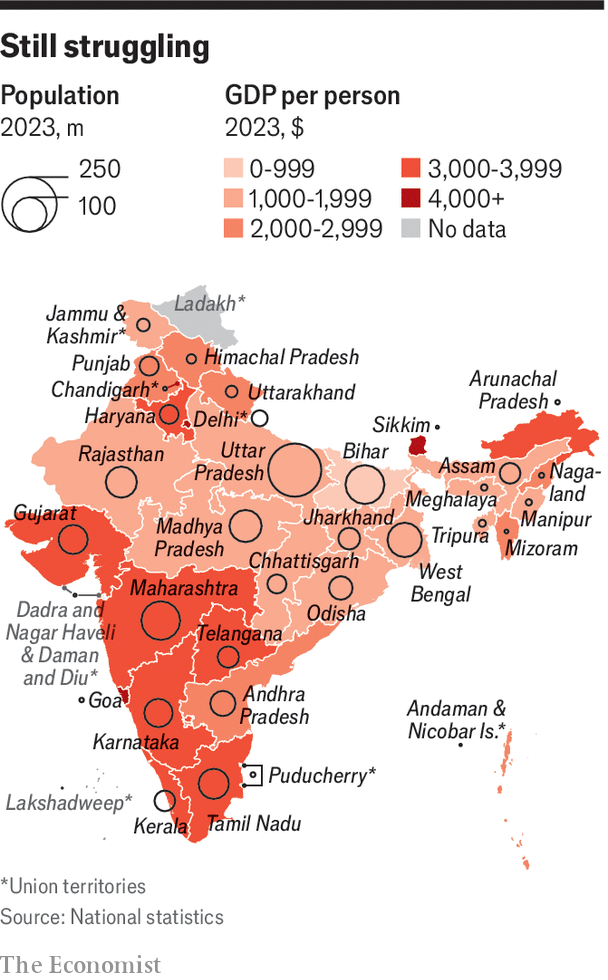
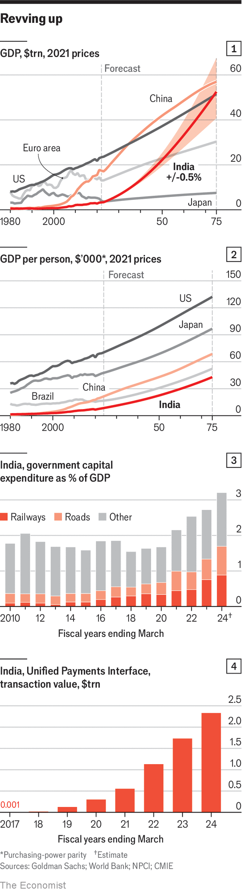
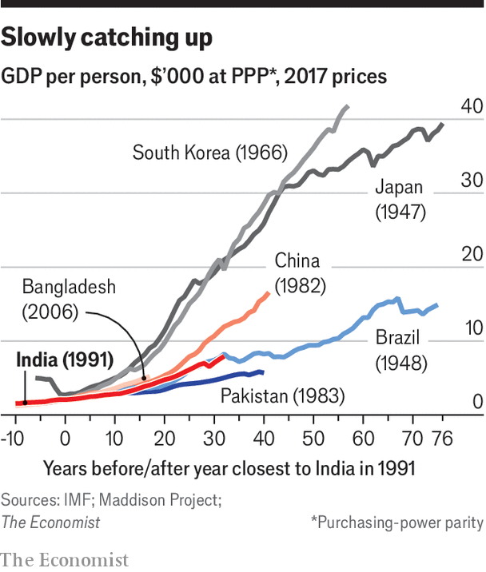

###### The India express

# For its next phase of growth, India needs a new reform agenda 

##### With the right changes, it can become an engine of global growth, say Arjun Ramani and Thomas Easton 

 

> Apr 22nd 2024 

: This is the first of  on the economy of India, published this week.

The consecration of the Ram temple in Ayodhya, a city in Uttar Pradesh, in January was a matter of supreme importance to Narendra Modi, India’s prime minister; attendance was thus  for those seeking his approval. The attendant courtiers included not just politicians, officials and foreign dignitaries but also India’s biggest corporate bosses. Uttar Pradesh is not their normal stamping ground, and Ayodhya has not until recently been much of a destination for tycoons. Now it has 115 hotels under construction, and some of those January visitors may soon be finding reasons to return.

Uttar Pradesh, known as up, is India’s most populous state and also one of its poorest. With 240m people, it would be the world’s sixth-largest country. Its nominal gdp per person is $1,000, less than half the national average; on that basis it would rank around 174th in the world, alongside Tajikistan and Togo.

 


But over the past five years it has been growing at an annual rate of 5.3%—a percentage point faster than the national average—and, since 2021, at 9.2%. The state government’s investment, as a percentage of output, is the highest in India, at 6.6%, says hdfc Bank. New roads crisscross the state. up’s chief minister, Yogi Adityanath, a keen follower of Mr Modi, is clearing red tape and cracking down on crime to attract business. One vivid example: the liquor trade, long a source of financing for criminals, is becoming part of the formal economy, as shown by rising tax receipts. 

Talk of India’s economic prospects often focus on Bangalore, the tech hub, or Mumbai, the financial centre. But Mr Modi’s ambition of , or developed-country status, by 2047 (in the form of a gdp per head of $14,000) needs a broader perspective. It is one in which all the 28 states are capable of competing against each other economically, giving business leaders opportunities beyond the prosperous south.

There are signs that this is happening. In February Tata Electronics said it would invest $3bn in a chip plant in Assam, creating 27,000 jobs in the remote state. In May, what will be India’s biggest vaccine plant will open in Odisha, a middling state on the rise. But the needed change is only just getting under way.

The almost 7% solution

The idea that Mr Modi is a strong economic manager is one reason Indians, who go to the polls this month and in May, are likely to give him a third five-year term in office. gdp grew at a blistering 8.4% in the year to the fourth quarter of 2023 (though the underlying trend is closer to 6.5% because of quirks in how India measures gdp). But overall growth during Mr Modi’s tenure has not been remarkable by the country’s standards since it embarked on a path of liberalisation in the early 1990s. That was when India’s elites decided that the highly regulated socialist system (the “licence raj”) of the decades following independence needed wholesale reform, a process which has played out with remarkable continuity, despite changing political tides. Over three decades of reform, growth has averaged 6.4% a year. Though it has averaged 5.6% during the decade of Mr Modi’s rule, that has been in line with a broader slowdown in global growth. 


Yet robust growth since the pandemic and a strong outlook ahead has pleased voters and impressed outside observers, not least because it is measured against a world where growth remains sluggish. Since 2021 India has been the world’s fastest-growing large economy, and 6.5% growth would be more than twice the global average. If that average stays around 3%, India would account for 15% or more of the total this decade. But compared with other countries in the recent past, the rate might seem disappointing. East Asian countries grew at rates above 10% in their heyday. China and India had similar incomes per person in the 1980s. China is now five times richer. 

 


Few in India believe the country can achieve double-digit growth. The East Asian countries benefited from huge inflows of foreign investment and the exports of a job-rich low-skill manufacturing sector. That helped them deepen their links to global value chains at a time of rampant globalisation. India’s rise began later and followed a different path. That is hardly a surprise; in its size, religious and linguistic variety, it is unique. Governmental responsibilities are divided between the centre and the states in ways that make rapid reform tricky. 

India’s path has, therefore, been singular: its exports have been led not by manufacturing but by a productive yet job-poor it and services sector, and its companies are led by a handful of sprawling conglomerates along with a long tail of small informal businesses. Sustaining growth rates of 6% or more would be consequential. Goldman Sachs, a bank, expects India to become the world’s third-largest national economy this decade. Bump growth rates up just half a percentage point, cross your fingers and extrapolate wildly and it could even reach the number-one spot by 2070 (see chart 1), though it would still only be half as rich as China and a quarter as rich as America per person (see chart 2).

To achieve that growth, and have a fighting chance of boosting it, the future must look different. Because of the country’s remarkable diversity, there is no simple national nostrum. It will need everything from increasing competitiveness in labour-intensive sectors like textiles to growing prowess in high-tech sectors that blend services and manufacturing. That will require a deeper single market to boost domestic business, more innovation to export at the global frontier, and a stronger state that delivers on basic services to ensure India’s copious young talent is unleashed.

Cleaning up

Mr Modi’s two terms have seen progress on some of this. The financial sector has been cleaned up and enjoys growing global credibility. The corporate sector has a return on equity above the global average. That reflects a healthier business environment, including a national goods-and-services tax, introduced in 2017, that works across state lines and creates revenues which exceed those of the old state-based system. Public-infrastructure investment is surging (see chart 3); the national road network has grown by 60% over ten years, double the rate of the previous decade. 

Digital infrastructure has become even more impressive. Building up the national identity system called Aadhaar, begun by the previous government, has laid the foundation for a payment system that 300m Indians use every month (see chart 4). It has also enabled most households to get a bank account. Welfare payments are now paid electronically and credit is easier to access. The number of new business registrations in India has tripled since 2015. 

 


But there is no avoiding the economy’s shortcomings. The labour market is weak, with a majority of Indians underemployed or out of the labour force altogether. That limits consumption, and exports do not make up the shortfall. Indian education is partly to blame and cities lack the governance needed to accommodate vast shifts of people from rural to urban areas, a potential boon for productivity. Tackling these issues needs a lot more co-operation between central and state governments than financial reform does, and better relations with state governments have not been Mr Modi’s strong suit. Some, like up’s, are led by politicians of the prime minister’s stamp. Many are not.

Mr Modi’s muscular management style has had some benefits, not least pushing through some big national projects. It has also strayed into bullying and an increasingly authoritarian approach. Yet the country’s basic political structure is still democratic, so consensus-building will be needed. Thirty years of reform have laid a foundation for India to reach scale. To achieve its potential, a new agenda just as ambitious as that of 1991 is needed. In surveying the landscape to ascertain where India is heading, a good place to start is where it has turned weakness into strength: the financial sector. ■

