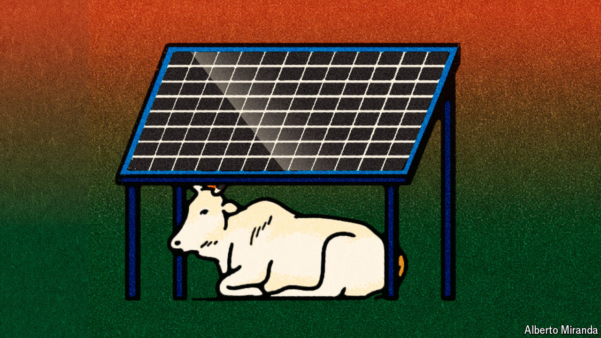

###### Stellar solar

# Going green could bring huge benefits for India’s economy 

##### But it is also bringing plenty of tensions 

 

> Apr 22nd 2024 

Every day 1,000 trucks jostle along a single-lane road to Khavda, near India’s border with Pakistan, to build the Adani Group’s 730 square kilometre solar and wind farm. When completed, the project, with 30 gigawatts (gw) of capacity, could provide 4% of India’s current electricity consumption.

 In all, Gautam Adani plans to build 45gw of renewable-energy capacity by 2030. Between them, he and Mukesh Ambani, India’s biggest tycoon, will together invest $150bn over the next decade in renewables. Over the past five years, over 80% of the newly installed generating capacity in India has been in the renewable sector. Narendra Modi, the prime minister, wants to increase renewable capacity to 500gw by 2030. 

Impressive stuff; also sorely needed. India’s coal-fired power plants are a major contributor to the atrocious outdoor air quality that killed around 1m Indians in 2019; add this burden to the indoor air pollution which kills around 600,000 and the total effect is calculated to be costing India 1.4% of annual output, according to a study in the . The power stations also pump out a lot of carbon dioxide: 1.8 gigatonnes in 2022, 12% of all the world’s emissions from coal, and rising. India’s share of the world’s cumulative emissions from fossil fuels and industry is very low: just 3%. But as a country which will be very badly affected by a hotter climate, it has a powerful interest in future emissions being as low as possible, and that will mean cleaning up at home.

Despite all this, India’s emissions continue to rise. Coal-fired power stations have allowed a tripling in the country’s electrical power consumption in the past 20 years. Even if its renewable goals are reached, which would require the pace of the build-out to increase from today’s 15GW a year to almost 60GW a year, the rate at which consumption is growing leads the government to think more will be needed: 80gw of new coal capacity by 2031, according to R.K. Singh, the minister for power. 

There are clear incentives for doing more. Solar panels are cheap and getting cheaper, and India is a sun-drenched place, making them even better value than they are elsewhere; what is more, roof-top solar is heavily subsidised. Solar installations which allow businesses to reduce their reliance on the state-owned power-distribution commissions offer the potential for big savings: the “discomms” have long charged industry extra to subsidise agriculture. 

There are also barriers to bring down. The government is slashing red tape to get renewable projects connected to transmission systems faster and using reverse auctions to prioritise the most cost-effective ones. 

If solar power brings with it electric vehicles, there are more big wins. Electric scooters and cars will not just further reduce air pollution and reduce the economy’s exposure to global oil prices, a chronic source of vulnerability. Those manufactured in India, or using Indian batteries (Ola Electric is building a battery gigafactory in Tamil Nadu which it says will be the largest in the world), could also, with the right trade deals in place, offer an exciting export market, offering the world an alternative to those exported from China. 

It will not be plain sailing. Among other things, China does not want a rival. Sumant Sinha, the boss of ReNew, a clean-energy firm, says the country is blocking the export of equipment to make solar wafers so as to prevent India gaining a foothold in green supply-chains. Indian diplomats accuse China of “dumping” batteries , electric vehicles and other clean-tech goods on global markets. Green ambitions have put India in the middle of a trade war. ■

