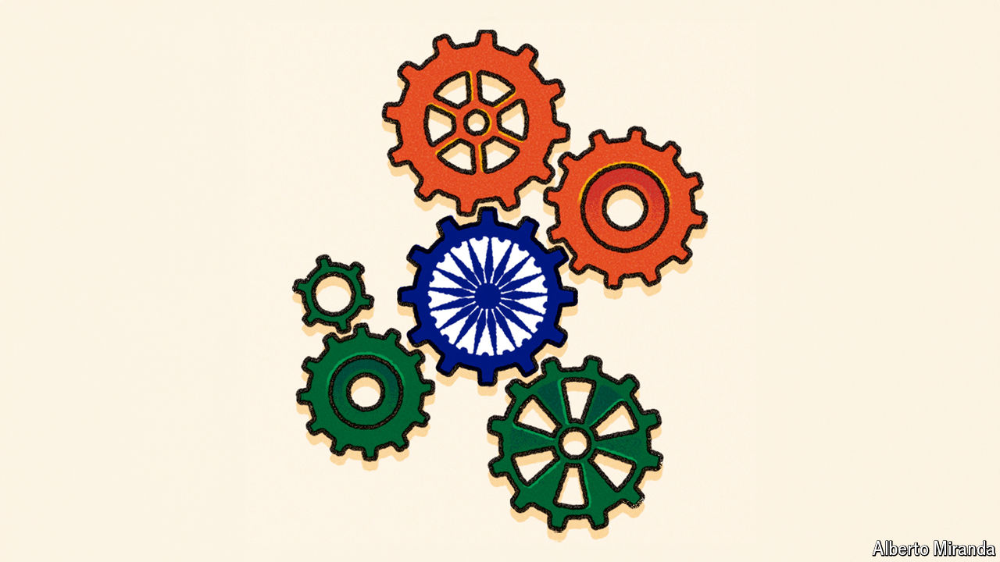

###### Building for the future

# India must make much deeper changes if it is to sustain its growth 

##### Improved human capital and a better relationship between the centre and the states will be crucial 

 

> Apr 22nd 2024 

At the start of the 18th century India was one of the world’s two largest economies, with China the other. Part of that came down to sheer population and, in India’s case, being colonised by the country which led the Industrial Revolution put paid to that. When it achieved independence from Britain in 1947, India made up just 3% of the world economy (adjusted for purchasing power). In 1991, when its great liberalisation started, the figure was 1.1% (at market exchange rates). Today it is 3.6%, spread between 18% of the world’s population. If it can keep growing at 6% or more, as it has for the past 30 years, then by the time of the modern country’s 100th birthday, it will represent 10% or more of the world economy. And depending on assumptions about growth elsewhere, it could be back in the top rank by the 2070s.

But 30 more years of such growth is a tall order, and it will need a wider and deeper national consensus than that which drove the past 30 years of liberalisation. It will require a new compact between central government, state government and the cities where growth will be concentrated. And, India being India, it will require flexibility. There is no simple one size fits all for the world’s most populous and diverse country. 

Some of this can be achieved by deepening the liberalisation which has been supported by most of India’s elites so far and which can be achieved by central government on its own, electoral politics permitting. An obvious part of this agenda is trade. 

For much of his tenure, Mr Modi has been ambivalent about trade deals, reflecting a belief that past deals hurt India. The country “signed ftas with all the wrong countries...for all the wrong reasons,” says an industrialist who advises Mr Modi. The industrialist adds, though, that there is growing recognition that growth requires exports, and exports require deals. The exact contours of the new strategy are unclear but, since 2021, India has done deals with Australia, the uae and, in March, four small European states. Britain could follow. The biggest prizes are the markets of America, the European Union and Asia. Though America is off the table because of its own domestic politics, negotiations with the eu are ongoing. 

A side-benefit of liberalisation would be that India could step back from the subsidies it currently offers exporters. A recent analysis by researchers at icrier, a think-tank, suggests the subsidies and tariffs are partly cancelling each other out. Average tariff levels have grown from 13% to 18% in the past decade, driving up the prices of imported goods which exporters need, as India’s domestic suppliers are too meagre to be an adequate substitute. The fact that the government has its feet on both accelerator and brake may explain why the subsidies have not yet borne much fruit. 

There is also much the central government can do to boost the tax base. India’s tax-to-gdp ratio is a middling 18% and has barely budged over the past decade. Just 0.3% of Indians pay 76% of income tax, suggesting the base needs to expand. One impact is an 80% debt-to-gdp ratio, the third largest among big emerging economies, which brings with it interest payments which eat up 20% of the annual budget. The introduction of the goods-and-service tax (gst) shows that tax reform is possible and can increase revenues. Further simplifying the tax system would boost compliance and returns. 

One of the things more revenue might be used for is R&amp;D. India’s r&amp;d spending is 0.7% of GDP. In China it is 2.4%, in oecd countries, on average 2.7%. Companies are especially lagging in India. Naushad Forbes, a boss in Maharashtra, says that Samsung, a South Korean firm, spends more on r&amp;d than all of India combined. More money would keep top researchers in India. Cutting bureaucracy would, too. International collaboration remains mired in red tape. 

There are other ways to improve the government’s budget. Divestment from state-owned entities would cut overall debts as well as opening more of the economy up to competition. An obvious place to cut spending is on agricultural subsidies, which make up nearly 10% of the budget. But these are a political minefield into which the prime minister has made only a few forays, none of them successful. 

The centrifugal and the centripetal

One of the things which might help him do so is a new relationship with the states. The division of power between the centre and the states is one of the things which makes India possible—and also one of the things that can make governing it feel impossible. Many of the reforms which seem obvious to outsiders but remain undone are in domains where the Indian constitution divides power between centre and states (as with labour, energy or schooling) or invests it in the states alone (as with land). 


Building consensus is thus a necessity, not just among elites, as has been done with the case for liberalisation since the 1990s, but among groups nationwide whose interests are often only partially aligned. India’s late finance minister, Arun Jaitley, was crucial to the passage of the gst because he helped convince state governments to sacrifice autonomy for the sake of the national market. No one has taken on that role. 

The need for more such bridge-builders is great; only by securing active participation between all levels of government will the reforms of tomorrow be achieved. Take the deepening of the internal market, which is vital to providing jobs and new scope for growth. At the national level a new labour code is still restrictive, but it has at least shortened a list of rules. The obstacles are even greater at the state and local levels. Contract enforcement remains weak. One study found that filling judge vacancies in district courts would produce economic gains 30 times the costs. Land-use restrictions and highly indebted state-run energy-distribution companies raise costs for firms. 

Or take schooling. Any serious plan to boost Indian growth also requires far deeper human capital beyond the elites. This is true even if you think India should focus on manufacturing. The boss of a global manufacturer that is planning to double its rate of investment in south India this decade, says he faces bigger talent bottlenecks hiring for roles like design and marketing than for factory workers.

India now has near universal enrolment in primary school. But aser, a nationwide survey, suggests that outcomes plateaued in the 2010s and then fell during the pandemic. In 2022 only two-fifths of students leaving primary school in rural India could read a text intended for second-years. Teacher pay is not bad, yet teacher absentee rates are often 20-30%, suggesting poor governance. And teaching is parochial, too. One of the barriers to internal migration is that schools often teach in regional languages, not national ones. Much as central government might like to drive reform, it cannot; the machinery of education operates at a state and local level to which it has no access.

Leaders within the bjp do not deny this. They suggest the fact that states are increasingly competing with each other for investment, as Mr Modi did when he ran Gujarat, is a reason for optimism. Some think the central government should use its control over most tax revenues as a stick and a carrot to incentivise more states to follow national priorities. Still others argue that if only the bjp had control over more states, as it does through leaders like Yogi Adityanath in Uttar Pradesh, and a whacking majority in the centre, the country’s problems would be solved. But there are reasons to think something deeper and subtler is needed.

Softly, softly

Much of what India needs—from making courts efficient to shoring up education—depends on improved capacity, especially at the local level. In 1992 India amended its constitution to shift many functions of government to the local level. But the amendment stayed on paper. As N.K. Singh, the chairman of the 15th Finance Commission observes, “the three F’s—funds, functionaries and functions” did not follow. Just 15% of government employees work at the local level: in China and America the figure is 60%. Local government spending accounts for a paltry 3% of resources, compared with 50% in China. 

 


Local does not necessarily mean small-scale. The problems of “governance mismatch” are acute in big cities, where elected mayors are ceremonial and control sits with state-appointed bureaucrats less responsive to local concerns. Much of India still sees itself as fundamentally agrarian, and so governance often ignores the needs of cities. “The joke is that you become the chief minister of Maharashtra in order to gain control of Bombay,” says an adviser to the government. Since most growth comes from the cities this matters a lot. The increasing need for cities to become centres of innovation, with well-run universities surrounded by entrepreneurs, makes the issue particularly pressing.

Broadly speaking, the quality of Indian government is proportional to the scale on which it is exercised. This makes the idea of delegating power down the chain of governance seem fraught to central and state governments alike. But for a really large country to develop quickly some such restructuring is necessary. Chinese reformers under Deng Xiaoping realised this early on. India has yet to grasp the nettle. 

A national conversation is needed to obtain the buy-in of groups that stand to lose from reform. Mr Modi has made progress extending his party’s support among lower-class groups, but there is still a big divide between urban and rural areas and between the centre and the southern states, and Mr Modi has stirred up animosity towards Muslims and other minorities. In 2020 he tried to reform agriculture, but pushed through the changes without consulting anyone, causing massive protests, and ended up backing down. Bolstering city governance has stalled because no one wants to give up power.

India is a diverse democracy, in which no party has ever won more than half the vote, and a federal one made up of 36 diverse states and territories. Leaders cannot bulldoze everything through. That is why building a lasting consensus around reform is essential to sustaining India’s rise, a consensus as enduring as that on liberalisation in the early 1990s but far wider based. If that can be done, not only will 1.4bn people be better served, but the world at large could have a new engine of growth. ■

