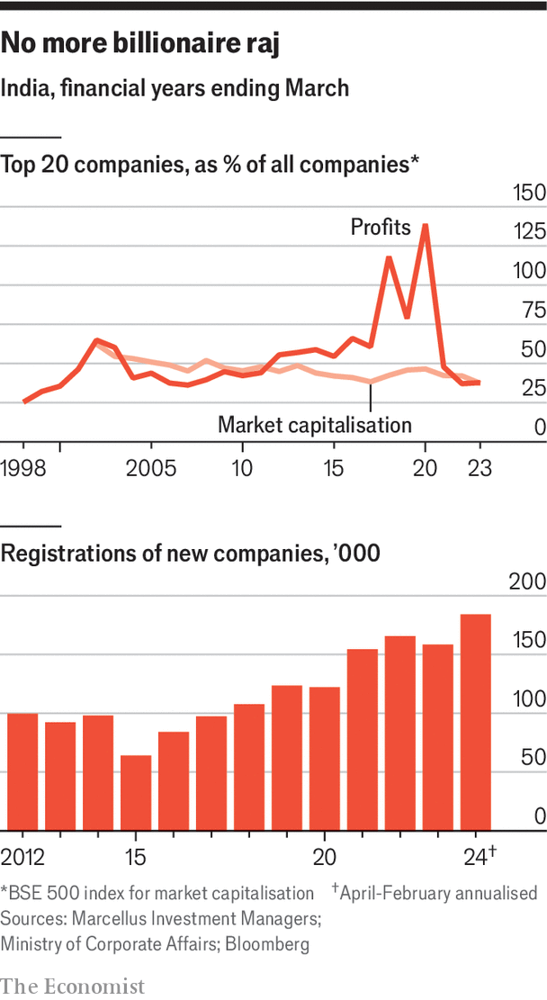
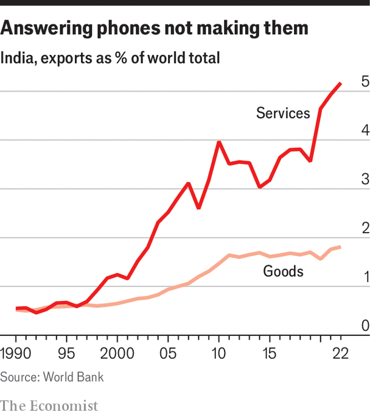

###### Functioning anarchy

# India’s difficult business environment is improving 

##### The changes are allowing Indian firms to become more dynamic 

 

> Apr 22nd 2024 

Ramesh Muthuramalingam founded Alphacraft, a manufacturing firm, 25 years ago in a small workshop in the southern city of Coimbatore. It now operates out of a 4,500 square-metre (50,000 square-foot) factory, piled with aluminium cast parts. It employs 400 people and will soon open a second facility of similar size. Customers include Indian startups, notably Ola Electric, a fast-growing local scooter manufacturer, and global companies including Britain’s Aston Martin and America’s John Deere. 

Foreign firms are newly interested in companies like Alphacraft because of three shifts: a desire to lessen their dependence on China; a belief that Indian production can now meet global standards; and the fact that India itself is a fast growing market that favours local production for its own products. 

In the past, the biggest block to growth was not customers, but financing, says Mr Muthuramalingam. For most of the firm’s existence, interest rates over 15% were common, if money was available at all. Over the past year, the rate it pays has fallen to 10%. Availability has improved, though the long-term debt best suited to capital investment remains scarce. The shift to a single goods-and-services tax, electronically filed, has made sales in other states easier. 

The growth and diversification of firms like Alphacraft suggest India is becoming more open. A spate of pro-business policies, some of which began under previous governments but have been pursued by the current one, have been crucial for this. That is why most of corporate India backs a third term for Mr Modi. 


The reforms also reflect a broader change going on within Indian business. A century ago the American corporate world, after a period of frenetic growth, underwent profound structural change as owners gave way to professional managers, and companies reconfigured themselves in accordance with shareholder demands. Some of that is now happening in India.

Professional eyes

Based on the market value of holdings, what are known in India as “promoters” (that is, those who have a controlling stake in the company, usually the founders or their descendants) still own slightly more than half of the value of companies trading on the Indian exchange. A study by the National Stock Exchange has found that control of companies by promoters declined between 2009 and 2019; though that trend has since levelled off, other evidence suggests that non-promoter management is increasingly valued. A survey by ema Partners, an executive-search firm, on million-dollar compensation packages showed the number of outsiders who have reported salaries which put them in that bracket has risen from 61 in 2016 to 119 in 2023. 

 


The difficulties of doing business in India and the lack of broadly available finance are two reasons why large conglomerates have dominated the economy—they have been able both to obtain finance and handle a prickly state. But there are hints of change. A study by Marcellus, a money-management firm, concluded that in 2019 the top 20 companies in India earned 79% of all profits. The figure fell to just 38% in the fiscal year ending in March 2023. The share of the bse500’s market capitalisation held by the top 10 firms has fallen from 33% to 26% in the same period. The shift is being driven by the expanding breadth of successful companies. The number of listed firms valued at more than $1bn has increased 20-fold since 2000. 

That said, the big conglomerates are still influential. Reliance Industries dominates telecoms and refining, and is expanding into entertainment. The Adani Group is the largest manager of airports and seaports and the second-largest producer of cement and power. Though broader corporate concentration may be weakening, these firms have seen continually increasing market shares. The recent data could turn out to be a post-covid blip. Tata Sons is, through subsidiaries, the biggest of all, owning the largest it consultancy and interests in cars, hotels and steel. The Bajaj Group owns the largest non-banking finance company and builds appliances, motorcycles and rickshaws. 

State-controlled firms also continue to play a big role. The collective valuation of those listed on India’s stock exchanges is $804bn. Hindustan Aeronautics (defence), pfc (financing of energy projects) and the State Bank of India all dominate their sectors. 

A handful of foreign-controlled firms remain important, including Hindustan Unilever and Nestlé in consumer products, Maruti Suzuki and Honda in vehicles, and Google and Amazon in tech. And some global supply chains have shifted as India has become the “+1” in an increasing number of China+1 strategies. 

But other foreign consumer-product companies, such as Whirlpool, and giant pharmaceutical companies, such as AstraZeneca, as well as cultural icons such as Disney, are reducing their stakes or teaming up with a local partner, having found that India is a tough place to go it alone. Foreign-direct-investment flows into India, which surged in 2020 to 6.2% of the world’s total, have since fallen to a decadal low (1.1% of the world in the third quarter of 2023). This is partly due to higher interest rates, but also because of the tough operating environment for foreign firms. 

Formal eyes

Many Indian companies are now doing well. Leverage has been declining since 2015, such that the finance minister recently said India has swung from the weakness of overleveraged banks and firms to the strength of healthy banks and underleveraged firms. Return on equity for listed companies has been improving since 2019 and exceeds the global average. Profits, lockdown excepted, have been rising strongly since March 2018. The economy has been boosted as informal activities like village money-lending and pushcart sales shift to banks and stores.

 


There have been pockets of disaster. Byju’s, an ed-tech firm that was once India’s highest-valued startup, at $22bn, is now almost insolvent. Paytm, another star of the short-lived venture-capital boom of a few years ago, played a critical role in spreading electronic payments in India. It was valued at $20bn at the time of its ipo in 2021. Its share price has fallen 73% from the post-offering peak, a reflection of how hard it is to turn a valuable service into a profitable business. 

But smaller manufacturing firms are growing. States such as Tamil Nadu, home of Alphacraft, are being transformed by them. Along the new roads there, a vast electronics-assembly industry has emerged, led by local firms like Tata and foreign ones like Foxconn and Pegatron. There are new factories for electric vehicles, green-energy products, shoes and clothing. Since 2021, $10bn has been invested in 130 new projects in the state, with another 48 under way. 

One important new development is “global capability centres”—tech centres used by the world’s biggest firms. Unlike the outsourced call centres of old, these also provide engineering, semiconductor design and r&amp;d automation, as well as product development. In Tamil Nadu new entrants include ups and Roche Pharma. Some 1,600 others across the country serve firms such as hsbc, Target and Tesco. These centres are, in some ways, like the Chinese factories manufacturing for foreign firms, but more important. They do not just take orders; increasingly they give them, too. 


Since their product is data, they are immune from much of the craziness of doing business in India, from bad traffic to obstructive customs procedures. A new study by Wizmatic, a consultancy based in Pune, says they employ 3.2m people, generating $121bn in revenues including $102bn in foreign currency from exports, making them one of the biggest sectors in India.

Stable eyes

The government has become increasingly pro-active in helping all of these changes. It has done much to  the financial sector. Administrative changes have led to a surge in business creation. A central-government department has been created to remove obstacles to doing business. In 2020 it became possible to set up a company entirely online. In the same year the government introduced “production-linked incentives” (pli) in 14 sectors, which involve direct payments of at least 4% of revenues, to help firms get established and then phase them out once scale has been achieved. In 2019 corporate taxes were reduced from 35% to 25%. 

Against this background, India is becoming more innovative. A study by PatentVector, an analytics firm, showed the valuation of Indian patents has more than tripled over the past five years, as the filing process has been simplified. A private space industry has emerged, with more than 200 firms filling the sector. Two are on the verge of launching rockets. 

Many problems remain. Ease of doing business has not improved enough. Legal disputes are backlogged—as of December, there were 50m cases pending in the courts. It remains hard to obtain usable land, to initiate redundancies, and to hire on the basis of merit. New projects can still require dozens of permits. Too much still revolves around finding, and buttering up, the person who can get things done. 

All this may explain why the government’s capital investment push has yet to “crowd in” the private sector to the degree Mr Modi would like. ’s analysis of firms in the bse500 index of listed firms, using data from Bloomberg, shows that investment as a share of revenues was 6.3% in the financial year to March 2023, down from 7% before covid. Optimists hope that announcements of new projects, which rose to decadal highs in 2022, indicate an impending surge.

There is also policy uncertainty. Taxes and tariffs on imports and exports change frequently. The demonetisation of the two-largest banknotes in 2016 crushed small businesses and startled large ones. Firms worry about political interference, and whether the rule of law is reliable in India. According to data collected by Henley and Partners, a consultancy, India had a net outflow of 14,000 millionaires in 2022 and 2023, the highest after China and just beating Russia. 

Much change still needs to happen. But that the government is even being talked about as a growing part of the solution, rather than the biggest part of the problem, makes it clear how far India has come. ■

