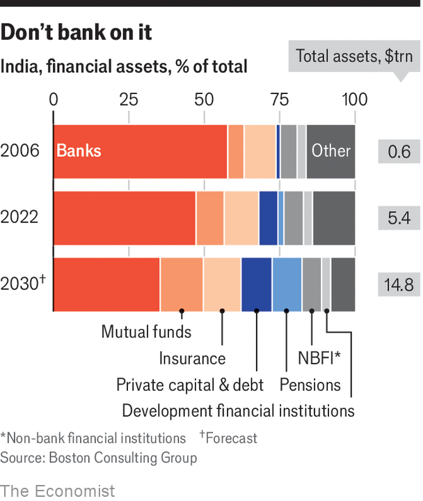
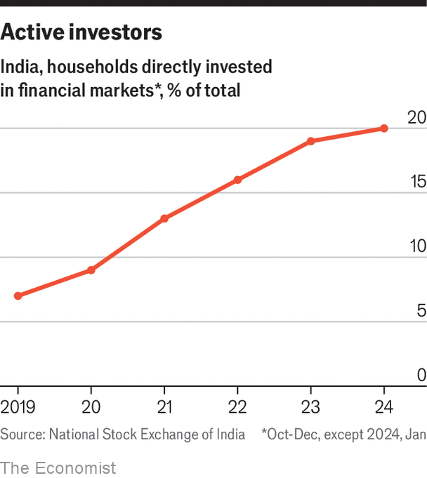

###### Surprise winner

# India’s financial system has improved dramatically in the past decade 

##### There is much more change to come 

 

> Apr 22nd 2024 

: This is the second of  on the economy of India, published this week.

In “lombard street”, published in 1873, Walter Bagehot, then editor of  wrote that the City of London’s success was based on taking funds that elsewhere were kept under floorboards, and putting them to use. He might have found what is unfolding in modern India to his liking. 

But for those dormant funds to be used, the system first had to be repaired. In 2013, the year before Narendra Modi became prime minister, Morgan Stanley, a bank, had grouped India with other financially troubled countries—Brazil, Indonesia, South Africa and Turkey—into what it called the “fragile five”. India’s weak capital markets were contributing to three big problems: financial and balance-of-payments instability; no way for ordinary people to save; and a high cost of capital for business. There was also high inflation and a growing problem of non-performing loans at state-run banks. 

Ten years on, inflation is stable (if a little high) and India is less dependent on capital flows from abroad. It has large foreign-exchange reserves, strong domestic savings, and adequate exchange-rate management. More change is needed. But reforms have moved it to a position of comparative strength. Indian finance, and thus India itself, is becoming more credible.

In 2010 state-run banks, then the largest component of the financial system, were rotten and threatened to drag down the rest. But in 2013, the previous government brought in a professor from the University of Chicago, Raghuram Rajan, to run the Reserve Bank of India (rbi). He initiated an “asset quality review” that put an official stamp on the country’s “twin-balance-sheet problem”, the holes on both bank and corporate balance sheets. In 2016 a new bankruptcy code was introduced. Bad loans worth $106bn were written off, and there was an injection of government money, forced financial consolidation and new rules.

Between 2017 and 2019, the government merged 27 government-run banks into 12. Rules were changed to allow dbs, a Singaporean bank, to acquire Lakshmi Vilas bank in 2020, allowing an outsider to have a large branch network for the first time. The tighter reporting regime brought revelations which led to the failure of five major Indian financial institutions.

Cliff edge

It looked like India might fall off a financial cliff. In retrospect, an inflection point had been reached. Non-performing loans at state-controlled banks have since declined from 15% in 2018 to 4% of assets. 

As the weakest components of the system were strengthened, other aspects that had been seeded decades before came into their own, starting with a handful of new private banks. hdfc Bank, founded in 1994, is now the world’s tenth-most valuable bank by market capitalisation. It returns 16% on equity. JPMorgan, America’s leading bank, returns 12%; European banks, on average, just over half that. 

The new healthier system has enabled credit to be available for consumption, housing and industry. The private banks have boosted the number of branches by 60% since 2015 to 163,000 (America has 78,000). This has had a huge effect in villages, as consumer finance has shifted from local lenders charging 10% per week to bank loans at annual rates of 15% or below. 

The big push to help poor people open basic bank accounts—520m have been opened since 2014, and they now hold $28bn—has been crucial, helping to transform India’s masses into savers, providers of capital and, possibly, entrepreneurs. Since the accounts are linked to India’s new digital payment and identification system, they are records that can be used to evaluate and grant credit. This may explain a recent increase in lending to small businesses. 

 


Stockmarkets, too, are booming, reflecting the success of Indian business and the expansion of available capital. Ten years ago, capitalisation of India’s stockmarkets was smaller than Spain’s. Now neck and neck with Hong Kong’s, only America’s, China’s and Japan’s surpass them. Based on long-term growth rates, bcg, a consultancy, says India’s will become the second-largest in 2036. The proportion of the population owning shares of some sort has risen from 7% to 20% since 2019. Small monthly payments into mutual funds through “systematic investment plans” have risen sharply. From 2013 to 2023, fund assets under management rose by over 600%. They now account for 9% of equity holdings in the Indian market. Money flowing into the stockmarket is not idle. A record number of firms has gone public already in 2024. 

In developed markets, this kind of growth could seem like a bubble, and that may be part of the story. It may also just be catch-up. A study by Deepak Parekh, one of the architects of India’s private financial system, found that fund assets equate to only 17% of gdp, compared with an average of 80% in developed markets. This “under-penetration” is clear in other areas such as consumer credit, totalling 37% of gdp compared with 62% in China and 80% in America. 

The Indian financial system is slowly reconfiguring itself to deal with these imbalances. In 2006, 56% of assets were in the banking system. In 2022 the proportion was 48% and bcg predicts that will shrink to 36% by 2030 (see chart). In place of the banks will come components of more mature capital markets: funds, pensions, insurance companies, private equity and more venture capital. Life Insurance Company of India, listed by the government in 2022, was the world’s fourth-largest life insurer in 2023 by market value. A common theme in these expanding sectors is their desire to use capital to foster growth. 

Not everything is rosy. A surge of foreign venture capital starting in 2020 has imploded as a result of some big tech startup failures, from a record $42bn in 2021 to $2.5bn in the first quarter of 2024. Commonly published valuations of private firms are being written down; many will crash. But none of this seems to affect the general public or the domestic stockmarket.

 


The bond market, too, is still in an early stage of development. It has grown and become more free, but it is still run to finance the government and is largely unavailable for all but the largest firms. Even for them, the long-term debt that is best suited for the big capital investments that India needs is often unavailable, and must be obtained overseas, with additional costs. However, a healthier system creates its own opportunities. India has asked all the big global ratings agencies to upgrade its borderline junk status, which has been left unchanged since the mid 2000s. 

An upgrade would signal India’s rising stature. It would also help to lower the capital costs which impede investment and growth. The most solvent companies pay 8% or more on bank loans, compared with under 6% in Singapore or America and under 2% in Japan. What is more, a high sovereign rating would provide an underpinning for the issuance of long-term corporate debt.

In September, JPMorgan will be adding India to a government-bond index, in January Bloomberg indicated it will do the same. Foreign portfolio investment hit a record $40bn in the year to March. Money is being put to better use. Bagehot might applaud. ■

