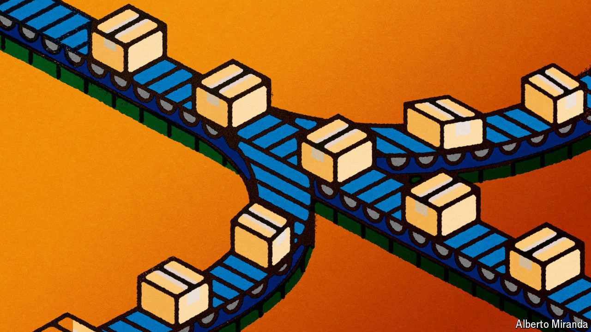
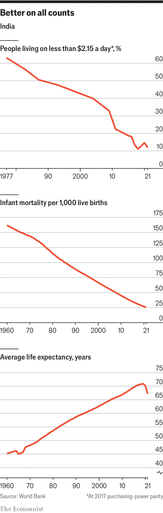
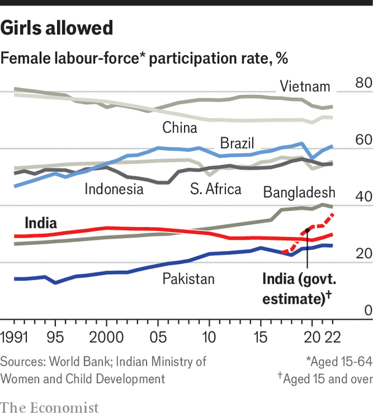

###### A tricky trio

# India’s leaders must deal with three economic weaknesses 

##### For growth to become more sustainable, it needs to be broader based 

 

> Apr 22nd 2024 

When shashi tharoor, a stalwart member of parliament for the opposition Congress Party, criticises the current growth model as “trickle-down economics” that doesn’t trickle down, he has a partial point. Estimates of this nature are fuzzy, but from 2000 to 2022, the wealth share of the top 1% of Indians grew from 33% to 41%, making India the second-most unequal major country in the world, after Brazil. In other ways, though, the problem is a lack of trickle up. The economy is not allowing those with low incomes to become a source of growth. 

India’s economy has three intertwined deficiencies: its poverty means there is not enough demand; there are not enough people in the workforce; and there is not enough geographical spread in the benefits of growth. The progress that the country has made in reducing the effects of poverty through redistribution goes some way to minimising the pain of these deficiencies; the standard of living is improving (see charts). But if economic growth is to last, these deep-seated deficiencies must be addressed. 

Start with the lack of demand. Though India’s gdp is $3.7trn, just 60m of its people earn over $10,000 a year. That is less than 5%. Over the past decade consumption per head grew by just 2.5-3% a year. 

 


When domestic demand is insufficient, the obvious answer is to tap into foreign demand through exports. A casual comparison to the rise of China might suggest that, blessed with the largest pool of cheap labour in a single market that the world has ever seen, India should be a manufacturing giant exporting to all and sundry. Part of the reason that it is not is that too much of that cheap labour is unskilled. But there are other factors at play. 

Bhuvana Anand of Prosperiti, a Delhi-based think-tank, points out that the Indian reforms of the 1990s were restricted to the national level; regulations on land and labour, which are state matters, went mostly untouched. That is in stark contrast to the reforms which were turning China into an export powerhouse at the same time: there land and labour markets were very flexible. Even today, India has laws that require factories to get state permission to fire workers if they have over 100 employees on the books. One reason the tech sector has so outperformed manufacturing is that it has been far less regulated, says Poonam Gupta of Mr Modi’s Economic Advisory Council.

What is more, as Raghuram Rajan and Rohit Lamba observe in “Breaking the Mould”, a recent book, China’s growth created a world where following in its path is no longer an option. China already serves the world as a workshop, and manufacturing has become more automated. The power China has derived from its growth at a time of rapid globalisation is one of the reasons why the world is now de-globalising, a development that helps India in as much as “China+1” policies may favour it but which is also a big challenge. 

 Pawan Goenka, a retired businessman who heads a government committee on advanced manufacturing, says that today Indian exporters are at a big cost disadvantage compared with those in China. He breaks the gap down into logistics costs, high factor costs (such as for power), the tariffs other countries put on Indian exports and a lack of scale on the part of the firms involved—“All of which”, he says, “are being worked on.” 

Infrastructure investment can help with logistics, and the government can do something about trade. Having fought shy of trade agreements for some time, Mr Modi’s government is now pursuing a number of them in the hope of cutting tariffs on its exports of agricultural goods, cars and textiles. 

On the basis that these and other measures will take time to have their desired effects, the government is also offering subsidies to encourage exporters: a $26bn pot of production-linked incentives (pli) for firms (including foreign ones) in 14 industries. With only $1bn disbursed to date, some have doubts about the government’s commitment to the scheme. 

Churn out those e-widgets

Electronics have emerged as a bright spot. In 2023 came the news that Apple planned to increase its production of iPhones in India, then around 7% of global supply, to 20% by 2026; it is reported to have already reached 14%. Google will soon begin making Pixel phones in India. Apple’s confidence suggests that, with openness to foreign companies, India can compete in high-tech products. But that has yet to change the overall trajectory. India’s share of global manufactured exports is flat. Corporate investment and foreign direct investment have yet to take off.

Not cracking the export market limits the demand for labour, contributing to a sluggish job market: the second deficiency, and one that is being exacerbated by demographics. Over half India’s population is under 25. Every year 10m people join the workforce. That should be a boon for the economy. Unfortunately it is not creating productive jobs at a commensurate rate.

 


Getting a handle on the true size of the problem is hard, particularly when it comes to women, whose labour-force participation is particularly low. Anantha Nageswaran, the government’s chief economic adviser, noted in a recent column that one should expect women to drop out of market-based work as families shift away from agriculture and incomes increase. Indeed, the Nobel prize in economics in 2023 was awarded partly for work showing that female labour-force participation follows a “u-curve” as countries develop, dropping and then rising again. Yet this phenomenon should apply broadly, and India’s rate seems to be well below that in other countries (see chart). There are many complex factors behind this. But there are also simple ones like restrictive labour laws; in many states, for example, women are not allowed to work night shifts. 

What is more, the shift away from agriculture which might drive such a change is hard to see. The share of Indian employment in agriculture remains high at 43%, up from 41% in 2019. Data for 2022-23 suggest that real consumption grew only about 3% a year in rural areas and 2.4% a year in urban areas, on average, since the last survey in 2012. 

The third deficiency is variation in performance across regions. Southern cities like Bangalore are as rich as southern Europe. Parts of the north are like sub-Saharan Africa. The government in Delhi is trying hard to help poor regions, much to the annoyance of rich ones which contribute the bulk of tax revenue. Some poor states, like UP, are attracting investment. Yet over the past decade, the gap in income per person between the southernmost seven states and the 21 others has grown from 35% to 50%. Five states in the south are home to 66% of it-services exports and 30% of foreign direct investment despite having less than 20% of the population. 

Move it, move it

There are signs that interstate competition is spurring investment in some poor states. But large-scale migration is also needed. India has 100m temporary migrants who work in rich areas and send remittances back home. Yet permanent movement, where migrants bring their families, appears too small to compensate for higher birth rates in poor states.

India has found ways to alleviate some of this. The government has given most poor households bank accounts to which it sends welfare payments directly. In the fiscal year to March 2023, it sent $45bn in cash (1.2% of gdp) this way. 

There are countless other programmes. “We’ve built 40m houses, enough for every person living in Australia; 110m toilets, one for every German; and piped water for 253m citizens, that would cover everyone in Brazil,” says Amitabh Kant, Mr Modi’s sherpa to the g20. Include numerous state-level programmes and you have a system in which part of India grows and compensates the rest. Poverty rates (at a threshold of $2.15 a day in 2017) have fallen from 40% in 2000 to just 13% by 2021, according to the World Bank. An updated method for calculating poverty using data from the 2022-23 consumption survey, suggests it has fallen below 5%. Life expectancy is up, and infant mortality down. 

Arvind Subramanian, the government’s chief economic adviser in 2014-18, notes the new welfare set-up involves the “public provision of private goods”. In a healthy market economy, citizens would buy their own cooking gas. Governments would focus on public goods like education; private consumption and exports would fuel growth. In the light of the three deficiencies, the government has stepped in. ■


