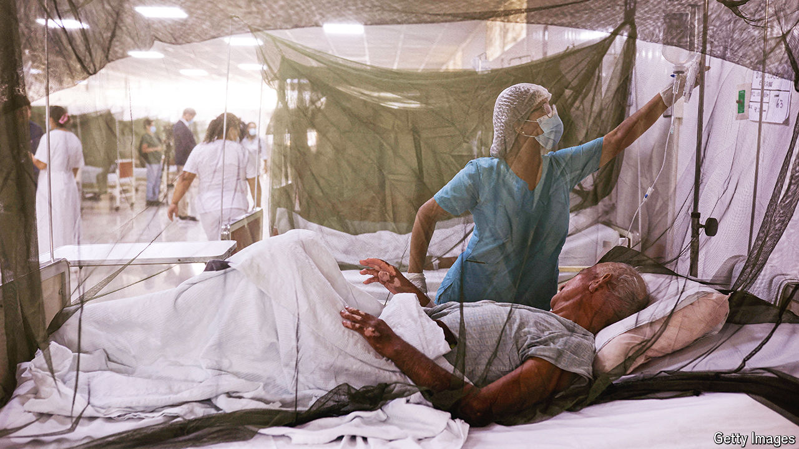
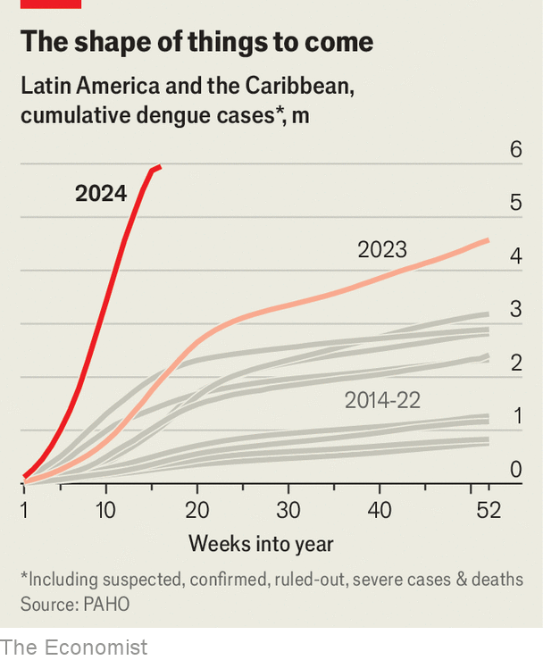

###### Mosquito-borne illness

# Dengue fever is surging in Latin America 

##### The number of people who succumb to the disease has been rising for two decades 

 

> Apr 25th 2024 

For the second time in five years, Brazil’s army is building field hospitals in the capital, Brasília. The tents are accommodating a surge of patients from swamped emergency departments, as millions of Brazilians succumb to dengue fever that is spreading across the country. As with covid-19, the last disease to prompt the construction of field hospitals, many dengue infections are asymptomatic. The one-in-four people who do fall ill can suffer for several weeks with a painful condition known as break-bone fever. Unlike covid-19, the virus causing this wave of illness is carried by mosquitoes. As the climate warms, their range is expanding and the number of people they infect is increasing (see charts). 

 


