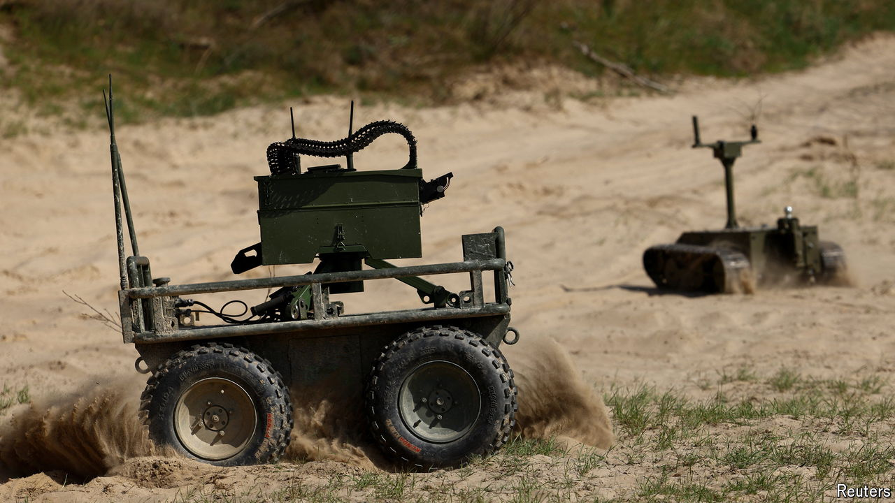

###### The Economist explains

# The growing role of fighting robots on the ground in Ukraine 

##### Drones already fill the skies. Now uncrewed vehicles are heading to the front lines 

 

> Apr 19th 2024 

SINCE RUSSIA’S full-scale invasion of Ukraine began in 2022, drones have shaped . Both sides pummel the enemy with cheap kamikaze models and use long-range craft to strike targets far from the front lines. In the Black Sea Ukrainian naval drones have helped to inflict serious damage on Russia’s fleet. But so far, ground robots have featured little in . Is that about to change?

Military robots operated by remote control are known as Uncrewed Ground Vehicles (UGVs). The earliest model was the Soviet Teletank, used during the invasion of Finland from 1939. The Russians fitted obsolete light tanks with crude radio-controlled steering and flamethrowers to attack fortifications. The tanks had no camera, so an operator had to be positioned nearby. The technology proved unreliable and the experiment was soon abandoned.


But armed forces did not give up on the idea. Since the 1970s UGVs have been used for bomb disposal. Building a remotely operated fighting machine, however, has proved difficult. Navigation is a problem. Today’s drones can easily steer themselves, but on the ground automated driving is still hard, even on well-marked roads: machines often struggle to interpret simple obstacles such as potholes. This means that if UGVs lose contact with an operator they can get lost or stuck, leaving them vulnerable to attack. Russia deployed a small robotic tank, Uran-9, in Syria, reportedly in 2017—but it suffered communication problems, and has not been seen since.

Most UGVs are expensive. The United Arab Emirates recently bought 60 such robots from Milrem Robotics, an Estonian firm, reportedly for more than €100m ($107m). The Russian military’s most advanced ground robot—Marker, a vehicle the size of an SUV that uses sophisticated artificial intelligence to operate autonomously—would be too costly to make in large numbers. In Ukraine both sides have used simpler models, mainly in support roles, such as transporting supplies, mine-laying and demining. 

But that is starting to change. In March Russia carried out an attack on a Ukrainian defensive position with what appeared to be three Couriers, small, tracked robots armed with automatic grenade-launchers. Recent videos show Ukrainian UGVs attacking bridges and positions in Russian-held territory, either by placing an explosive charge and withdrawing or in a kamikaze attack. 

Both sides seem to be emulating the DIY approach that allowed them to quickly design and make cheap attack drones. Russia’s Couriers are built by volunteers. In March United24, an organisation set up by Ukraine’s government to raise funds for the war, announced that it was putting fighter UGVs into mass production. It is funding the production of hundreds of models, including fighters, designed by various civilian groups. One, the Ratel S, resembles a camouflaged remote-control car with explosives strapped to the top. Another, the Death Scythe, is a weapon turret operated remotely with a video-game controller. Using commercial components makes production cheap: some of the Ukrainian machines cost as little as $900.

That means they could be fielded in large numbers, much like the drones buzzing overhead. Ukraine hopes these UGVs will help it to counter the numerical superiority of Russian forces. And although Russia has a huge advantage in troop numbers, it too wants to limit its casualties. In a long war of attrition, substituting expendable fighting machines for irreplaceable humans could be a winning strategy. ■

