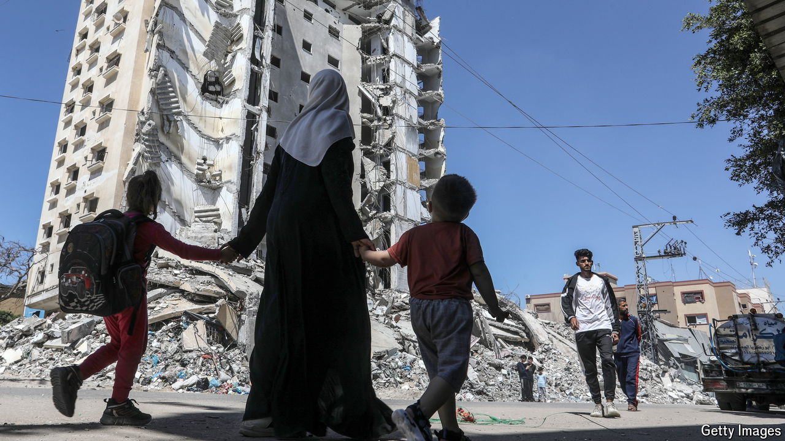

###### The Economist explains

# What are the obligations of Israel and Hamas to protect civilians? 

##### International Humanitarian Law creates obligations—but contains numerous caveats 

 

> Apr 24th 2024 

THE ISRAEL DEFENCE FORCES (IDF) are preparing for an offensive against the city of Rafah, in the southernmost tip of Gaza. It is the last redoubt of Hamas—but is also home to some 1.5m displaced Palestinians. Fearing a humanitarian catastrophe, even Israel’s closest ally, America, has warned against military operations there. But Israel’s prime minister, Benjamin Netanyahu, insists that the IDF will go in. He claims to have a plan to protect civilians. One Israeli official said that the country was buying 40,000 tents to prepare for an evacuation. Israel argues that it has always abided by  (IHL) in Gaza. What exactly are its obligations? 

Under the four  of 1949, of which it is a signatory, Israel qualifies as a combatant, or “warring party”, in Gaza, which obliges it to observe strict prohibitions against targeting civilians, using starvation as a method of war and more. But Israel’s obligations towards Gazans could be greater still if it were considered an “occupying power”, a status that is hotly disputed. Israel claims it is not, but many international bodies argue that in practice it is: the country controls imports and access to Gaza to a significant degree, as well as maintaining the Palestinian population registry through its defence ministry.

If Israel were considered an occupying power then Article 55 of the fourth convention would apply. It says: “To the fullest extent of the means available to it the Occupying Power has the duty of ensuring the food and medical supplies of the population; it should, in particular, bring in the necessary foodstuffs, medical stores and other if the resources of the occupied territory are inadequate.” Article 56 also throws the onus on an occupying power “with the co-operation of national and local authorities” for “maintaining…the medical and hospital establishment and services.” Yet  in Gaza and its hospitals are . The UN says that Israel routinely stops aid convoys from entering the strip, and hinders the distribution of supplies within Gaza. 

But the conventions contain as many caveats as they do obligations. They accept that military exigencies can, in specific circumstances, override the provisions for protecting civilians. Article 53 “prohibits” the destruction of “real or personal property” by an occupying power, “except where such destruction is rendered absolutely necessary by military operations.” Article 55 commands that outside bodies, such as the UN or the Red Cross, have the “liberty” to monitor the supply of aid, “except where temporary restrictions are made necessary by imperative military requirements.” Article 49 prohibits “mass forcible transfers” of people—but states that an occupying power “may undertake total or partial evacuation of a given area if the security of the population or imperative military reasons so demand”. That sounds as if it could cover moving Gazans out of Rafah, if such displacement is temporary and humanitarian relief is provided. 

Just as humanitarian law—whether or not it provides clear answers—applies to Israel’s actions, so it does to Hamas’s. Lawyers debate whether the group can be considered a “state” in the same sense as Israel but it is certainly a warring party, and thus also subject to IHL. Hamas’s horrific attack on Israel on October 7th flouted international law and it has failed to protect Palestinian civilians since the onset of Israel’s offensive. It has not allowed Gazans to shelter in the 500km of , nor did it build any separate bomb-shelters for civilians. The UN (as well as Israel) has accused Hamas of using civilians as human shields; under interrogation, captured fighters have acknowledged that the group uses hospitals and clinics as cover because it knows Israel is loth to target them. Throughout, its treatment of Gaza’s civilians has been cynical.■

