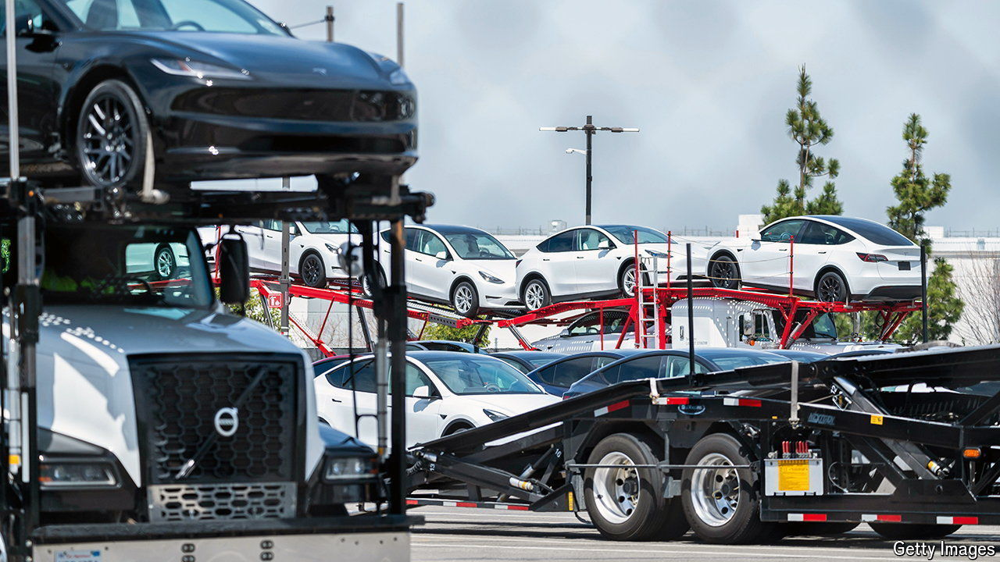
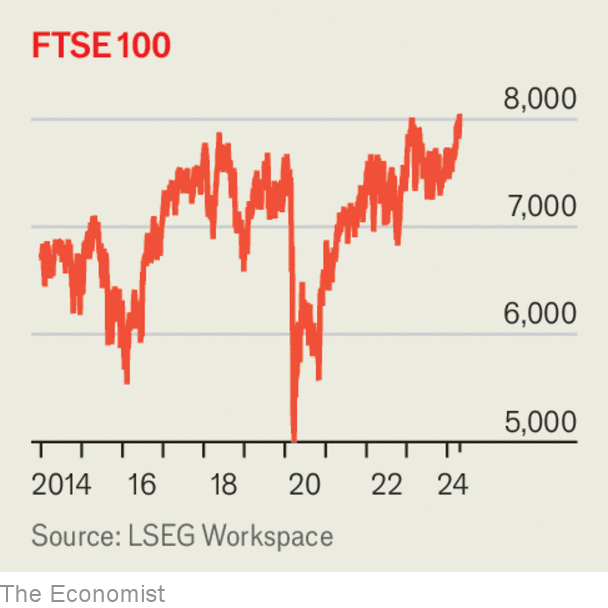

###### The world this week

# Business 

#####  

 

> Apr 25th 2024 

As America’s electric-vehicle industry sputters,  announced gloomy first-quarter results. Revenue fell to $21bn, a decline of 9% year on year, and the firm’s operating margin fell by half. Shareholders, however, found something to celebrate as the firm said that new, more affordable models would go into production sooner than expected. Tesla’s share price, which has fallen by more than a third this year, climbed by 12% after its earnings release.

Boeing, Boeing, gone

 burned through $3.9bn of cash and made a loss of $355m in the first quarter. The results were better than feared but will not pull the aircraft-maker out of its deep crisis. In March its boss announced his resignation, two months after the blowout of a fuselage panel from one of Boeing’s 737 max planes. Among the corrective actions being considered is an acquisition of , a troublesome supplier it had previously spun off.

Business activity in  rose more than expected in April, according to the purchasing-managers’ index. The gain is explained by services, where activity increased by the most since May 2023.

As part of a bill allocating military aid to Ukraine, Israel and Taiwan, America’s president, Joe Biden, signed into law measures that will force , the Chinese parent of , to divest the popular app within a year or face a ban in America. China’s government is likely to resist any forced sale, and the firm could seek to challenge the law in the courts, arguing that it violates the right to free speech.

The European Commission launched a probe into the in China, claiming that European manufacturers face discrimination in procurement processes. Officials also raided the European offices of , a Chinese security-equipment supplier, under new anti-subsidy laws. These moves will further strain trade relations between Europe and China, which have been in focus since Europe launched an investigation into Chinese electric vehicles in October. 

Australia’s biggest oil-and-gas producer faced a revolt over its climate action plan.  proposal was rejected by 58% of shareholders at its annual general meeting, though the firm’s chairman managed to keep his job, despite a campaign against his reappointment backed by Glass Lewis, a proxy adviser. 

Hong Kong’s largest initial public offering of the year flopped. Shares in  plunged by as much as 38% on their first day of trading after the firm, which makes bubble tea, raised HK$2.6bn ($330m).

The  has told banks to begin stress-testing their relationships with private-equity firms. The central bank said it had uncovered gaps in banks’ risk-management processes and that the growth of private markets meant banks were exposed across many parts of their business. 

 


After issuing a profit warning to investors last month,  announced bleak quarterly results. Sales at , its biggest brand, declined by 21% year on year.

Britain’s  crept to a record high after a weaker pound and higher commodity prices boosted the index. This will do little to quell fears of further exits from Britain’s stockmarket, however, or complaints about the index’s poor relative performance in recent years.

Luxury handbagging 

The  (FTC) voted to . The American trustbuster said that nearly one in five Americans are bound by clauses that limit their ability to work for a competitor if they leave their employer, and that a ban would result in higher wages and more innovation. The  quickly filed a lawsuit challenging the rules in a Texas court. Separately, the FTC sued to stop an $8.5bn retail merger. It said that allowing , whose brands include Coach and Kate Spade, to buy , which owns Michael Kors, would give it a dominant share of the “accessible” luxury handbag market.

 offered to buy  in what would be the biggest mining deal in more than a decade. The all-share merger, which would also involve Anglo hiving off its South African platinum and iron-ore units, would greatly expand the copper footprint of BHP. Any transaction could face significant regulatory hurdles, including from antitrust authorities.

 increased its revenue to $36bn in the first quarter, a rise of 27% year on year. Profits more than doubled, to $12bn. Investors, however, were unimpressed by its revenue guidance for the current quarter and plans to boost investment in artificial intelligence.

