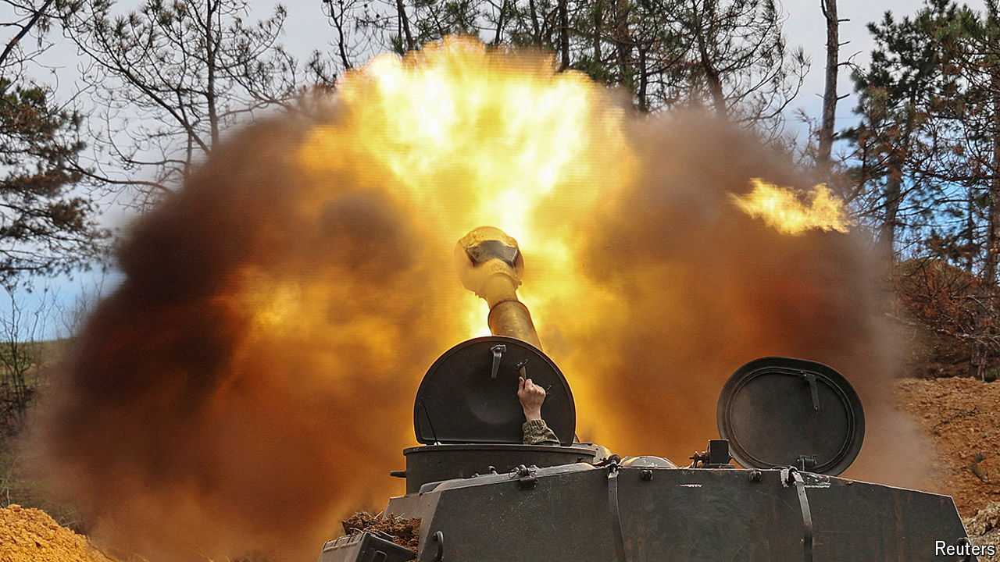
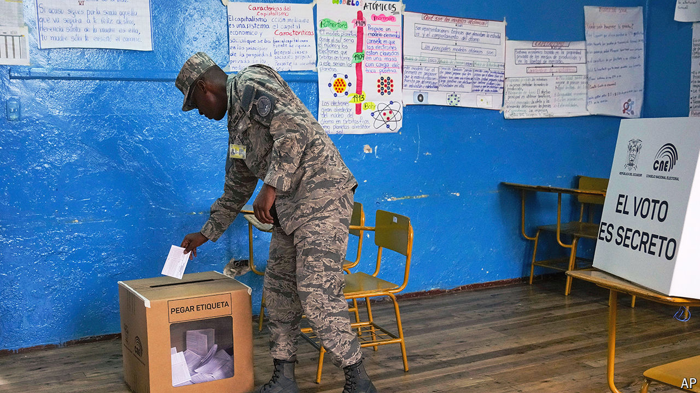

###### The world this week

# Politics 

#####  

 

> Apr 25th 2024 

Joe Biden signed a worth $95bn. America’s president said the legislation was necessary to fend off “terrorists” like Hamas and “tyrants” like Vladimir Putin, Russia’s president. Of the aid, $61bn is to help Ukraine. Arms will begin flowing within days, according to the Pentagon. Congress overwhelmingly passed the bill following six months of deadlock. Republican hardliners called for the sacking of Mike Johnson, their party’s House speaker, who worked with Democrats to bypass them.

The deal also carries $17bn of aid for , despite concerns that its soldiers are violating human rights in Gaza and the West Bank. , the prime minister, responded angrily to reports that America might impose sanctions on an Israeli battalion and promised to “fight” any penalties. The UN said that it had found mass graves containing bodies at two hospitals in Gaza. It called for independent investigations.

The final tranche of military aid in the package will go to . American backing for the island has weighed on relations with China, which claims Taiwan as its own. , America’s top diplomat, visited China to keep communication channels open—and warn China against providing weapon parts and dual-use products to Russia.

 against the war in Gaza swept elite American universities, including Columbia and Yale. Hundreds of pro-Palestinian demonstrators were arrested. Many have set up encampments. The White House condemned “blatantly antisemitic” statements.

trial kicked off in Manhattan. Prosecutors used their opening arguments to link electoral fraud to undisclosed payments, allegedly made to suppress stories of Mr Trump’s sex life when he ran for president in 2016. In a separate trial in Arizona, several of Mr Trump’s allies, including his ex-lawyer, Rudy Giuliani, were indicted for alleged electoral interference in 2020. The former president was not charged.

Voting in the world’s largest election started in . The first of seven stages runs until June. Armed clashes and damage to voting machines were reported at several polling stations, where voting will be repeated. Narendra Modi, the prime minister, and his Bharatiya Janata Party (BJP) are expected to win a third term in power.

America held joint military drills with the Philippines in the . Meanwhile, China hosted naval officials from 29 countries in its port city of Qingdao to discuss threats to maritime security.

A court in the  banned , an experimental grain modified to carry beta-carotene, a chemical precursor of vitamin A, added to combat childhood blindness. It cited “severe” health and environmental concerns.

Speaking freely

, an entrepreneur, clashed with  about access to footage of a stabbing in a church in Sydney. He decried a court order to remove the violent video from X, his social-media platform, across the world as a step towards censoring “the entire internet”. Australia’s leader, Anthony Albanese, said Mr Musk was an “arrogant billionaire who thinks he is above the law”. 

 struck an Iranian air-defence system in retaliation for Iran’s unprecedented assault on April 13th. American troops in Syria faced renewed attacks, as militias in Iraq fired rockets at their air base. 

 stepped down as head of Israel’s military intelligence directorate. He is the first senior official to resign over the failure to stop Hamas’s attack in October 2023.

Fighting around the  ended a truce that had shielded it from the country’s civil war. The city of some 1.6m residents was the last holdout in North Darfur not to have fallen to militias. 

 passed a law to send unwanted asylum-seekers to  to deter people from making the perilous journey across the English Channel. Campaigners decry the law as expensive and inhumane; UN officials have urged Britain to rethink the plan. Rishi Sunak, the prime minister, said transfers would begin by July. Last year some 30,000 people arrived in Britain on boats. Five died when an overcrowded dinghy sank this week.

The power-sharing agreement between the  (SNP) and the Scottish Greens came to an acrimonious end. The SNP’s decision to halt the arrangement comes soon after Scotland ditched its decarbonisation targets for 2030; the SNP will now form a minority government.

 


 voted in a referendum to empower the police and army to fight gangsters. The country has become one of Latin America’s deadliest. The unprecedented security measures, spearheaded by Daniel Noboa, Ecuador’s president, include harsher penalties for gang-related crimes such as kidnapping, soldiers patrolling streets and legalising extraditions of gang bosses to the United States.

 threatened to step down as Spain’s prime minister as a court opened a corruption investigation into his wife. The Socialist leader cleared his calendar ahead of an announcement on Monday.

, Russia’s deputy defence minister, was accused of taking bribes. (He denies the charges.) Corruption is rife in Russia but high-level crackdowns have been rare since it attacked Ukraine in 2022. Activists say Mr Ivanov, who is in charge of military investment projects, profited from construction work in the Ukrainian city of Mariupol after it was bombed by Russia.

 tried to press draft-age men to join its army as it faced an acute shortage of manpower to fight Russia. Men eligible for conscription will be denied consular services abroad—a measure to “restore fair attitudes” towards those who stayed in Ukraine and those who left, said Dmytro Kuleba, the foreign minister. 

Four  were arrested on suspicion of. One of them, Jian Guo, was a staffer for the far-right Alternative for Germany party. 

Too much of a good thing

Thousands of protesters in the  called for curbs on tourism, which they say is spoiling nature and inflating house prices. The Spanish archipelago of 2.2m people had 14m visitors in 2023. Rosa Dávila, president of Tenerife, suggested putting in place visitor limits and fees for natural attractions. Elsewhere,  became the world’s first city to charge tourists to enter.

 started speaking to Earth again after months of relaying gibberish.  was launched in 1977 to tour the outer planets. It is now humanity’s most remote object. In November the probe began scrambling data. Engineers fixed it remotely. 

