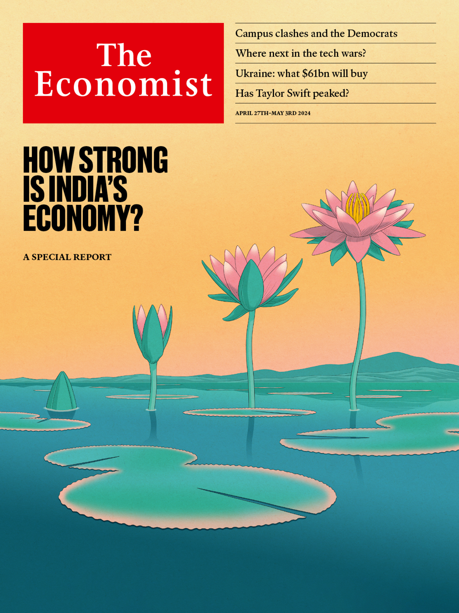

###### The Economist

# This week’s cover 

##### How we saw the world 

> Apr 25th 2024 

SIX WEEKS before Narendra Modi is expected to win a third term as India’s prime minister, our  focuses on the country’s economy. 

Mr Modi’s India is an experiment in how to get richer amid deglobalisation and under strongman leadership. Whether it can grow fast and avoid unrest over the next 10-20 years will shape the fate of 1.4bn people and the world economy. Mr Modi’s formula is working—up to a point. But if you are looking for “the next China”—a manufacturing-led miracle—you won’t find it here. The country is developing at a time of stagnating goods trade and factory automation. It therefore needs to pioneer a new model for growth. 

 


 

 

