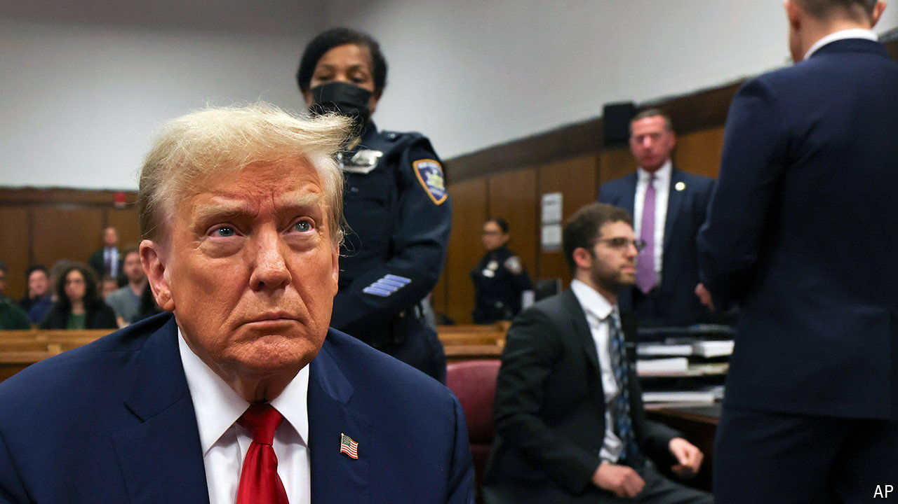

###### Spoiler alert

# A dispatch from Donald Trump’s courtroom 

##### A tale of two struggles 

 

> Apr 25th 2024 

Every trial involves two struggles, wrote Janet Malcolm, a shrewd observer of the American courtroom. One is engrossing, the other is stultifying, and both have been on full display at Donald Trump’s trial in a Manhattan courtroom in this past week.

The first contest—the exciting one—is about the narrative itself. Who can tell it better: prosecutors or the defence? The  are minor: they concern whether he falsified business records to conceal a payment to a porn star so that she would keep quiet about an old tryst. As a story, that lacks gravitas. So prosecutors, keen to inflate their case, claim it is really about “election fraud, pure and simple”, since the payment came on the eve of the 2016 presidential vote and denied information to voters. “Spoiler alert,” retorted Todd Blanche, Mr Trump’s lawyer. There was “nothing illegal” about the hush money; trying to influence an election is “called democracy”.


First to testify was David Pecker, a former tabloid publisher and friend of Mr Trump who helped orchestrate the payment. During the campaign he bought stories from sources intent on embarrassing the candidate, though he had no intention of running them. “Chequebook journalism”, Mr Pecker called this. Cue raised eyebrows from every journalist in the room.

So far, so engrossing. Yet your correspondent would be fibbing if he said the second contest described by Malcolm had not played out in court, too. She called this the “struggle of narrative itself against the constraints of the rules of evidence, which seek to arrest its flow and blunt its force”. In other words, trials get tedious. Interruptions about procedure are constant. Objections, sidebars, the need to run to the toilet and ruminations about what to eat for lunch spoil the story that each side wants to tell. 

Everyone feels it—even the person with most at stake. Sure enough, towards the end of the trial’s fifth day, there sat Mr Trump: twirling a pen and looking immensely bored. And the former president can look forward to about six more weeks of this. ■


