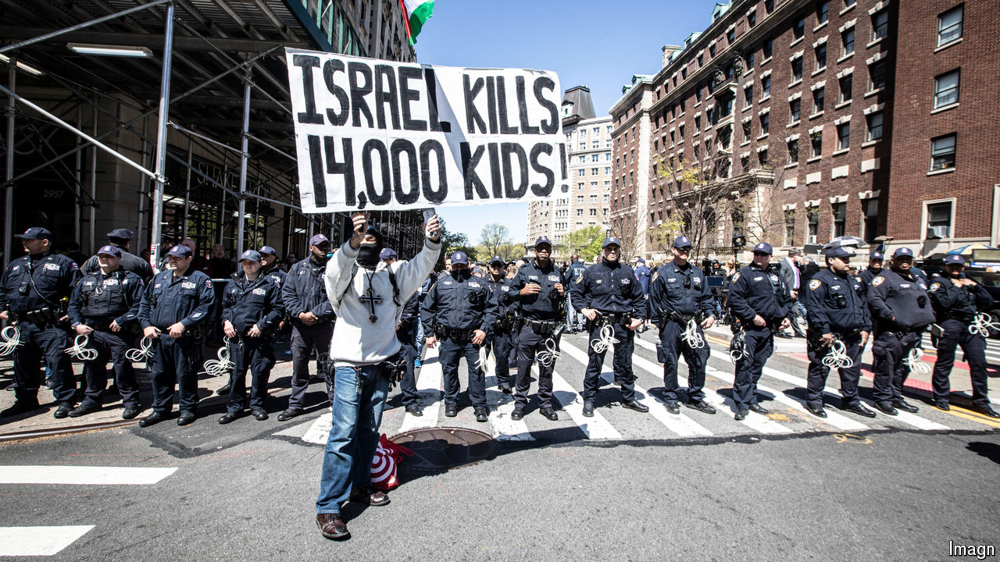

###### Clumsy college crackdowns

# Efforts to tackle student protests in America have backfired badly 

##### Police intervention at Columbia has provoked protests at other universities 

 

> Apr 23rd 2024 

PART OF THE reason Elisha “Lishi” Baker wanted to go to Columbia University, an Ivy League university in New York, was its Middle Eastern History programme. He loved his first year and says he “felt great as a Jewish student at Columbia”. But since  on Israel on October 7th, the atmosphere on campus has changed. Within days there were protests. He heard students calling for an . He kept being told: “You’re interpreting it wrong”, but this week there was no misinterpreting, he says, the undercurrent of antisemitism on campus. “We’re coming for you,” other Jewish students say they were told: “Get off our campus.”

University presidents are struggling with policing free speech on campus: how to deal with pro-Palestinian protests? Having seen the  and the  being forced to step down after their timid responses, they are trying a tougher approach. They are in danger of over-correcting. 

The trigger for the latest troubles was the clearing by police of tents and protesters at Columbia on April 18th, and the arrest of more than a hundred students. This was an “alarming decision”, wrote Jameel Jaffer, from the university’s free-speech centre, adding that “it was not evident to us how the encampment and protest posed such a danger” as to justify the escalation. According to the New York Police Department (NYPD), the arrested protesters were peaceful and offered no resistance. “It was so scary,” says Layla Saliba, who saw the arrests. “All these cops just swarming everywhere and we had people in like full riot gear.” Within days another encampment sprang up on a nearby lawn.

In a letter posted on Columbia’s website Minouche Shafik, Columbia’s president, wrote that she asked the NYPD to intervene after other efforts failed: she did so “out of an abundance of concern for the safety of Columbia’s campus”. The move only inflamed matters. “The irony is that in trying to quiet things down and assert control over the encampment, the administration unleashed this firestorm,” says David Pozen, a law professor at the university.

That firestorm spread, with tent encampments popping up far beyond Columbia. The demands by student protesters are largely the same: divest endowments from Israeli firms and any weapons manufacturers that sell there; end academic partnerships with Israeli institutions; and condemn Israel’s actions in the war. 

As at Columbia, administrators elsewhere are overcoming their reluctance to call the cops. On April 22nd nearly 50 protesters were charged with trespassing for taking part in a week-long occupation of a plaza at Yale (protesters returned the next day). At New York University police broke up a copycat encampment, arresting more than 130. At the University of Texas dozens were arrested after state troopers in riot gear swept through the campus. “These protesters belong in jail,” Texas’s governor, Greg Abbott, wrote on X. Police clashed with protesters as they attempted to clear the campus at the University of Southern California (USC). 

Long before the debacle at Columbia, instances of disruptive behaviour had put administrators on edge. In February pro-Palestinian activists at UC Berkeley shattered a glass door leading to a lecture by an Israeli speaker. Weeks later others interrupted an event at the home of Erwin Chemerinsky, the dean of the law school.

Last year Columbia suspended two pressure groups, Students for Justice in Palestine and Jewish Voice for Peace, for organising unauthorised demonstrations. The New York Civil Liberties Union has sued over the move. Equally controversial was USC’s decision to cancel the graduation speech of its pro-Palestinian valedictorian, who is Muslim; the school cited safety threats. USC has since cancelled all guest speakers at commencement.

Presiding over an American university was once a plum job; . On April 17th Dr Shafik was the latest president to be grilled by the House Education Committee about antisemitism on campus. Unlike the presidents of Harvard and the University of Pennsylvania, who  in December, Dr Shafik survived—for now. When asked the question that both Claudine Gay, at Harvard, and Elizabeth Magill, at Pennsylvania, had struggled with (whether calling for the genocide of Jews violated their university’s code of conduct), she and her colleagues answered simply: “Yes, it does.” 

Critics say she has not defended free speech adequately. The university’s rules, wrote Mr Jaffer, guarantee broad protection “even for speech that is objectionable or offensive to some listeners”. In her own public letter, Dr Shafik insists: “we cannot have one group dictate terms and attempt to disrupt important milestones like graduation to advance their point of view.” 

Dr Shafik is not out of the woods. Donors are restive and politicians are circling: on April 24th the House speaker, Mike Johnson, visited Columbia and said calling in the National Guard should be an option. He told students who heckled him to “enjoy your free speech”, and described Dr Shafik as “a very weak and inept leader”. For her part, Dr Shafik touted progress in talks with student protesters, raising the possibility of an internal resolution.

At Columbia, life is now disrupted for the majority of students not taking part in protests. Classes have moved partially online. Helicopters circle above. The bullhorns from protesters outside the gates are so loud that students studying for the MCAT, an exam for medical school, cannot find a quiet spot for practice tests. ■


