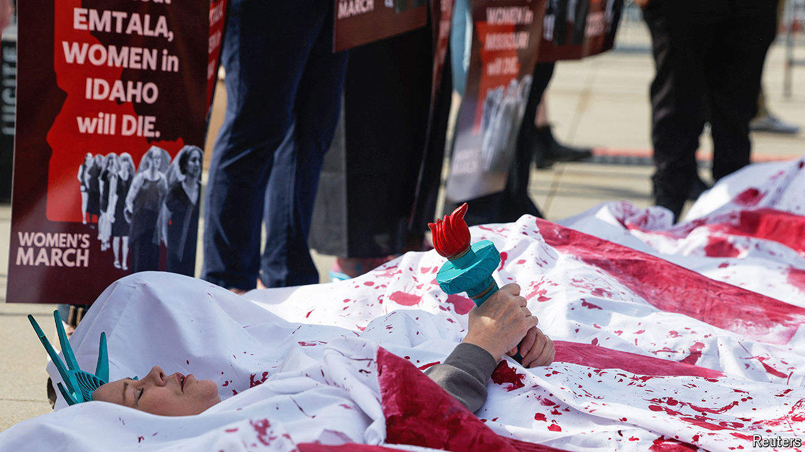

###### Termination disputation

# In its latest abortion case the Supreme Court seems to back Idaho 

##### Moyle v US asks if federal law protects women whose pregnancies threaten their health 

 

> Apr 24th 2024 

IN 2022, five Supreme Court justices wrote that they were returning the issue of abortion to “legislative bodies”. Two years on, that sounds like wishful thinking: the court finds itself right back in the middle of America’s abortion battle. A month ago the issue was —a fight opponents of abortion seem destined to lose. On April 24th the question was whether state bans that criminalise terminations are trumped by a federal law concerning emergency care. 

The Emergency Medical Treatment and Labour Act (EMTALA), passed in 1986, requires hospitals receiving federal funding to offer “stabilising treatment” to people showing up in their emergency rooms (ERs). In 2022 the Biden administration notified hospitals that this duty includes offering abortion when a woman’s pregnancy poses immediate risks to her health. But a law passed that year—the Idaho Defence of Life Act—prohibits abortion except in cases of rape or incest, or when “necessary to prevent the death of the pregnant woman”.  concerns cases where a woman’s health is at imminent risk but she is not at death’s door.

Joshua Turner, defending Idaho’s statute, faced a barrage from the three liberal justices. Idaho’s law explicitly recognises abortion as the standard of medical care when a woman’s “life is in peril”, Justice Elana Kagan noted. So can’t EMTALA extend that same standard to cases when her “health is in peril” and she could “lose her reproductive organs”? Well, Mr Turner said, that raises “tough medical questions that implicate deeply theological and moral questions” that states should answer. “That would be a good response if federal law did not take a position on what you characterise as a tough question,” Justice Kagan retorted. But EMTALA “says that you don’t have to wait until the person is on the verge of death”.

Justice Sonia Sotomayor cited the case of “a real woman” in Florida who was sent home from hospital despite doctors believing she needed an abortion to avoid sepsis and uncontrolled haemorrhage. Doctors “refused to treat her because they couldn’t say she would die.” She later returned to the hospital, after bleeding at home and passing out, and an abortion saved her life. Would Idaho’s law require a woman to endure a similar experience? Mr Turner could not give a clear answer. Justice Ketanji Brown Jackson walked Mr Turner through a discourse on the constitution’s Supremacy Clause, which states that “what the federal government says takes precedence”.

The court’s conservative justices largely steered clear of questions of women’s reproductive health. But they voiced three lines of attack on the Biden administration’s position, suggesting that their sympathies lay with Idaho. 

Justices Samuel Alito, Amy Coney Barrett, Neil Gorsuch and Clarence Thomas all noted that EMTALA was enacted under the constitution’s Spending Clause and probed whether it was proper for the government to withhold Medicare funds unless emergency abortions are provided. Mr Turner argued that such conditions must be “clear and unambiguous” in the statute itself. Elizabeth Prelogar, the solicitor-general, suggested that the court should not consider this argument as the lower courts “did not address” it. Conservative justices raised the question of conscience exemptions—whether doctors who object to abortion would have to follow a federal mandate. But Ms Prelogar insisted that “individual doctors are never required to perform an abortion”. 

One objection to the Biden administration’s position seemed to gain more traction: the worry that adding a health exception via EMTALA would invite a host of elective abortions via mental-health claims. Ms Prelogar strove to allay concerns: it would be “incredibly unethical” to treat a woman who comes to the ER “with some grave mental-health emergency” by terminating her pregnancy, she said. 

Mary Ziegler, a law professor at the University of California, Davis, said that, though it “seems like Idaho will prevail”, there is “a lot of ambiguity” about how the justices will justify such a ruling, as all of the pathways explored in the hearing are murky. By contrast, perhaps the starkest moment in the hearing was Justice Kagan’s observation that six women have been airlifted out of state from one Idaho hospital since the law went into effect. “It can’t be the right standard of care”, she said, “to force somebody into a helicopter.” ■


