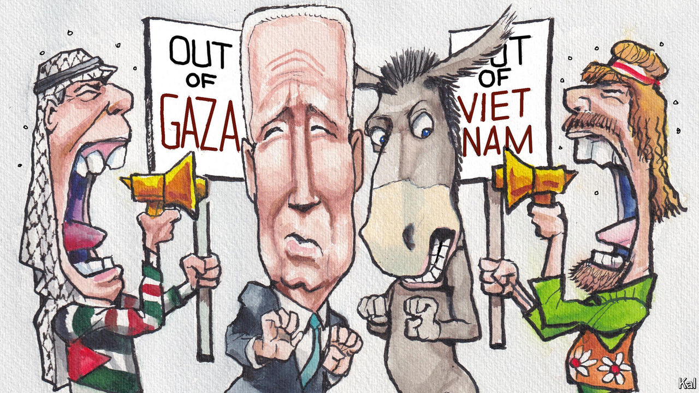

###### Lexington

# The campus is coming for Joe Biden 

##### As in 1968, the Democrat risks being the candidate of chaos and war 

 

> Apr 24th 2024 

Aconnoisseur of radical chic can find plenty to catalogue these days while observing pro-Palestine protests on Ivy League campuses: the black or red , the conga drums, the folk songs, the kitschy signs (“Dykes 4 Divestment”) and the showy Arabic pronunciations of “Gaza”, so reminiscent of the Spanish-ish inflection given to “Nicaragua” by pro-Sandinista activists back in the 1980s. 

And then there are the dainty intersectional gestures of the protesters: “We recognise our role as visitors and, for many of us, colonisers, on this land,” reads the third of nine “community guidelines” scrawled on a whiteboard in the “Gaza Solidarity Encampment”, the bivouac of domed tents on Columbia University’s south lawn. Not only was the land once inhabited by native Americans, but Columbia was guilty of “complicity in the displacement of the Black and Brown Harlem community”.

But such emblems of political taste are superficial. They might mislead the observer about the anger of many protesters, about how deeply it is felt and how deeply it is dividing universities, pitting some Arab-American students and their allies against some Jewish students and theirs. At elite institutions, years of uneven application of speech codes, of unequal attention to those offended by speech, have left students, alumni, faculty and even presidents seeming uncertain what the rules are and how to enforce them. This has doomed them to fighting about how to fight about what they are fighting about. At Columbia, a , Minouche Shafik, to get New York City police to break up a previous encampment on April 18th, arresting more than 100 students, has touched off a faculty revolt. 

On April 22nd faculty gathered on the granite steps of Low Memorial Library, the main administrative building, to demand an apology and amnesty for the students. One speaker, Christopher Brown, a professor of history, accused Dr Shafik of endangering the students and of failing to defend Columbia’s excellence in testimony to a House committee the day before the police raid. “She has forfeited the privilege to lead this great university,” Professor Brown declared, to raucous cheers and a chant of “Resign!” from hundreds of students. The university says it is negotiating with students over the new encampment, even as workers set up chairs nearby for next month’s commencement. 

All this outrage is closing in on another institution, the Democratic Party, and its leader, President Joe Biden. The touchstone for the Columbia protesters is the struggle on that campus in April 1968 for racial justice and against the Vietnam war, which culminated in a police crackdown and more than 700 arrests. For Democrats nationally, 1968 is also becoming a touchstone, an ominous one. The campus protests that year found a focus in the Democratic National Convention in August in Chicago, where the party plans to convene in the same month this year. 

In 1968 pro- and anti-war delegates shouted and bickered over Vietnam. In the end the Democrats voted down an anti-war plank and nominated Hubert Humphrey, a Minnesota liberal who, as Lyndon Johnson’s vice-president, was tarred as pro-war. A national television audience watched in horror as Chicago police attacked protesters outside the delegates’ hotel with tear gas and clubs. More than 650 protesters were arrested and scores were hurt, as were many police officers.

Any chaos in Chicago would be bad for Mr Biden, who is running, as in 2020, as the candidate of normality. But the drama will almost certainly not be as intense as in 1968. Pro-Palestine groups want to rewrite the party’s plank on Israel, yet such fights no longer play out on convention floors. Mr Biden’s aides will control the platform, as they will the script of the convention, now just a particularly dull TV show. As in 1968, Chicago is being stingy with permits to protest, but the police superintendent, Larry Snelling, has said the department is preparing to respond to “large-scale First Amendment activity” with “constitutional policing”. Many of the superficial parallels to 1968 will probably prove to be just that.

Still, “There is a parallel that’s unavoidable,” says Bill Ayers, who as a leader of Students for a Democratic Society was beaten and arrested in Chicago in 1968. “And that is that Hubert Humphrey, the great liberal from the Midwest, tried way too late to extract himself from being a cheerleader for Vietnam.” Dogged by anti-war protesters, Humphrey struggled to unite Democrats and ultimately lost narrowly to Richard Nixon. “Irony of history,” Dr Ayers says. “How could Richard Nixon be elected as a peace candidate? Here’s a great anti-communist warmongering prick.” Though as president Nixon would intensify the war, he claimed as a candidate to have a “secret plan” to end it. Donald Trump has said he would end the  in a day and, referring to the war in Gaza, has told Israel to “get it over with”. 

They’re more like guidelines, anyway

Maybe Mr Biden will succeed in brokering a ceasefire in Gaza, and the anger will dissipate. Maybe the protesters chanting today against “Genocide Joe” will nevertheless show up to vote for him. Dr Ayers, who went on to help found the militant Weather Underground and spent years as a fugitive, pulled the lever for Humphrey. “I always vote for the lesser of two evils,” he says, “because they’re less evil.” He argues that voting is a practical rather than moral act, words other activists might take to heart.

The more thoughtful of Columbia’s activists, by the way, may also have something to teach everyone else, on campus and off. “We commit to assuming best intentions, granting ourselves and others grace when mistakes are made,” reads the eighth community guideline in the Gaza Solidarity Encampment, “and approaching conflict with the goal of addressing and repairing.” ■


