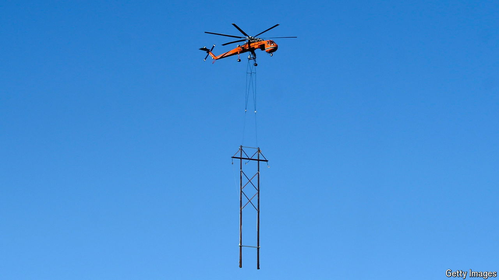

###### What the FERC

# The most important climate agency you’ve never heard of 

##### An inept Congress puts America’s Federal Energy Regulatory Commission in the spotlight 

 

> Apr 25th 2024 

THE CLEAN-ENERGY transition is doing wonders for energy nerds. Not because of any particular policy triumph, but because people beyond wonkdom are actually trying to understand what they are saying. Several times in the past two years “energy permitting”, such as the approval of electricity-transmission lines, became one of the hottest legislative topics in America. Attempts at planning reform failed. But the nerds’ moment in the sun is not over. Those newly captivated by provisional environmental-impact statements and land-use planning will soon turn their attention to the Federal Energy Regulatory Commission (FERC), an obscure, independent agency that regulates the interstate transmission of energy. 

In 2022 Congress passed the  (IRA), a climate law full of tax incentives for clean-energy infrastructure. President Joe Biden and Democrats won the support of Joe Manchin, a centrist senator for West Virginia, by promising that they would also seek to ease the cumbersome process of . It can take years for solar and wind farms to be approved, and even longer for interstate transmission lines. Speeding up planning is crucial. A study from Princeton University in 2023 found that America needs to expand electricity-transmission capacity 50% faster than its recent historical rate to reap the maximum decarbonisation benefits of the IRA. 

One way to launch a building boom would be for Congress to grant FERC the power to permit interstate transmission lines as it does for natural-gas pipelines, which sail much quicker through planning processes. But progress there has stalled. Other good ideas are floating around. One bill, from John Hickenlooper, a Democratic senator for Colorado, would mandate that regions be able to transfer a certain amount of electricity between them. That could make it easier to move power around during extreme weather, reduce costs for consumers where energy is now scarce and help states meet their clean-energy-generation targets. 

Yet progressive Democrats are wary of rushing projects through. And though Republicans have long favoured making permits easier to get, they would like to make it easier to build fossil-fuel infrastructure, too. The result is a stalemate. The lack of congressional action leaves agencies trying to speed things up themselves. 

Enter FERC. The next few months could determine how effective the commission will prove to be for the foreseeable future, for two reasons. 

First, a final rule is set to be released on May 13th that could require transmission developers to plan 20 years into the future and that works out who should pay for new interstate lines. The transmission-opposition-complex is waiting. Environmentalists and  are suspicious of how such projects mar the landscape, and often sue to delay them. Many utilities are local monopolies, and building interstate transmission could introduce competition from power generators beyond their regions. “It’s all about the control they have over where our power comes from, and transmission can disrupt that control,” says Ari Peskoe, director of the Electricity Law Initiative at Harvard University. 

Politics also threatens to get in the way. After FERC initially released its rule in 2022, 17 Republican attorneys-general argued that the commission wants to inflict renewable energy on states that resist it via new transmission lines, and that it does not have authority from Congress to do so. The Supreme Court may be amenable to this argument. In , in 2022, the court used the “major questions doctrine” to strike down an EPA rule regulating greenhouse-gas emissions on similar grounds. It will also take time for transmission operators to comply with the new rule. Mr Peskoe reckons that compliance and legal challenges could delay the rule’s implementation by several years. 

The second factor that will affect FERC’s power to change the energy landscape is the commission’s size: it is shrinking. It is supposed to be made up of five members nominated by the president and confirmed by the Senate. But Mr Manchin blocked the renomination of the commission’s chairman in 2022, another member’s term expired last year and a third commissioner is scheduled to leave in June. If FERC goes down to two commissioners then it loses a quorum, notes Caitlin Marquis of Advanced Energy United, a clean-energy lobby group. In that case, “they can’t function as a decision-making body,” she adds. 

In February Mr Biden announced three nominees who would bring the commission back to full strength—provided that they are indeed confirmed. Their nominations appear uncontroversial so far, but America’s toxic politics have made even energy nerds superstitious. The common refrain from the cognoscenti when contemplating the nominees’ prospects is: “I don’t want to jinx it.”■


