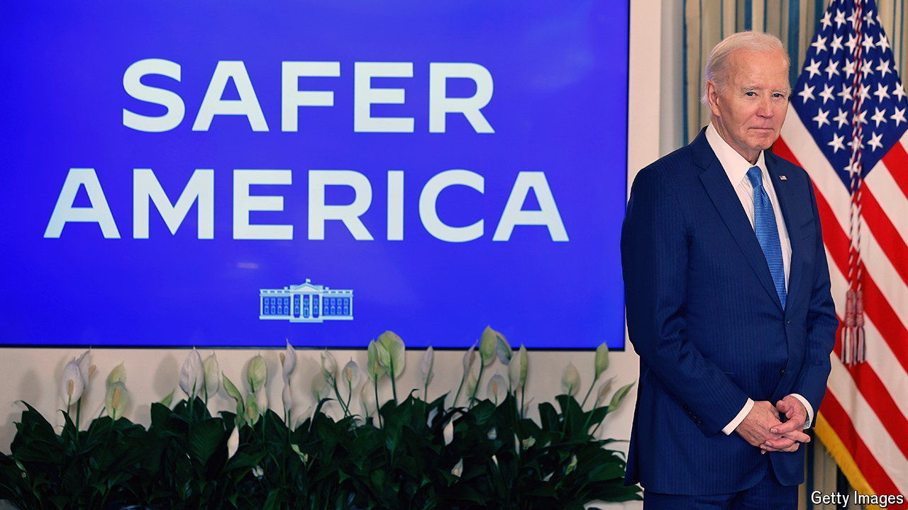
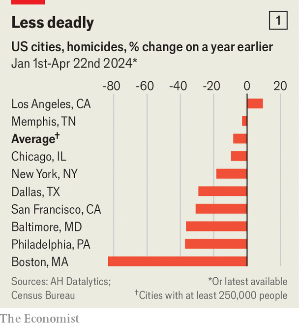
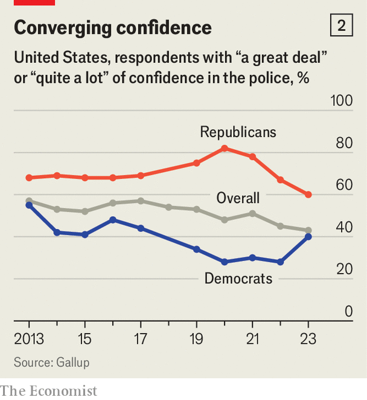

###### Back to square one

# Will Joe Biden benefit from falling murder rates across America? 

##### Violence seems to be returning to pre-pandemic levels 

 

> Apr 25th 2024 

Few politicians talk about violence as much as Donald Trump. In early April, when the former president held his first rally since wrapping up the Republican nomination in Grand Rapids, Michigan, he came onto the stage flanked by uniformed sheriffs. America, he argued, is being overwhelmed by murderous foreigners deliberately sent by hostile governments seeking to empty their prisons at home. Gang members, Mr Trump claimed, are “hiding in bushes, actually, they say”. Overall, he argued, crime rates are “only going in one direction and it’s going to be very bad”.

Unfortunately for Mr Trump, but happily for most Americans, what data there are suggest that most crime is indeed only going in one direction—down. In March the fbi released (partial) national data showing that violent crime of all sorts dropped in cities, suburbs and rural areas alike in the final quarter of 2023. That confirmed what  were already indicating by the middle of last year: that the wave of violence that started almost everywhere across America in the summer of 2020 (when Mr Trump was still president) had  in 2022. Murder, both the most damaging and the most reliably counted of all crimes, is now heading back towards pre-pandemic levels.


Last year, according to data published by the Major Cities Chiefs Association, which represents police chiefs in the United States and Canada, in the 69 American police departments covered, the total number of murders declined by roughly 10%. More recent data gathered from police departments by ah Datalytics, a private analysis firm, suggest that the total has continued to drop so far this year (see chart 1). In some big cities, such as Boston, Philadelphia and Baltimore, the size of the falls has been especially striking. The firm’s figures also suggest that even the  that swelled last year may have begun to ebb slightly.

 


Explaining why crime falls or rises is tricky. The best explanation for this fall, says Jeff Asher, of ah Datalytics, is simply the end of the pandemic. Most murders in America are the result of arguments that escalate to gunfights, typically between young men. When the virus was spreading, schools and other public services closed, and so more youngsters were pushed onto the streets. Higher levels of stress may have led to more arguments. Now things are somewhat back to normal. Added to that are a few policy changes. For example, many cities have invested plentiful federal money in “violence interrupters” who try to identify and de-escalate fights before they turn into shootings.

Will lower crime help Joe Biden win re-election? Certainly, it is better than the opposite. But the gains are likely to be limited. Polling suggests much of the public thinks crime is still rising. One of the bigger problems Mr Biden has is that police officers are generally conservative, and many are backing Mr Trump, who they think will let them continue to do their job the way they always have. 

In the past few years, Republicans in general have enthusiastically hugged cops. For example, earlier this month Florida’s governor, Ron DeSantis, signed a law that criminalises “harassment” of police officers and bans civilians from “carrying out extra-judicial investigations against law enforcement”. Mr Biden, by contrast, is at least rhetorically committed to police reform. “It is a bit of a danger zone” for the president, says Neil Gross, a professor at Colby College in Maine. 

 


The irony is that Mr Trump’s approach seems more likely to generate crime. Under Mr Biden trust in the police has risen among Democrats (see chart 2). When police are trusted, crimes are solved, and crime rates tend to fall. When trust is destroyed—by, say, a police killing—crime rises. 

Among the places that saw a rise in the murder rate last year was Memphis, Tennessee. That city was shaken up last January when a young, unarmed and innocent man, Tyre Nichols, was brutally beaten to death by plainclothes officers from a “tactical squad” who had stopped his car. Murders in Memphis have edged down this year. But last month Republicans in the state overturned a city-level ordinance intended to end such unwarranted stops. If Mr Trump wins the election, he may get more violence to talk about. ■


