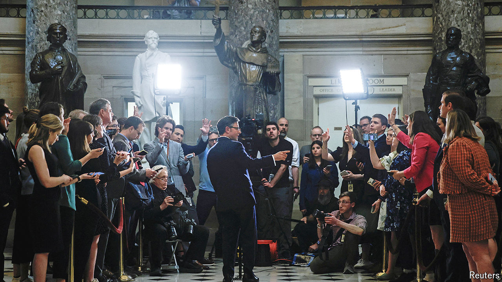

###### The centre holds

# Will the dramatic burst of bipartisanship in Congress last? 

##### For all its procedural power, America’s hard right has had stunningly little influence on policy 

 

> Apr 25th 2024 

Something remarkable just happened in American politics. Despite intense polarisation, a burst of bipartisanship has enabled Congress to pass vital legislation, over the objections of hard-core obstructionists in the House of Representatives. How was this possible?

The Republican Party began the 118th Congress holding the fifth-narrowest House majority in American history—and its most extreme members appeared firmly in control. Kevin McCarthy became speaker after a humiliating 15 rounds of voting. As a way to win the job, Mr McCarthy agreed to place hard-right members on the powerful Rules Committee, where they could routinely undermine the party’s leaders. He also accepted a change that allowed a single member of Congress to call a vote on his ouster. The influence of the berserker caucus peaked when eight Republicans voted with the Democratic Party to remove Mr McCarthy from the speakership in October 2023. 


However, the extremists have had stunningly little influence on policy, despite their formidable procedural power. The passage of legislation to aid Ukraine and other allies is only the latest example. President Joe Biden signed it into law on April 24th (along with a bipartisan move to  unless it is sold by its Chinese owner).

In the spring of 2023 Mr McCarthy negotiated a deal to modestly cut discretionary spending in exchange for an increase to America’s borrowing limit. The House Freedom Caucus howled that the reductions were insufficient. Although 71 Republicans voted against the Fiscal Responsibility Act, the legislation still passed with help from Democrats. The insurgent wing of the Republican Party could only grumble as Mr McCarthy held on to his job.

But averting a government shutdown in September 2023 was a step too far. Mike Johnson, a Louisiana congressman, replaced Mr McCarthy after several weeks of chaos in the lower chamber. He kept the government funded with short-term spending bills, the sin for which Mr McCarthy was excommunicated, but Republicans were not eager to go through the ordeal of finding yet another speaker. Republican divisions undermined the party’s bargaining power with the White House and the Democrat-controlled Senate, and Mr Johnson eventually passed a solution for the remainder of the fiscal year that bore a striking resemblance to what Mr McCarthy had negotiated a year before. 

The hard right betrayed even greater legislative ineptitude in its fight against funding for Ukraine. Many conservatives demanded drastic changes to America’s immigration system, and a group of senators negotiated what would have been the most restrictive immigration law in decades in exchange for nearly $100bn in funding for Ukraine, Israel and Taiwan. Republicans rejected the proposal because of pressure from Donald Trump, who sees the crisis on America’s southern border as a political winner as he campaigns for a new stint in the White House.

Mr Johnson, who had voted against Ukraine aid several times before taking the speaker’s gavel, had a change of heart, swayed in part by intelligence briefings. The legislation he put to the House was remarkably similar to the Senate bill, though he broke it into several pieces. Whereas a majority of Republicans supported the debt-ceiling increase and the government-funding bills, most rejected the new aid for Ukraine. Ironically, many complained that nothing had been done to tackle America’s porous border. Republican hardliners won virtually nothing they had sought in earlier negotiations, yet Congress still provided $61bn for Ukraine. Though shamefully late, it will make a big difference to . 

While the hard right was up in arms, Mr Trump stood by the speaker. “We have a majority of one, OK?” Mr Trump said in a radio interview on April 22nd. “It’s not like he can go and do whatever he wants to do. I think he’s a very good person.”

For now Mr Johnson appears secure in his position. Marjorie Taylor Greene, an excitable congresswoman from Georgia, has threatened to oust him, but has yet to force the question. “The old maxim on Capitol Hill is that you vote when you have the votes,” says Doug Heye, a former Republican leadership aide. “Clearly Marjorie Taylor Greene didn’t have the votes.”

A strong majority of House Republicans would back Mr Johnson, as they did Mr McCarthy, but the new speaker has also built goodwill with some Democrats. “For all its rank partisanship, the House right now is functionally and uneasily governed by a group of Republicans and Democrats,” wrote Brendan Buck, a former aide to two Republican speakers.

Mr Johnson’s shift on Ukraine does not mean Congress will take up much serious legislation for the remainder of this term, especially as the campaign season shrinks the legislative calendar. Expect some tweaks—Mr Johnson is considering changes to how “earmarks”, which designate a specific recipient for certain spending, are made in funding bills, probably an attempt to shore up support with conservatives—but nothing as salient as the foreign-aid package. A serious effort to impeach Mr Biden is unlikely: even trying would alienate many of the Democrats implicitly helping Mr Johnson remain in power.

Will America’s accidental speaker be leading House Republicans next year? Retaining the House won’t be easy, and parties that lose their majorities tend to fire their leaders. The Republican Party will have to increase its majority to give Mr Johnson a chance, and the power of a Trump endorsement would depend largely on whether he wins the presidency. It doesn’t help that House Republicans have a history of punishing their leaders for doing the right thing. ■


