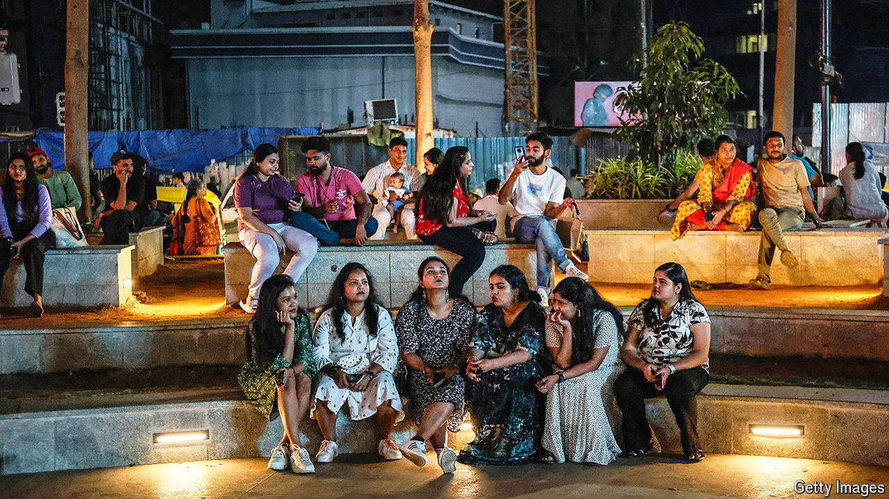

###### Young and conservative

# Even disillusioned young Indian voters favour Narendra Modi 

##### They worry about their future, but do not blame the BJP 

 

> Apr 30th 2024 

India is a young country: around two-fifths of its 1.4bn people are under the age of 25. That makes them an important constituency in the general election, which will end on June 4th. Getting their vote is not straightforward. Just before the election, data released by the election commission showed that less than 40% of eligible first-time voters were registered to vote. Some youngsters are disappointed with what they perceive to be a lack of economic progress since the last general election, in 2019. “I am voting for NOTA,” shrugs Jitender Kumar, a 24-year-old from Katihar, a small city in the eastern state of Bihar. NOTA stands for “none of the above”.

Mr Kumar’s complaints are echoed by other young Indians elsewhere. Unemployment and the rising cost of living were the main concerns voters cited in a survey conducted by the Centre for the Study of Developing Societies (CSDS), a think-tank in Delhi, in the run-up to the election. “We are told we can all be entrepreneurs...but actually there are no routes to success,” says Isha, a 26-year-old radio producer in Patna, Bihar’s capital. In the CSDS survey, 62% of respondents said it had become harder to get a job over the past five years. 

