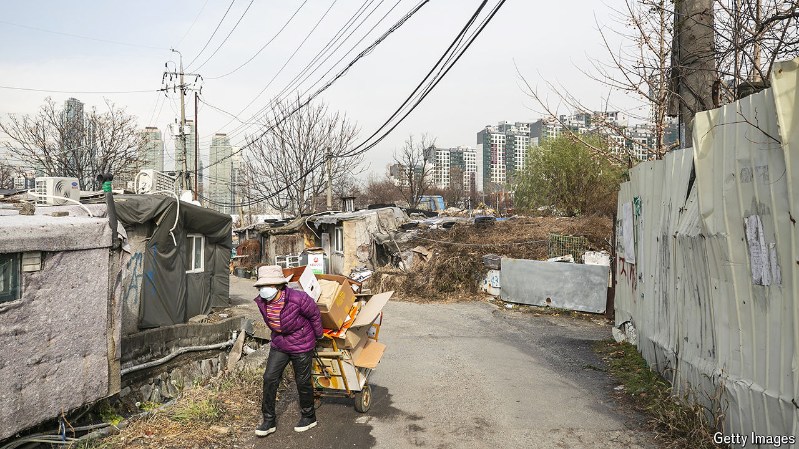

###### Pensions and penury

# Japan and South Korea are struggling with old-age poverty 

##### Their problems may be instructive for other countries 

 

> May 2nd 2024 

At a soup kitchen in Dongdaemun, a district of Seoul synonymous with the capital’s fashionistas, Kim Mi-kyung is busy preparing for the lunch rush. Ms Kim explains that the kitchen serves around 500 people a day, most of them elderly. “They can’t work, they can’t ask for money from their children and they can’t eat,” she says. “So they come here.” 

South Korea has the second-highest rate of income poverty among the elderly in the OECD, a club of mostly rich countries (the highest is tiny Estonia). Nearly 40% of South Koreans over 65 live below the OECD’s poverty line, set at half the national median income. In Japan that rate is 20%. The OECD average is 14%. South Korea’s and Japan’s abundance of old people and lack of young ones, combined with changing labour markets and inflexible pension systems, mean the problem is likely to worsen. Other rich countries will soon face similar issues. East Asia provides an example of what works—and what doesn’t. 

