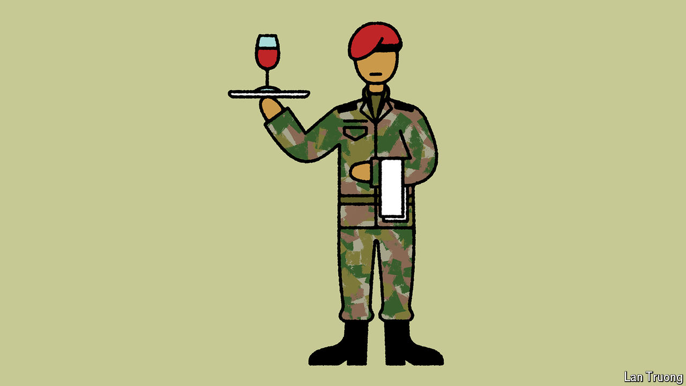

###### Banyan

# Meet the maharajas of the world’s biggest democracy 

##### Indian officialdom still treats citizens like subjects 

 

> May 2nd 2024 

WALK INTO the office of a senior government official anywhere in India and you will find the same scene. Behind a large desk sits the man (or, occasionally, the woman) in charge. Arrayed in front of him are neat rows of chairs. And on those chairs sit supplicants patiently awaiting their turn to petition for justice, relief or favours. Many more clamour outside. Periodically the official rings a bell, signalling to a peon to usher in the next hopeful. 

From the offices of district magistrates in remote backwaters to those of the bureaucratic elite in the national capital, and from provincial municipal commissioners to senior tax inspectors, the physical manifestation of the Indian state can often remind visitors of a plastic-chair-cluttered reconstruction of a noble court. That is because Indians are not governed. They are ruled. 

