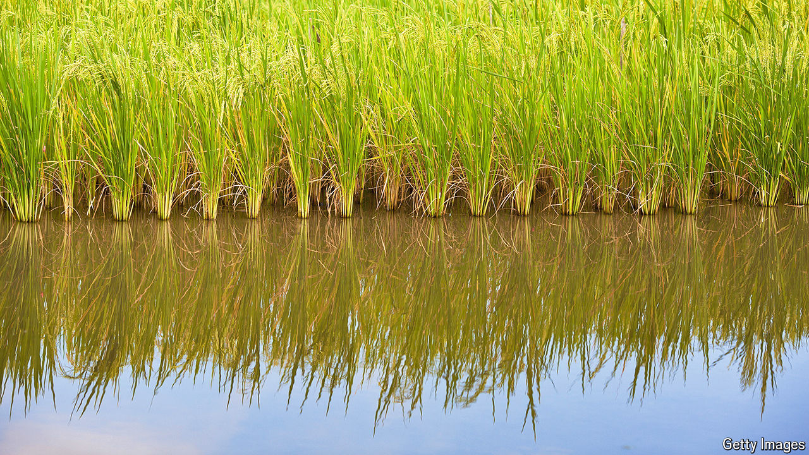

###### No to GMO

# The Philippines bans some genetically modified foods 

##### But golden rice could help thousands of nutrient-deficient children 

 

> May 2nd 2024 

Greenpeace described it as a “monumental win”. Lauro Diego, a rice-farmer in the Philippines, sees it as a “triumph” against “genetic erosion”. But advocates of genetically modified (GM) foods say the decision could be disastrous for poor Filipinos. In April environmentalists convinced a court in the Philippines to ban golden rice, a GM food that had been approved for cultivation in 2021. Green groups claimed it could contaminate other crops. Their success could scupper a golden opportunity to feed the Philippines—and possibly Asia.

Most Asians eat white rice, which is not very nutritious. Partly as a result, around a sixth of Filipino children do not get enough vitamin A. This deficiency can contribute to blindness or premature death. One solution is to engineer the rice to include beta-carotene, a chemical precursor of vitamin A that turns kernels gold. 

