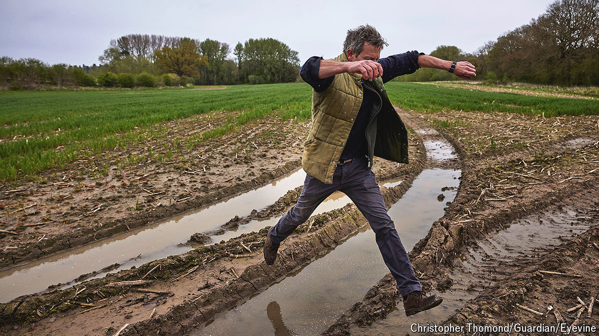

###### Food or the environment?

# British farmers shunned green schemes. Then the rain came 

##### A rare Brexit dividend 

 

> May 2nd 2024 

Imagine a line running through the middle of Britain, from top to bottom. West of the line, rain is frequent and the topography is tricky. Cows and sheep manage fine but tractors and combines struggle. East of the line, rain is rarer and fields are flatter. Although it is not as pretty, the east is a superb place to grow cereal crops. 

At least, it usually is. Last October, as farmers were preparing to sow winter wheat and barley, eastern England was inundated. Another deluge arrived in February, wrecking plans for spring drilling. “It’s been relentless,” says Jack Watts of the Agriculture and Horticulture Development Board (ahdb), which is funded by a farming levy. As a result, many farmers are being driven towards schemes that pay them for something other than growing food. 

