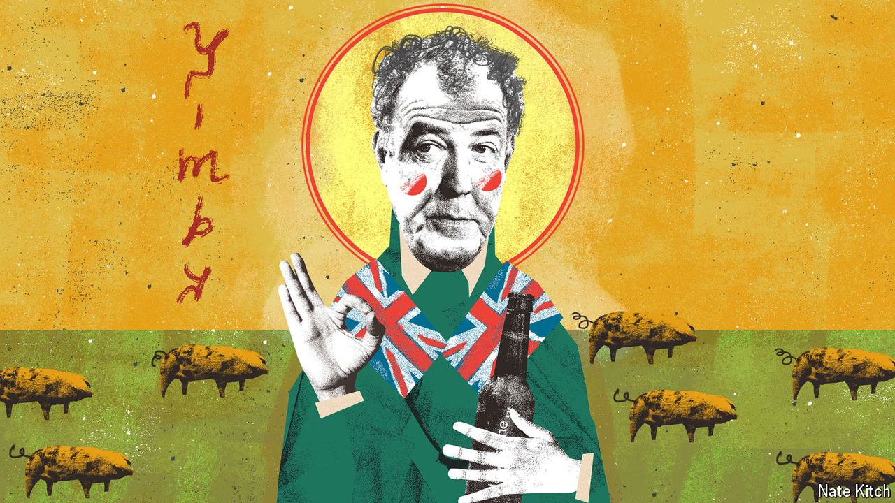

###### Bagehot

# Jeremy Clarkson, patron saint of the Great British bore 

##### He who speaks for the bore speaks for Britain 

 

> May 1st 2024 

Hurtling west along the M40 in a Porsche Taycan, an electric battery on wheels that seemingly teleports between zero and 60mph, Bagehot thought: this feel like a horse that had just had a mustard-covered hot dog shoved up its backside. His destination was Diddly Squat, a farm on the edge of the Cotswolds owned by Jeremy Clarkson, television presenter, near-national treasure and coiner of that evocative equine analogy. 

In barely a decade Mr Clarkson has gone from , a man who punched an underling for failing to provide a hot dinner, to strangely beloved guardian of the British countryside and yimby (Yes In My Back Yard) icon. This unlikely transformation is due to the success of “Clarkson’s Farm”, a hit Amazon Prime show that begins its third series on May 3rd. In the programme Mr Clarkson struggles to breed pigs, break even and defeat nimbys on the local council. 

