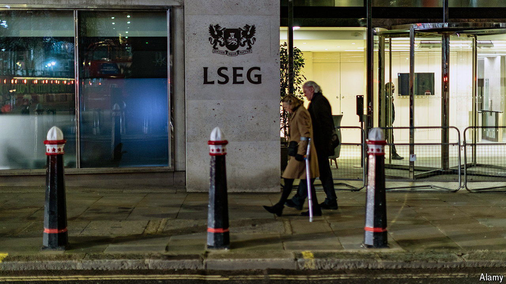

###### London not calling

# Questions grow over the future of the London stockmarket 

##### More than 20 listed companies are facing bids. Others are mulling their options 

 

> May 2nd 2024 

The London Stock Exchange (LSE) is shrinking. The decline of one of the world’s oldest stockmarkets has been under way for a while, but recently the pace of exits has been accelerating. More than 20 listed companies are facing acquisition bids; firms with a market cap of around £100bn ($125bn) could delist from the LSE as a result of pending and proposed deals. 

If this downward trend were to continue, small-cap firms—those which are valued between $300m and $2bn—could be gone from the exchange by 2028, according to Peel Hunt, an investment bank. Larger firms are also causing alarm. Twelve companies being targeted by would-be acquirers are in the FTSE 350, the 350 largest companies on the exchange, compared with just two last year.

