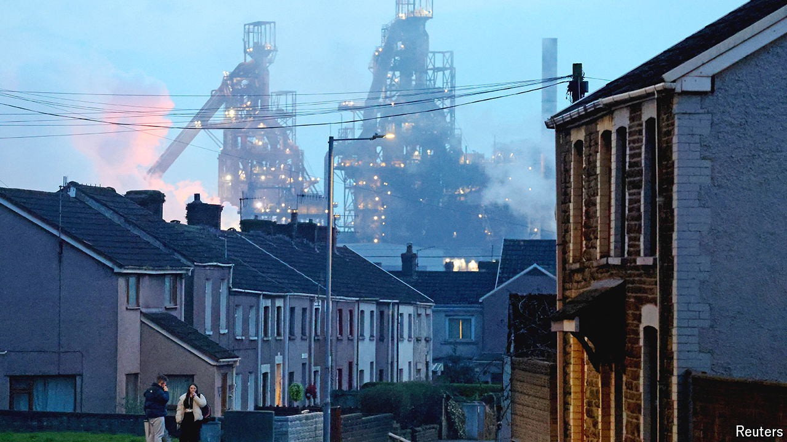

###### Steel yourselves

# The fight over one of Britain’s last steel plants 

##### Closing two blast furnaces in south Wales will cut emissions and jobs 

 

> Apr 30th 2024 

IT FELL TO Terry Leyshon to make the final push. On March 20th he moved the last batch of coke from the oven onto a waiting railcar, ready to head to the blast furnace. Mr Leyshon has worked at the Port Talbot steelworks in south Wales since he was a teenager. Steel runs in his blood: it was his father who made the first push when the site opened in 1981. The blast furnaces will keep going for another few months by burning imported coke. But come October the giant white plumes that have risen from the smokestacks for 40 years will be gone.

Even during that first push, the long decline of British steelmaking had begun (see chart). In 1970 Britain produced nearly 30m tonnes of steel, for everything from planes and cars to washing machines and food tins. It produces around 6m tonnes today; soon it will be less than four. That is mostly because demand for steel dried up as manufacturing moved abroad.  to compete with foreign rivals. Only six facilities remain; Port Talbot is by far the biggest.

