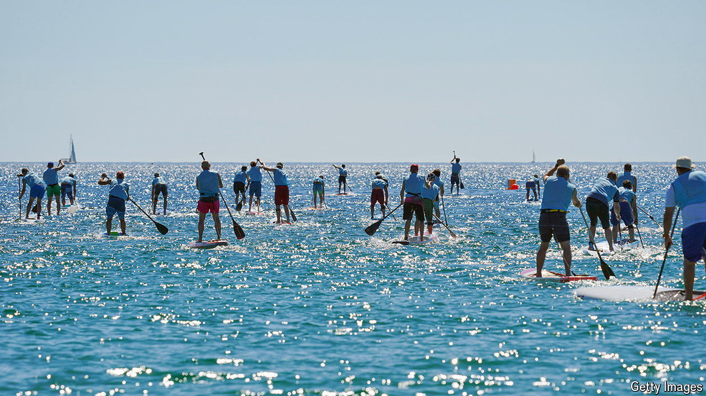

###### ‘SUP!

# Why so many Britons have taken to stand-up paddleboarding 

##### It combines fitness, wellness and smugness 

 

> Apr 26th 2024 

Visit any body of water in Britain this summer and you will spot them, wielding their paddles like modern-day Argonauts. In the past three years stand-up paddleboarding (or SUPing) has gone from obscurity to popularity. Some 4.5m Britons have dabbled; over 1m own a board, according to one survey. 

Paddleboards were invented in Hawaii in the 1940s. Originally marketed to  as a backup for days of flat water, early adopters used them for racing and exploring coastlines. But SUPs struggled to take off. Thrill-seekers thought they combined all the work (paddling) with none of the excitement (surfing). 

