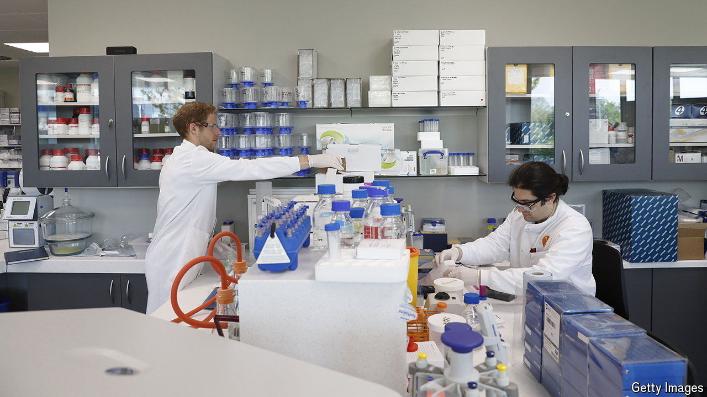

###### The fountain of youth


# Can biotech startups upstage Eli Lilly and Novo Nordisk? 


##### Smaller drugmakers are enjoying a revival 

 


> Apr 30th 2024 


BETWEEN 2021 and 2023 two parts of the drugmaking business were in contrasting states of health. An index of American big pharma rose by a third, outperforming the broader stockmarket thanks to robust sales of blockbuster drugs. One made up of smaller biotechnology companies sank by roughly as much, weighed down by rising interest rates and dissipating pandemic-era euphoria for all things medical. Unlisted biotech startups have, like most young firms, struggled to attract capital. Last year they drew just $17bn in investments, down from $37bn two years earlier. Fewer went public and more went bust.


This year the giants are still going strong. On April 30th Eli Lilly, maker of a popular weight-loss treatment, delivered another dose of strong quarterly results. On May 2nd Novo Nordisk, a Danish rival with its own hit anti-obesity drug, did the same. Together the two are worth $1.2trn, up from $350bn three years ago. But biotech’s vitals, too, are improving. That is good news for investors, patients and the pharmaceutical industry as a whole. 

