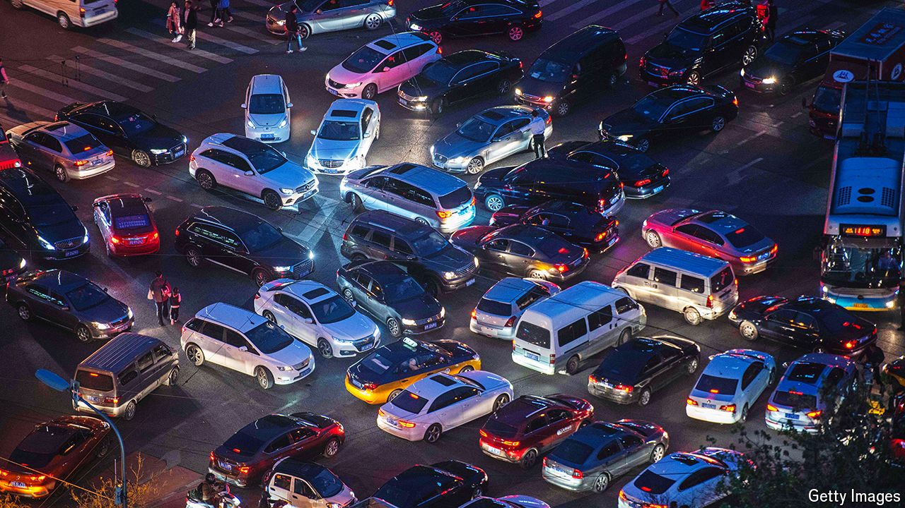

###### Jam-packed

# Chinese EV-makers are leaving Western rivals in the dust 

##### They have shone at Beijing’s car jamboree 

 

> May 1st 2024 

TO GIRD YOURSELF for Auto China 2024, a nine-day motor show which ends on May 4th in Beijing, get there by car. On the opening day, navigating the human traffic eager to glimpse the mechanical marvels on display required the same tenacity as negotiating the Chinese capital’s gridlocked roads. Helpfully, the ride to the venue is also useful preparation for understanding the intense competition gripping China’s car industry—which the jamboree itself further underscores. 

Both on Beijing streets and at exhibition booths, most of the vehicles are electric. And Chinese marques, some more familiar to overseas visitors than others, and local technology champions such as Huawei and Xiaomi, better known for gizmos you carry than those that carry you, are edging out the foreign manufacturers that once dominated the domestic market. 

