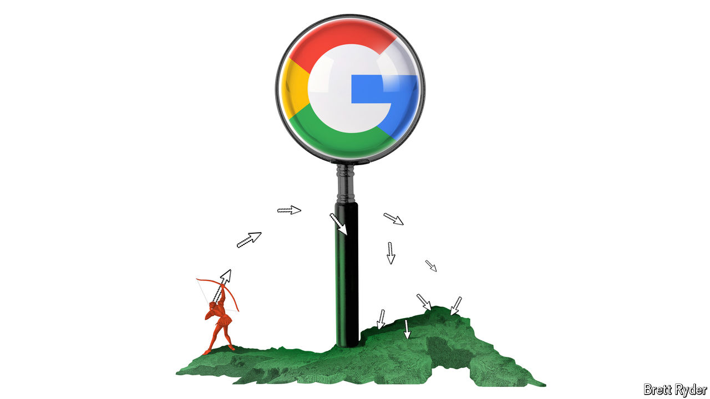

###### Schumpeter

# Does Perplexity’s “answer engine” threaten Google? 

##### Taking aim at one of the best business models of all times 

 

> May 2nd 2024 

When Aravind Srinivas was accepted at the University of California, Berkeley, to do a PhD, his mother was disappointed. Like many Indian parents, she wanted him to go to the Massachusetts Institute of Technology. But things worked out after all; on the west coast he interned at OpenAI and Google’s DeepMind, both of which became leaders in generative artificial intelligence (AI). With that experience, he co-founded Perplexity, a generative-AI startup recently valued at $1bn that provides fast, Wikipedia-like responses to search queries. He is an unassuming interviewee, but an ambitious one. His “answer engine” is aimed at competing with Google search, one of the best business models of all time. Think Martin Luther taking on the Catholic church. 

Mr Srinivas is a student of disruption. When a podcaster asked him recently to compare the cultures of OpenAI and DeepMind, he explained how the engineer-led, free-wheeling approach of the former disrupted what he called the research-obsessed “very British” hierarchy of the latter (which was founded in London). He resorts to disruption theory when discussing Alphabet, Google’s parent company. Rather than explaining how Perplexity’s business model will enable it to attack the search giant, he uses a celebrated concept outlined in “The Innovator’s Dilemma”, a management bestseller from 1997 by Clayton Christensen, to identify what he sees as Alphabet’s Achilles heel. He is not alone. The innovator’s dilemma has been invoked to explain why Google is threatened by OpenAI’s ChatGPT and by other generative-AI sites such as You.com. The argument is seductive. But it is off the mark. 

