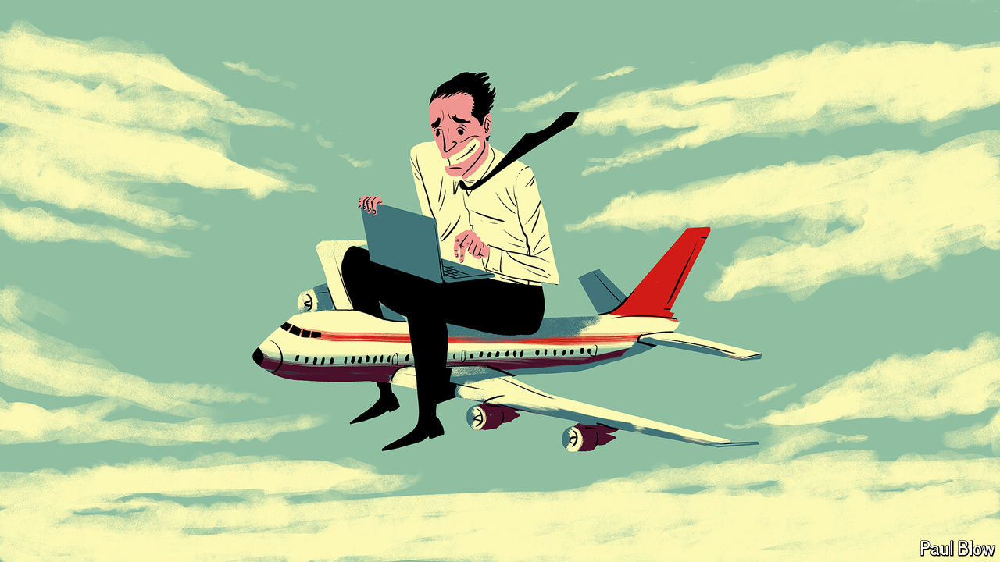

###### Bartleby

# How not to work on a plane 

##### Hours without interruption and work to do. What could go wrong? 

 

> May 2nd 2024 

You are not important enough to turn left on a plane. But you are important enough for the company to want you to have completed a project-risk update by the time you land. You have six solid hours in the air, and the work should take no more than three hours. You are not in a middle seat, and no one can email you. What could possibly go wrong?

You find your seat, which is on the aisle. You take out your laptop and a book, and try to put them into the seat pocket in front of you. It is made for someone who has absolutely no interests but you manage, with some effort, to shove both of them in. As the plane fills up, your hopes of space around you go down. You scan the people heading down the aisle. So does everyone else already in a seat. In this moment each passenger is being silently judged on only two criteria: girth and proximity to a baby. Eventually you get up to make way for a couple to sit beside you. Could have been worse.

