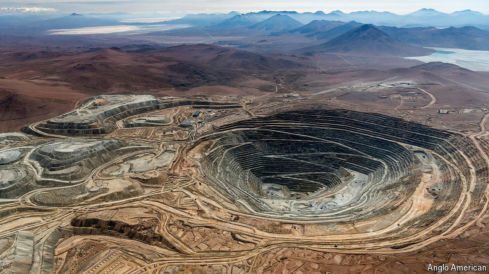

###### A copper-bottomed deal

# Why does BHP want Anglo American? 

##### Its $39bn takeover offer is the latest in a string of mining mega-mergers 

 

> May 2nd 2024 

TALK OF TAKEOVER has long swirled around 107-year-old Anglo American, once among the biggest mining companies in the world. On April 25th speculation turned to specifics when BHP, the $140bn behemoth that is today top of the pile by market value, offered to buy its diminished rival (minus Anglo’s South African business) for $39bn. It then emerged that Elliott Management, an activist hedge-fund known for picking apart lumbering giants to unearth buried value, had amassed $1bn-worth of Anglo shares, giving it a 2.5% stake. In the following days it raised this slightly, perhaps counting on other suitors to come in and bid up the price.

This clash of big dirt and high finance suggests that Anglo harbours something worth fighting over. Its big mines indeed tick all the right boxes: high quality and low cost, with the potential to expand. They are also extracting the right stuff at the right time. One of Anglo’s main products is copper, which is in high demand, particularly as tonnes of it will be needed for the electrification of transport and power in the green-energy transition; the red metal’s price has risen by 15% this year. Another is high-grade iron ore, which is in demand for its use in forging green steel. 

