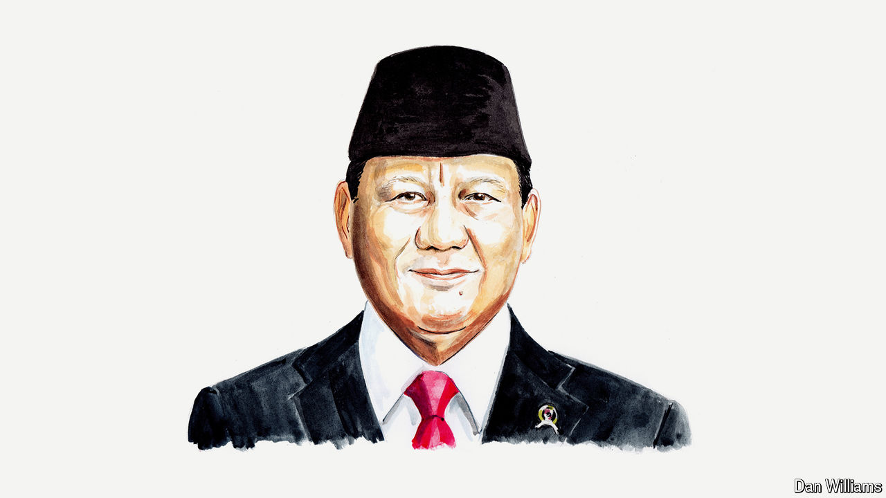

###### The war in Gaza

# Indonesia’s president-elect accuses the West of double standards 

##### Valuing Ukrainian over Gazan lives is morally indefensible, says Prabowo Subianto 

 

> Apr 26th 2024 

ON APRIL 9TH, on the eve of the Eid al-Fitr holiday, the Indonesian Air Force conducted an airdrop of humanitarian aid in Gaza. In practical terms, this aid was just a drop in the ocean of horror and deprivation to which  has been reduced lately. However, this gesture carried great symbolic value for the people of Indonesia and for me as their president-elect: it was a message of shared grief and pain, of solidarity and support, to our brothers and sisters in Gaza.

Over the past six months we have watched in horror as Gaza and its people have been subjected to a harsh campaign of collective punishment, in violation of international laws and norms. We had hoped and prayed that at least during the holy month of Ramadan the suffering of Gaza would stop, but it did not. 

