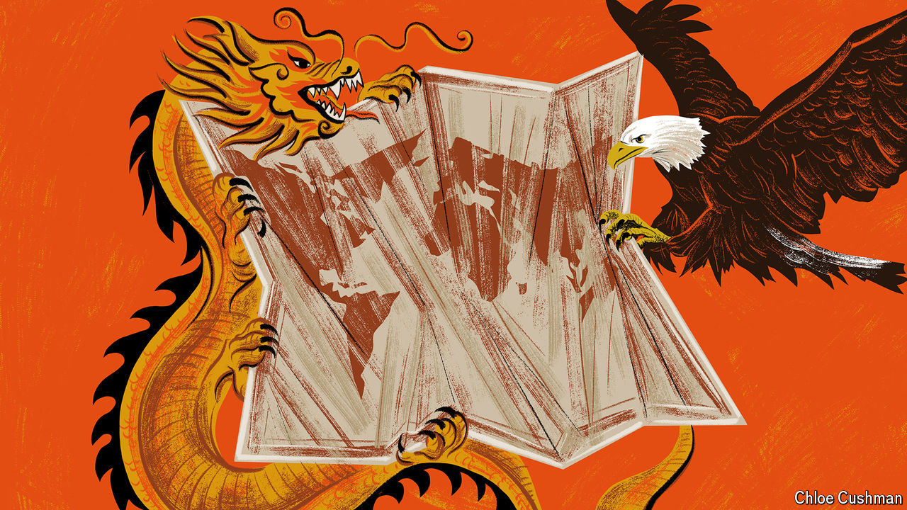

###### Chaguan

# China and America trade blame for a world on fire 

##### A global contest is under way to recruit like-minded countries as supporters 

 

> May 2nd 2024 

MOST COUNTRIES have no desire to choose between China and America. But it is becoming clear that they might have to. The contest between the two powers is going global. This is an age of political turmoil, economic angst and rising barriers to trade. In Beijing and Washington leaders see opportunities to blame rivals in the other capital for making the chaos worse. 

For now, this contest often sounds surprisingly high-minded. Because so many countries fear a conflict between China and America, the two giants have cause to play the responsible, constructive great power. China’s leader, Xi Jinping, duly adopted a gracious tone when he hosted America’s secretary of state, Antony Blinken, in Beijing on April 26th. Earlier China’s top diplomat, Wang Yi, had accused the Biden administration of trying to contain his country with “endless measures to suppress China’s economy, trade, as well as science and technology”. But Mr Xi wished to talk about the “bigger picture”, namely that “the world today is undergoing transformation not seen in a century”, and that “we live in an interdependent world and rise and fall together.” He suggested that China and America should help one another and avoid “vicious competition”. Amid the warm words, Mr Xi offered a rebuke, noting that China opposes alliances and American-led “small blocs”. That is code that China uses when accusing America of endangering peace by maintaining defence alliances with Atlantic partners in NATO, and with its Indo-Pacific partners, Japan, the Philippines and South Korea. 

