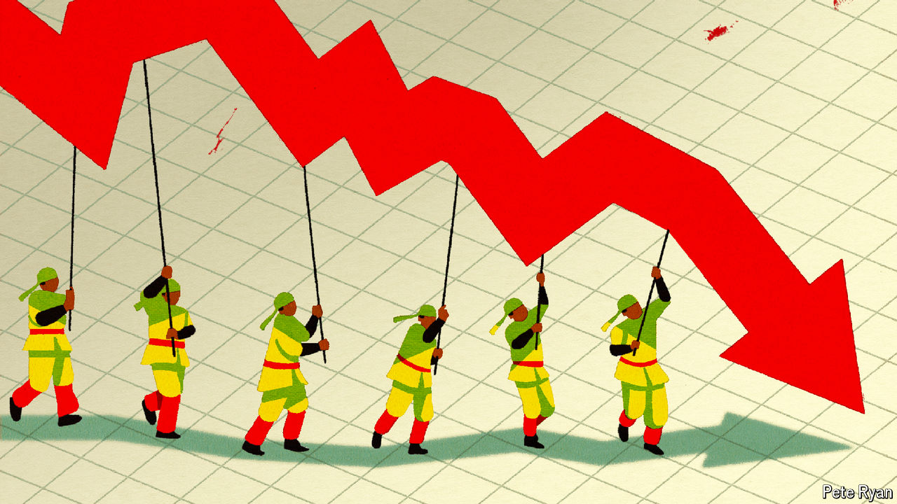

###### Raising revenue

# China mulls a bold test of taxation without representation 

##### With revenue declining, its leaders must figure out how to collect more money 

 

> May 2nd 2024 

CHAIRMAN MAO ZEDONG was a fan of meetings. “Whenever problems arise, call a meeting,” he wrote in 1949. “Place problems on the table.” Otherwise, he warned, they can drag on for years. A tableful of problems now beset China’s economy, including deflation, debt distress and demographic decline. A property slump has eroded confidence and hurt the land sales that help finance local governments. China also faces growing opposition from trading partners, who are limiting what they sell and buy from a country they now count as a geopolitical rival.

In response, China’s rulers have finally called a big meeting. On April 30th they announced that the party’s central committee will hold its third plenary session in July, gathering together over 370 committee members and their understudies. The third plenum, one of seven full meetings held over a typical five-year term, is traditionally devoted to reform and the economy. The session in 1978 enshrined China’s turn towards the market, making it one of the most consequential meetings in history. The most recent gathering in 2018 was also significant, for better or worse, paving the way for Xi Jinping, China’s ruler, to serve indefinitely as president.

