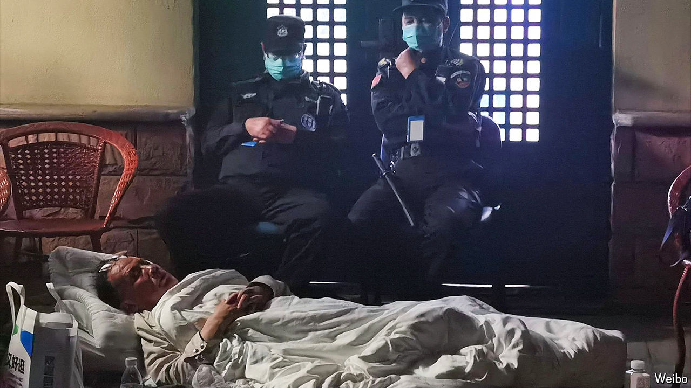

###### Covid-19 in China

# The Chinese scientist who sequenced covid is barred from his lab 

##### The Communist Party is still hounding experts whose work might expose its pandemic missteps 

 

> May 2nd 2024 

Since covid-19 emerged over four years ago in the central city of Wuhan, the Communist Party has made life miserable for those seeking to study the disease and share their findings with the world. Take Zhang Yongzhen, a Chinese virologist whose team sequenced the genome of the virus that causes covid in early 2020. Days later he granted permission for a British scientist to publish the groundbreaking work. This allowed the world to design covid tests and begin developing vaccines. But to party officials, hell-bent on deflecting blame for their missteps in managing the outbreak, it was a betrayal. Dr Zhang’s lab was investigated for wrongdoing.

Today China remains ill-prepared for a covid-like outbreak—and the party continues to torment scientists whose work might expose its shortcomings. In late April Dr Zhang was informed that his lab in Shanghai, which was examining the origins of covid, would be shut down. In a post on Weibo, a Chinese social-media platform, he said he had been barred by guards from entering the facility. So on April 28th he and some colleagues began a sit-in protest at the lab’s doors. “I won’t leave or quit,” he wrote. “I am pursuing science and the truth!” Photos circulating online appear to show Dr Zhang sitting defiantly in a wicker chair or sleeping on the ground outside the lab, as guards watch over him in the background (pictured). 

