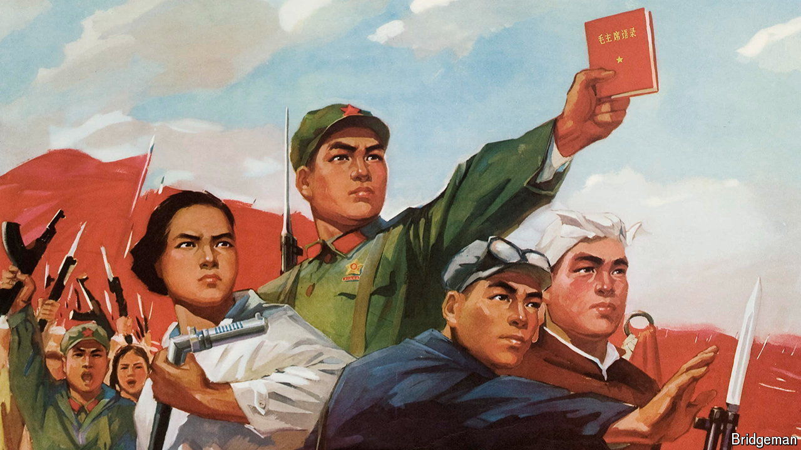

###### Stability starts in the workplace

# Why China’s companies are recruiting their own militias 

##### Officials want to keep things calm in an era of slowing growth 

 

> May 2nd 2024 

Employees of the Industrial and Commercial Bank of China (ICBC), a giant state-owned lender, typically wear suits. But some are now slipping into combat fatigues. On April 19th an ICBC branch in the western province of Qinghai said it had organised some of its staff into a part-time militia. As well as uniforms, they have training facilities, a “command centre” and a warehouse for storing military equipment. ICBC wants to “contribute its strength towards national defence”, the manager of the branch told local media. 

China has long used militias, known as People’s Armed Forces Departments, to supplement the People’s Liberation Army. During the rule of Mao Zedong, local governments recruited militiamen across China and gave them basic training and weapons. They were expected to help resist an invasion. But after Mao died in 1976, China started to worry less about such threats. The size of its militia forces shrunk from over 30m members to 8m in 2011, the last year for which there are official data.

