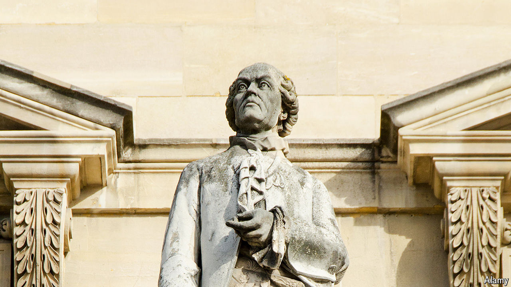

###### Class acts

# A little-remembered rivalry that shaped the modern world 

##### The race between Carl Linnaeus and Georges-Louis de Buffon to categorise all life had long-lasting consequences 

 

> Apr 30th 2024 

By Jason Roberts. 

Homo sapiens. Even the layest of laymen knows that the scientific  have two parts. Some may recall that this convention was invented by , a Swede. Classifying nature was a preoccupation of natural historians in the 18th century, and Linnaeus’s way won out.

